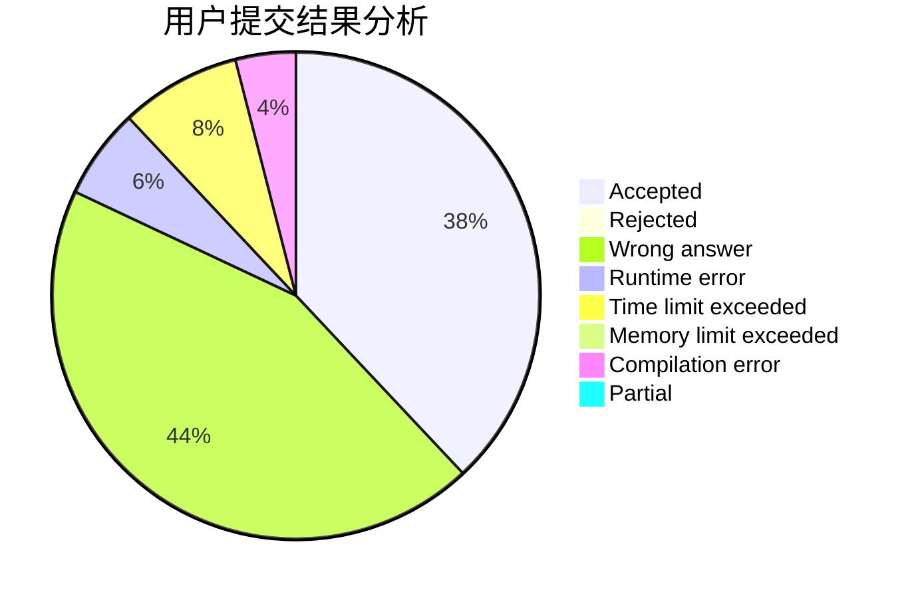
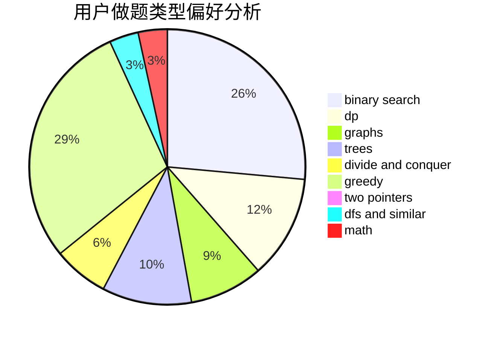

# UltiMadow

<!-- tabs:start -->

#### **用户提交结果分析**

#### **用户做题类型偏好分析**

<!-- tabs:end -->
# 推荐题目
[559A](https://codeforces.com/contest/559/problem/A)
[896A](https://codeforces.com/contest/896/problem/A)
[1220E](https://codeforces.com/contest/1220/problem/E)
[279B](https://codeforces.com/contest/279/problem/B)
[582A](https://codeforces.com/contest/582/problem/A)
[732B](https://codeforces.com/contest/732/problem/B)
[36B](https://codeforces.com/contest/36/problem/B)
[496B](https://codeforces.com/contest/496/problem/B)
[600C](https://codeforces.com/contest/600/problem/C)
[715A](https://codeforces.com/contest/715/problem/A)
