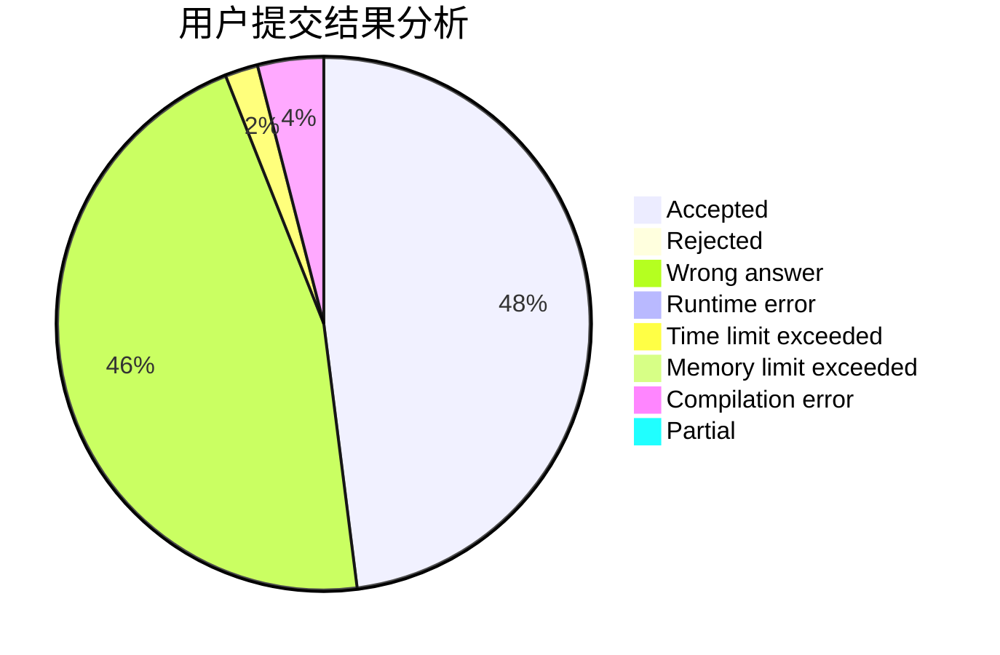
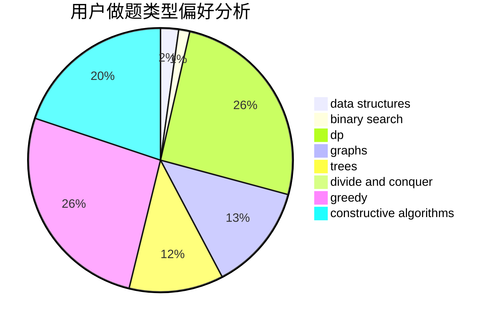
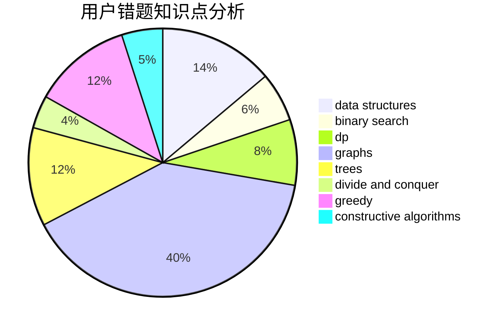

# Unity_wc

<!-- tabs:start -->

#### **用户提交结果分析**

#### **用户做题类型偏好分析**

#### **用户错题知识点分析**

<!-- tabs:end -->
# 推荐题目
[183A](https://codeforces.com/contest/183/problem/A)		constructive algorithms,
                        math		  
[1356A3](https://codeforces.com/contest/1356A/problem/3)		*special problem		  
[1332E](https://codeforces.com/contest/1332/problem/E)		combinatorics,
                        constructive algorithms,
                        math,
                        matrices		  
[294E](https://codeforces.com/contest/294/problem/E)		dp,
                        trees		  
[749B](https://codeforces.com/contest/749/problem/B)		brute force,
                        constructive algorithms,
                        geometry		  
[893F](https://codeforces.com/contest/893/problem/F)		data structures,
                        trees		  
[633A](https://codeforces.com/contest/633/problem/A)		brute force,
                        math,
                        number theory		  
[533E](https://codeforces.com/contest/533/problem/E)		constructive algorithms,
                        dp,
                        greedy,
                        hashing,
                        strings,
                        two pointers		  
[1360D](https://codeforces.com/contest/1360/problem/D)		math,
                        number theory		  
[208C](https://codeforces.com/contest/208/problem/C)		dp,
                        graphs,
                        shortest paths		  
