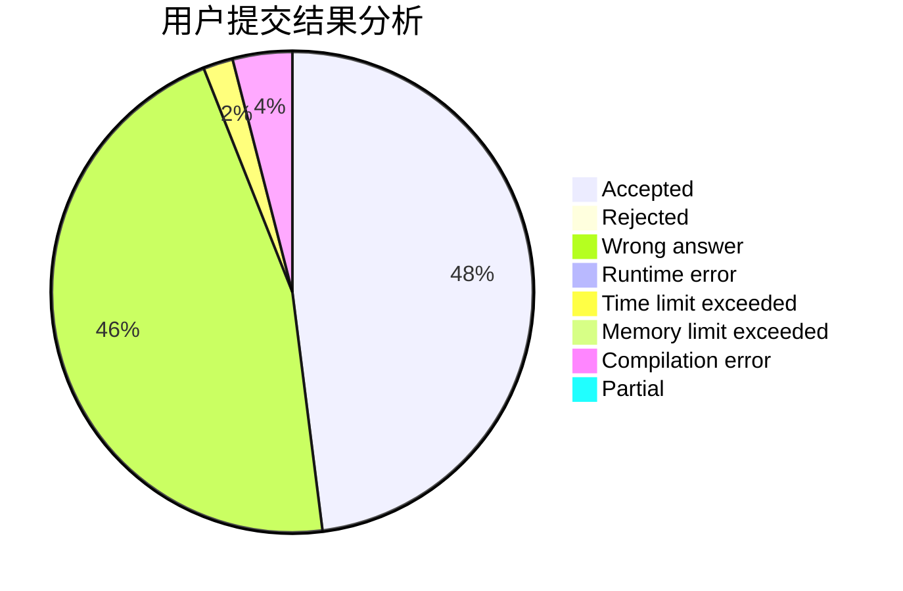
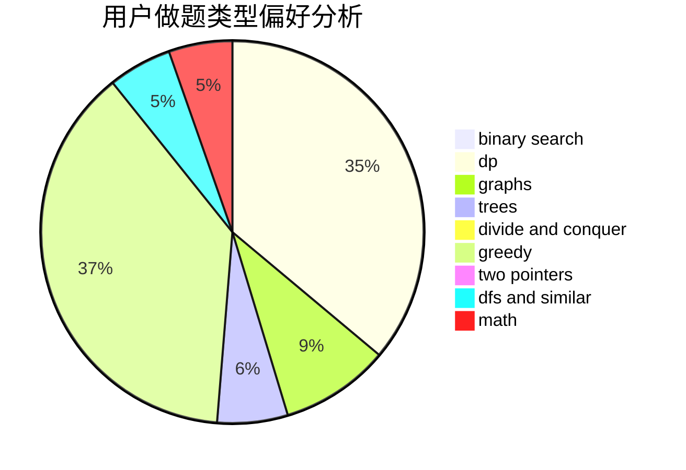

# Unity_wc

<!-- tabs:start -->

#### **用户提交结果分析**

#### **用户做题类型偏好分析**

<!-- tabs:end -->
# 推荐题目
[209C](https://codeforces.com/contest/209/problem/C)
[1363B](https://codeforces.com/contest/1363/problem/B)
[1339B](https://codeforces.com/contest/1339/problem/B)
[311B](https://codeforces.com/contest/311/problem/B)
[768B](https://codeforces.com/contest/768/problem/B)
[911F](https://codeforces.com/contest/911/problem/F)
[665C](https://codeforces.com/contest/665/problem/C)
[555C](https://codeforces.com/contest/555/problem/C)
[1368C](https://codeforces.com/contest/1368/problem/C)
[22E](https://codeforces.com/contest/22/problem/E)
