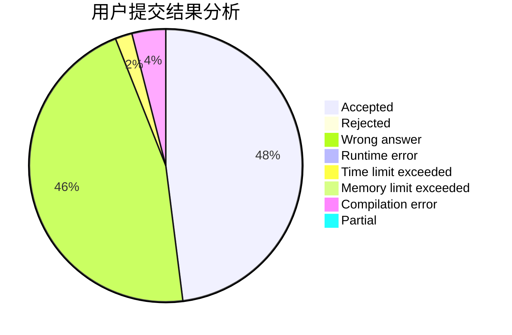
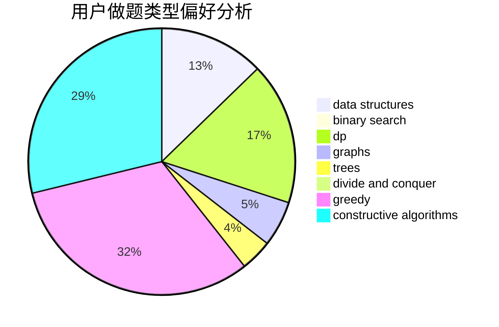
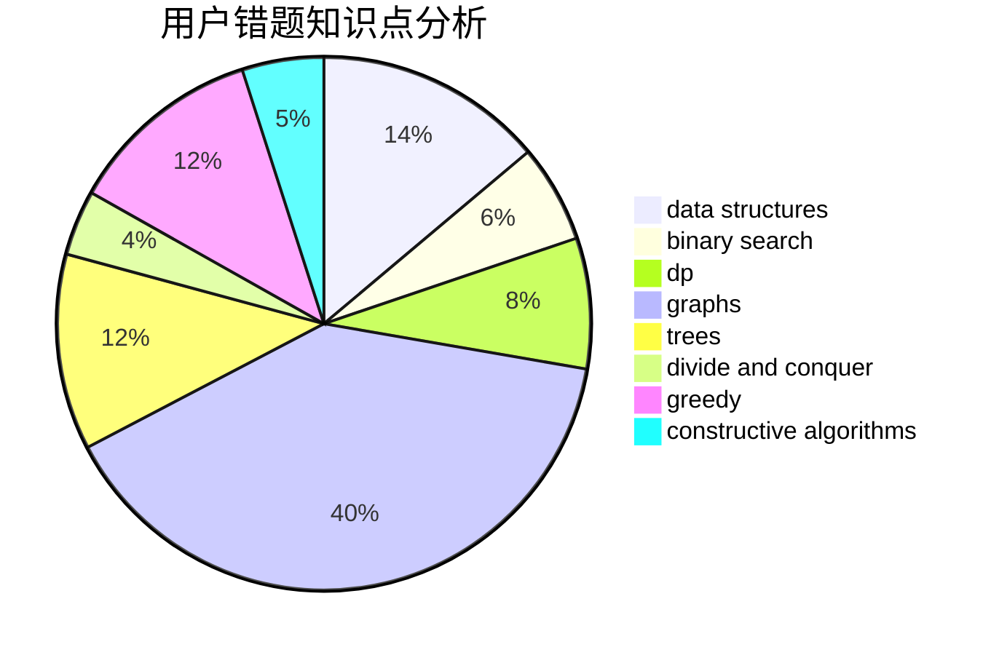

# Unity_wc

<!-- tabs:start -->

#### **用户提交结果分析**

#### **用户做题类型偏好分析**

#### **用户错题知识点分析**

<!-- tabs:end -->
# 推荐题目
[209C](https://codeforces.com/contest/209/problem/C)		constructive algorithms,
                        dsu,
                        graphs,
                        greedy		  
[1363B](https://codeforces.com/contest/1363/problem/B)		implementation,
                        strings		  
[1339B](https://codeforces.com/contest/1339/problem/B)		constructive algorithms,
                        sortings		  
[311B](https://codeforces.com/contest/311/problem/B)		data structures,
                        dp		  
[768B](https://codeforces.com/contest/768/problem/B)		constructive algorithms,
                        dfs and similar,
                        divide and conquer		  
[911F](https://codeforces.com/contest/911/problem/F)		constructive algorithms,
                        dfs and similar,
                        graphs,
                        greedy,
                        trees		  
[665C](https://codeforces.com/contest/665/problem/C)		dp,
                        greedy,
                        strings		  
[555C](https://codeforces.com/contest/555/problem/C)		data structures		  
[1368C](https://codeforces.com/contest/1368/problem/C)		constructive algorithms		  
[22E](https://codeforces.com/contest/22/problem/E)		dfs and similar,
                        graphs,
                        trees		  
