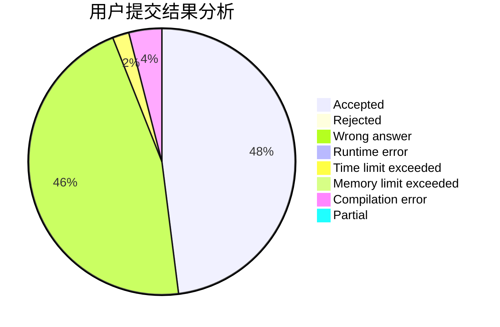
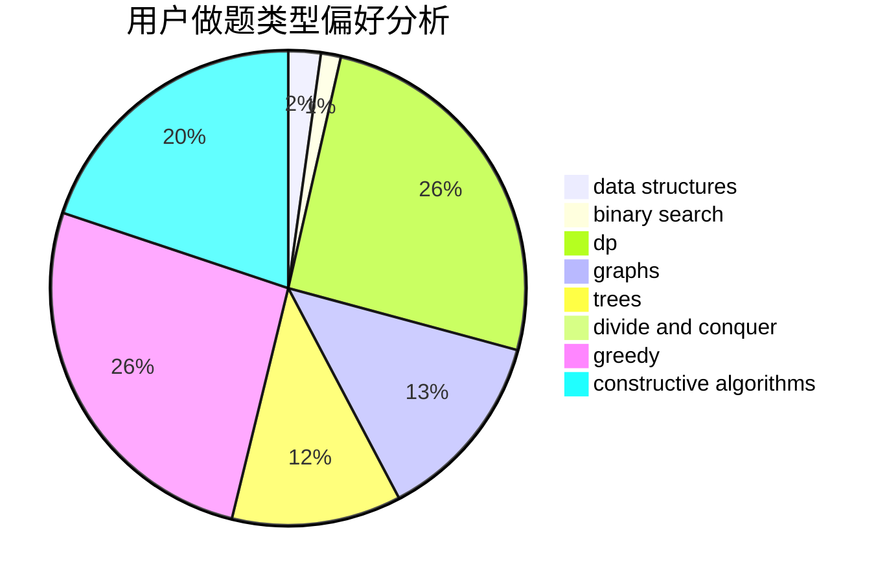
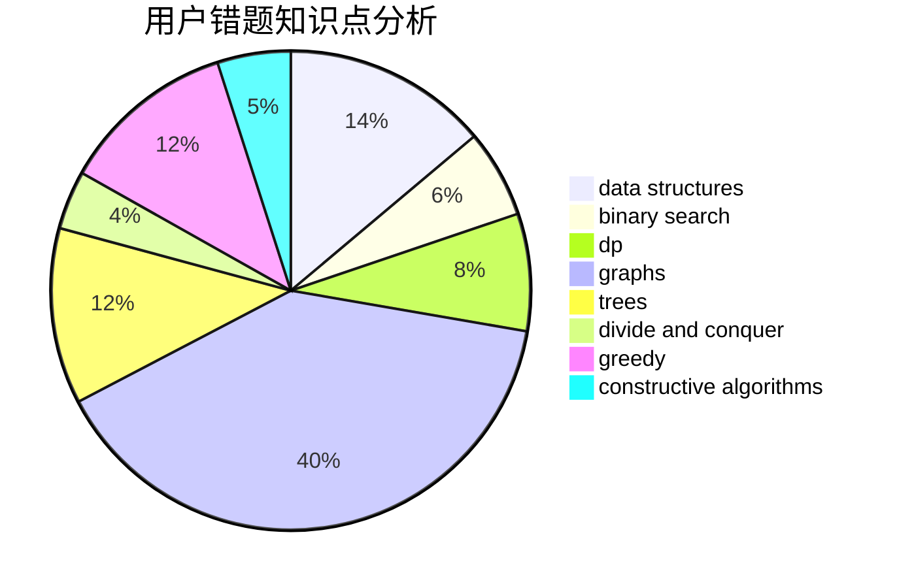

# Unity_wc
<!-- tabs:start -->
#### **用户提交结果分析**

#### **用户做题类型偏好分析**

#### **用户错题知识点分析**

<!-- tabs:end -->
# 推荐题目
[Cyclic Components](http://codeforces.com/problemset/problem/977/E)		dfs and similar,
                        dsu,
                        graphs		  
[Correcting Mistakes](http://codeforces.com/problemset/problem/533/E)		constructive algorithms,
                        dp,
                        greedy,
                        hashing,
                        strings,
                        two pointers		  
[You Are Given a Tree](http://codeforces.com/problemset/problem/1039/D)		data structures,
                        dp,
                        trees		  
[Buying Shovels](http://codeforces.com/problemset/problem/1360/D)		math,
                        number theory		  
[Kamil and Making a Stream](https://codeforces.com/contest/1229/problem/B)		math,
                        number theory,
                        trees		  
[A + B Strikes Back](http://codeforces.com/problemset/problem/409/H)		*special problem,
                        brute force,
                        constructive algorithms,
                        dsu,
                        implementation		  
[Ebony and Ivory](http://codeforces.com/problemset/problem/633/A)		brute force,
                        math,
                        number theory		  
[Parallelogram is Back](http://codeforces.com/problemset/problem/749/B)		brute force,
                        constructive algorithms,
                        geometry		  
[Tree](http://codeforces.com/problemset/problem/468/D)		graph matchings		  
[Petya and Strings](http://codeforces.com/problemset/problem/112/A)		implementation,
                        strings		  
<!-- tabs:start -->
#### **data structures**
[Cyclic Components](http://codeforces.com/problemset/problem/1039/D)		data structures,
                        dp,
                        trees		  
[Correcting Mistakes](http://codeforces.com/problemset/problem/893/F)		data structures,
                        trees		  
[You Are Given a Tree](https://codeforces.com/contest/1459/problem/F)		data structures,
                        graphs,
                        greedy		  
[Buying Shovels](http://codeforces.com/problemset/problem/1492/C)		binary search,
                        data structures,
                        dp,
                        greedy,
                        two pointers		  
[Kamil and Making a Stream](http://codeforces.com/problemset/problem/1490/G)		binary search,
                        data structures,
                        math		  
[A + B Strikes Back](http://codeforces.com/problemset/problem/1479/D)		binary search,
                        bitmasks,
                        brute force,
                        data structures,
                        probabilities,
                        trees		  
[Ebony and Ivory](http://codeforces.com/problemset/problem/1497/A)		brute force,
                        data structures,
                        greedy,
                        sortings		  
[Parallelogram is Back](http://codeforces.com/problemset/problem/1491/C)		brute force,
                        data structures,
                        dp,
                        greedy,
                        implementation		  
[Tree](http://codeforces.com/problemset/problem/1492/B)		data structures,
                        greedy,
                        math		  
[Petya and Strings](http://codeforces.com/problemset/problem/1436/E)		binary search,
                        data structures,
                        two pointers		  
#### **binary search**
[Cyclic Components](http://codeforces.com/problemset/problem/1271/E)		binary search,
                        combinatorics,
                        dp,
                        math		  
[Correcting Mistakes](http://codeforces.com/problemset/problem/1492/C)		binary search,
                        data structures,
                        dp,
                        greedy,
                        two pointers		  
[You Are Given a Tree](http://codeforces.com/problemset/problem/1463/D)		binary search,
                        constructive algorithms,
                        greedy,
                        two pointers		  
[Buying Shovels](http://codeforces.com/problemset/problem/1490/G)		binary search,
                        data structures,
                        math		  
[Kamil and Making a Stream](http://codeforces.com/problemset/problem/1479/D)		binary search,
                        bitmasks,
                        brute force,
                        data structures,
                        probabilities,
                        trees		  
[A + B Strikes Back](http://codeforces.com/problemset/problem/1436/E)		binary search,
                        data structures,
                        two pointers		  
[Ebony and Ivory](http://codeforces.com/problemset/problem/1461/D)		binary search,
                        brute force,
                        data structures,
                        divide and conquer,
                        implementation,
                        sortings		  
[Parallelogram is Back](http://codeforces.com/problemset/problem/1493/C)		binary search,
                        brute force,
                        constructive algorithms,
                        greedy,
                        strings		  
[Tree](http://codeforces.com/problemset/problem/1487/D)		binary search,
                        brute force,
                        math,
                        number theory		  
[Petya and Strings](http://codeforces.com/problemset/problem/1486/B)		binary search,
                        geometry,
                        shortest paths,
                        sortings		  
#### **dp**
[Cyclic Components](http://codeforces.com/problemset/problem/533/E)		constructive algorithms,
                        dp,
                        greedy,
                        hashing,
                        strings,
                        two pointers		  
[Correcting Mistakes](http://codeforces.com/problemset/problem/1039/D)		data structures,
                        dp,
                        trees		  
[You Are Given a Tree](http://codeforces.com/problemset/problem/294/E)		dp,
                        trees		  
[Buying Shovels](http://codeforces.com/problemset/problem/208/C)		dp,
                        graphs,
                        shortest paths		  
[Kamil and Making a Stream](http://codeforces.com/problemset/problem/1091/D)		combinatorics,
                        dp,
                        math		  
[A + B Strikes Back](http://codeforces.com/problemset/problem/1292/D)		dp,
                        graphs,
                        greedy,
                        math,
                        number theory,
                        trees		  
[Ebony and Ivory](http://codeforces.com/problemset/problem/1276/A)		dp,
                        greedy		  
[Parallelogram is Back](https://codeforces.com/contest/667/problem/C)		dp,
                        implementation,
                        strings		  
[Tree](http://codeforces.com/problemset/problem/1271/E)		binary search,
                        combinatorics,
                        dp,
                        math		  
[Petya and Strings](http://codeforces.com/problemset/problem/1029/E)		dp,
                        graphs,
                        greedy		  
#### **graph**
[Cyclic Components](http://codeforces.com/problemset/problem/977/E)		dfs and similar,
                        dsu,
                        graphs		  
[Correcting Mistakes](http://codeforces.com/problemset/problem/468/D)		graph matchings		  
[You Are Given a Tree](http://codeforces.com/problemset/problem/1333/D)		brute force,
                        constructive algorithms,
                        games,
                        graphs,
                        greedy,
                        implementation,
                        sortings		  
[Buying Shovels](https://codeforces.com/contest/1350/problem/E)		dfs and similar,
                        graphs,
                        implementation,
                        shortest paths		  
[Kamil and Making a Stream](http://codeforces.com/problemset/problem/208/C)		dp,
                        graphs,
                        shortest paths		  
[A + B Strikes Back](https://codeforces.com/contest/782/problem/E)		constructive algorithms,
                        dfs and similar,
                        graphs		  
[Ebony and Ivory](http://codeforces.com/problemset/problem/1292/D)		dp,
                        graphs,
                        greedy,
                        math,
                        number theory,
                        trees		  
[Parallelogram is Back](https://codeforces.com/contest/1459/problem/F)		data structures,
                        graphs,
                        greedy		  
[Tree](http://codeforces.com/problemset/problem/1029/E)		dp,
                        graphs,
                        greedy		  
[Petya and Strings](http://codeforces.com/problemset/problem/1487/C)		brute force,
                        constructive algorithms,
                        dfs and similar,
                        graphs,
                        greedy,
                        implementation,
                        math		  
#### **trees**
[Cyclic Components](http://codeforces.com/problemset/problem/1039/D)		data structures,
                        dp,
                        trees		  
[Correcting Mistakes](https://codeforces.com/contest/1229/problem/B)		math,
                        number theory,
                        trees		  
[You Are Given a Tree](http://codeforces.com/problemset/problem/893/F)		data structures,
                        trees		  
[Buying Shovels](http://codeforces.com/problemset/problem/294/E)		dp,
                        trees		  
[Kamil and Making a Stream](http://codeforces.com/problemset/problem/1292/D)		dp,
                        graphs,
                        greedy,
                        math,
                        number theory,
                        trees		  
[A + B Strikes Back](http://codeforces.com/problemset/problem/1479/D)		binary search,
                        bitmasks,
                        brute force,
                        data structures,
                        probabilities,
                        trees		  
[Ebony and Ivory](http://codeforces.com/problemset/problem/1511/C)		brute force,
                        data structures,
                        implementation,
                        trees		  
[Parallelogram is Back](http://codeforces.com/problemset/problem/1499/F)		combinatorics,
                        dfs and similar,
                        dp,
                        trees		  
[Tree](http://codeforces.com/problemset/problem/1491/E)		brute force,
                        dfs and similar,
                        divide and conquer,
                        number theory,
                        trees		  
[Petya and Strings](http://codeforces.com/problemset/problem/1466/D)		data structures,
                        greedy,
                        sortings,
                        trees		  
#### **divide and conquer**
[Cyclic Components](http://codeforces.com/problemset/problem/1461/D)		binary search,
                        brute force,
                        data structures,
                        divide and conquer,
                        implementation,
                        sortings		  
[Correcting Mistakes](http://codeforces.com/problemset/problem/1466/G)		combinatorics,
                        divide and conquer,
                        hashing,
                        math,
                        string suffix structures,
                        strings		  
[You Are Given a Tree](http://codeforces.com/problemset/problem/1490/D)		dfs and similar,
                        divide and conquer,
                        implementation		  
[Buying Shovels](https://codeforces.com/contest/1483/problem/C)		data structures,
                        divide and conquer,
                        dp		  
[Kamil and Making a Stream](http://codeforces.com/problemset/problem/1491/E)		brute force,
                        dfs and similar,
                        divide and conquer,
                        number theory,
                        trees		  
[A + B Strikes Back](http://codeforces.com/problemset/problem/1303/G)		data structures,
                        divide and conquer,
                        geometry,
                        trees		  
[Ebony and Ivory](http://codeforces.com/problemset/problem/1494/D)		constructive algorithms,
                        data structures,
                        dfs and similar,
                        divide and conquer,
                        dsu,
                        greedy,
                        sortings,
                        trees		  
[Parallelogram is Back](http://codeforces.com/problemset/problem/1482/E)		data structures,
                        divide and conquer,
                        dp		  
[Tree](http://codeforces.com/problemset/problem/566/C)		dfs and similar,
                        divide and conquer,
                        trees		  
[Petya and Strings](http://codeforces.com/problemset/problem/1428/F)		binary search,
                        data structures,
                        divide and conquer,
                        dp,
                        two pointers		  
#### **greedy**
[Cyclic Components](http://codeforces.com/problemset/problem/533/E)		constructive algorithms,
                        dp,
                        greedy,
                        hashing,
                        strings,
                        two pointers		  
[Correcting Mistakes](https://codeforces.com/contest/516/problem/B)		constructive algorithms,
                        greedy		  
[You Are Given a Tree](http://codeforces.com/problemset/problem/609/A)		greedy,
                        implementation,
                        sortings		  
[Buying Shovels](http://codeforces.com/problemset/problem/1333/D)		brute force,
                        constructive algorithms,
                        games,
                        graphs,
                        greedy,
                        implementation,
                        sortings		  
[Kamil and Making a Stream](https://codeforces.com/contest/790/problem/A)		constructive algorithms,
                        greedy		  
[A + B Strikes Back](http://codeforces.com/problemset/problem/1292/D)		dp,
                        graphs,
                        greedy,
                        math,
                        number theory,
                        trees		  
[Ebony and Ivory](https://codeforces.com/contest/1459/problem/F)		data structures,
                        graphs,
                        greedy		  
[Parallelogram is Back](http://codeforces.com/problemset/problem/1276/A)		dp,
                        greedy		  
[Tree](http://codeforces.com/problemset/problem/1419/B)		brute force,
                        constructive algorithms,
                        greedy,
                        implementation,
                        math		  
[Petya and Strings](http://codeforces.com/problemset/problem/1029/E)		dp,
                        graphs,
                        greedy		  
#### **constructive algorithms**
[Cyclic Components](http://codeforces.com/problemset/problem/533/E)		constructive algorithms,
                        dp,
                        greedy,
                        hashing,
                        strings,
                        two pointers		  
[Correcting Mistakes](http://codeforces.com/problemset/problem/409/H)		*special problem,
                        brute force,
                        constructive algorithms,
                        dsu,
                        implementation		  
[You Are Given a Tree](http://codeforces.com/problemset/problem/749/B)		brute force,
                        constructive algorithms,
                        geometry		  
[Buying Shovels](https://codeforces.com/contest/516/problem/B)		constructive algorithms,
                        greedy		  
[Kamil and Making a Stream](http://codeforces.com/problemset/problem/183/A)		constructive algorithms,
                        math		  
[A + B Strikes Back](http://codeforces.com/problemset/problem/1333/D)		brute force,
                        constructive algorithms,
                        games,
                        graphs,
                        greedy,
                        implementation,
                        sortings		  
[Ebony and Ivory](https://codeforces.com/contest/790/problem/A)		constructive algorithms,
                        greedy		  
[Parallelogram is Back](http://codeforces.com/problemset/problem/1136/C)		constructive algorithms,
                        sortings		  
[Tree](https://codeforces.com/contest/782/problem/E)		constructive algorithms,
                        dfs and similar,
                        graphs		  
[Petya and Strings](https://codeforces.com/contest/1262/problem/B)		constructive algorithms		  
#### **sortings**
[Cyclic Components](http://codeforces.com/problemset/problem/1294/B)		implementation,
                        sortings		  
[Correcting Mistakes](http://codeforces.com/problemset/problem/609/A)		greedy,
                        implementation,
                        sortings		  
[You Are Given a Tree](http://codeforces.com/problemset/problem/1333/D)		brute force,
                        constructive algorithms,
                        games,
                        graphs,
                        greedy,
                        implementation,
                        sortings		  
[Buying Shovels](http://codeforces.com/problemset/problem/1136/C)		constructive algorithms,
                        sortings		  
[Kamil and Making a Stream](https://codeforces.com/contest/1496/problem/C)		geometry,
                        greedy,
                        math,
                        sortings		  
[A + B Strikes Back](http://codeforces.com/problemset/problem/1495/A)		geometry,
                        greedy,
                        math,
                        sortings		  
[Ebony and Ivory](http://codeforces.com/problemset/problem/1497/A)		brute force,
                        data structures,
                        greedy,
                        sortings		  
[Parallelogram is Back](http://codeforces.com/problemset/problem/1427/A)		math,
                        sortings		  
[Tree](http://codeforces.com/problemset/problem/1461/D)		binary search,
                        brute force,
                        data structures,
                        divide and conquer,
                        implementation,
                        sortings		  
[Petya and Strings](http://codeforces.com/problemset/problem/1437/C)		dp,
                        flows,
                        graph matchings,
                        greedy,
                        math,
                        sortings		  
<!-- tabs:end -->
