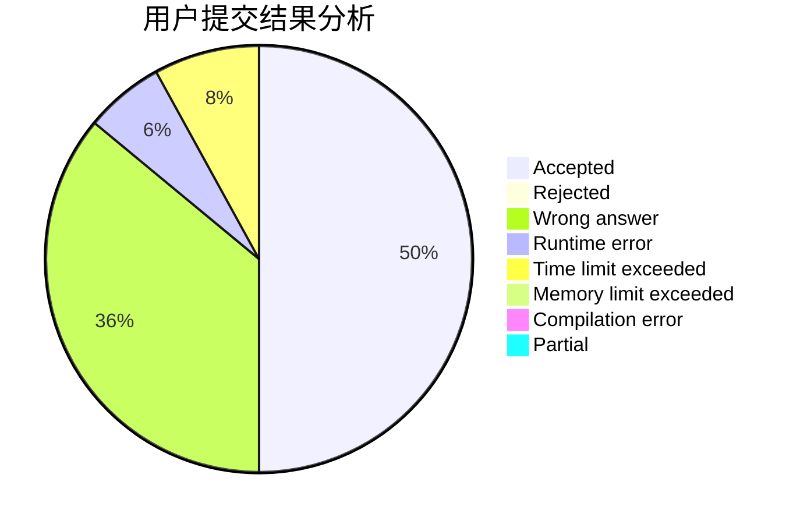
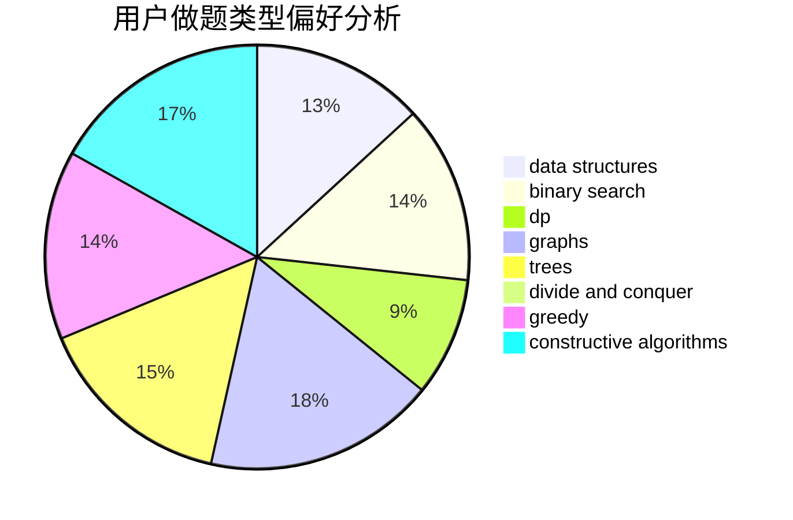
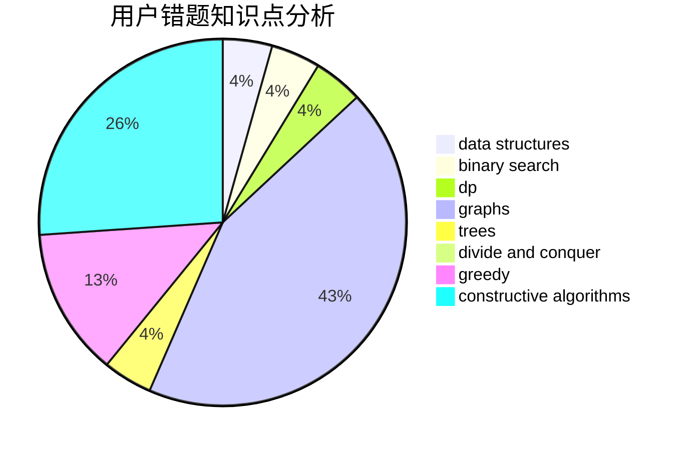

# Unkowing

<!-- tabs:start -->

#### **用户提交结果分析**

#### **用户做题类型偏好分析**

#### **用户错题知识点分析**

<!-- tabs:end -->
# 推荐题目
[963E](https://codeforces.com/contest/963/problem/E)		math		  
[1228D](https://codeforces.com/contest/1228/problem/D)		brute force,
                        constructive algorithms,
                        graphs,
                        hashing,
                        implementation		  
[1146A](https://codeforces.com/contest/1146/problem/A)		implementation,
                        strings		  
[1023A](https://codeforces.com/contest/1023/problem/A)		brute force,
                        implementation,
                        strings		  
[1470D](https://codeforces.com/contest/1470/problem/D)		constructive algorithms,
                        dfs and similar,
                        graph matchings,
                        graphs,
                        greedy		  
[584E](https://codeforces.com/contest/584/problem/E)		constructive algorithms,
                        greedy,
                        math		  
[996F](https://codeforces.com/contest/996/problem/F)		dsu,graphs,sortings,trees		  
[1210E](https://codeforces.com/contest/1210/problem/E)		math		  
[794C](https://codeforces.com/contest/794/problem/C)		games,
                        greedy,
                        sortings		  
[630R](https://codeforces.com/contest/630/problem/R)		games,
                        math		  
