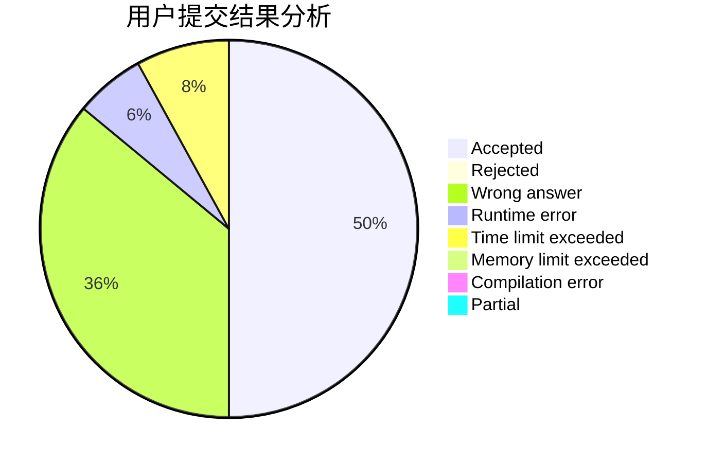
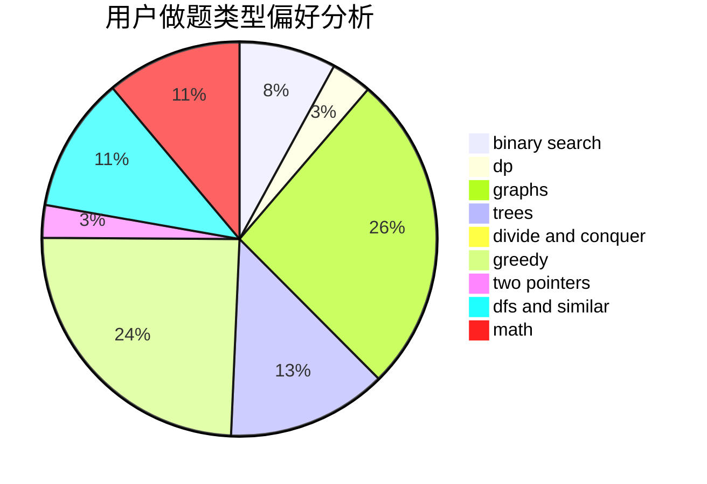

# Unkowing

<!-- tabs:start -->

#### **用户提交结果分析**

#### **用户做题类型偏好分析**

<!-- tabs:end -->
# 推荐题目
[963E](https://codeforces.com/contest/963/problem/E)
[1228D](https://codeforces.com/contest/1228/problem/D)
[1146A](https://codeforces.com/contest/1146/problem/A)
[1023A](https://codeforces.com/contest/1023/problem/A)
[1470D](https://codeforces.com/contest/1470/problem/D)
[584E](https://codeforces.com/contest/584/problem/E)
[996F](https://codeforces.com/contest/996/problem/F)
[1210E](https://codeforces.com/contest/1210/problem/E)
[794C](https://codeforces.com/contest/794/problem/C)
[630R](https://codeforces.com/contest/630/problem/R)
