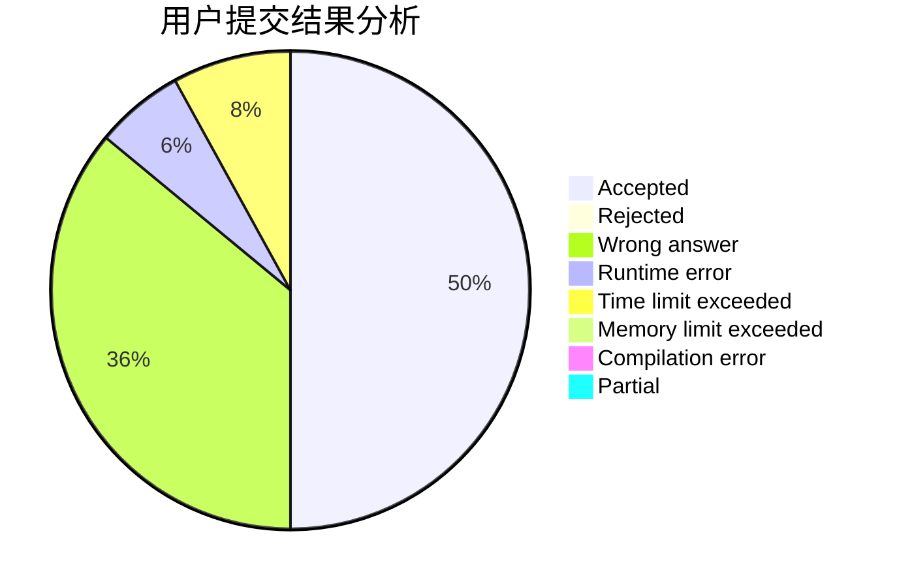
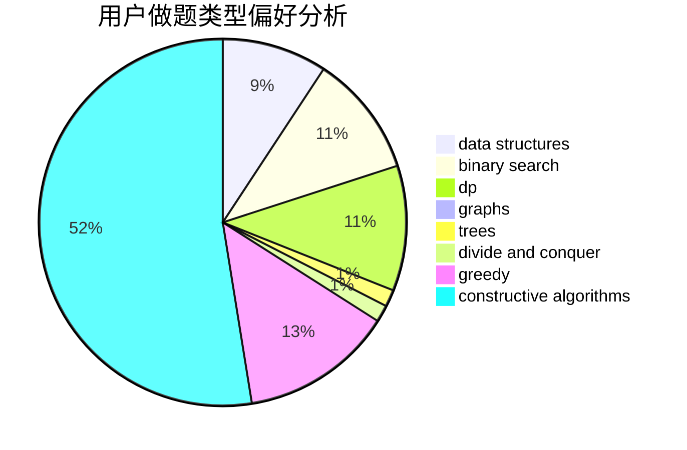
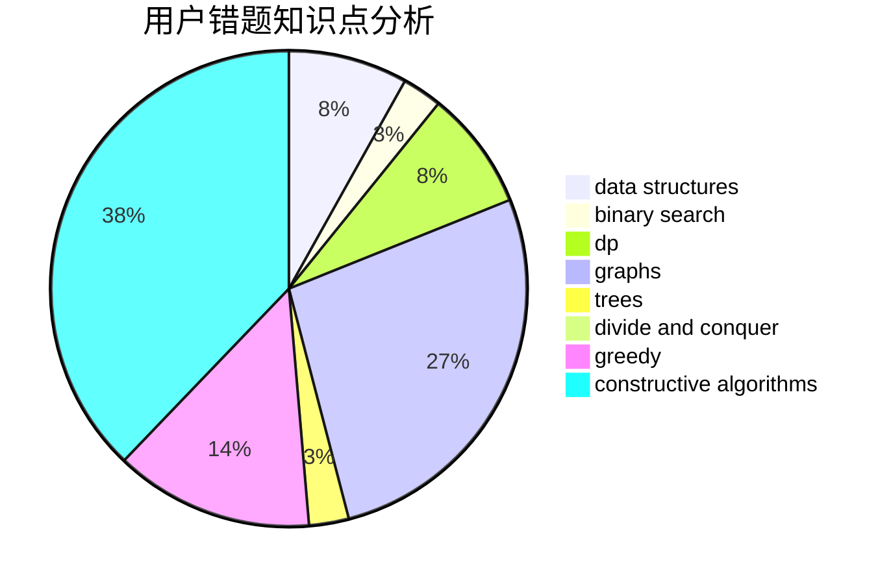

# Unkowing

<!-- tabs:start -->

#### **用户提交结果分析**

#### **用户做题类型偏好分析**

#### **用户错题知识点分析**

<!-- tabs:end -->
# 推荐题目
[947A](https://codeforces.com/contest/947/problem/A)		dsu,graphs,sortings,trees		  
[1220D](https://codeforces.com/contest/1220/problem/D)		bitmasks,
                        math,
                        number theory		  
[1143F](https://codeforces.com/contest/1143/problem/F)		dsu,graphs,sortings,trees		  
[1020C](https://codeforces.com/contest/1020/problem/C)		dsu,graphs,sortings,trees		  
[1463C](https://codeforces.com/contest/1463/problem/C)		implementation		  
[566A](https://codeforces.com/contest/566/problem/A)		dfs and similar,
                        strings,
                        trees		  
[981E](https://codeforces.com/contest/981/problem/E)		bitmasks,
                        data structures,
                        divide and conquer,
                        dp		  
[1206D](https://codeforces.com/contest/1206/problem/D)		dsu,graphs,sortings,trees		  
[776D](https://codeforces.com/contest/776/problem/D)		2-sat,
                        dfs and similar,
                        dsu,
                        graphs		  
[611G](https://codeforces.com/contest/611/problem/G)		geometry,
                        two pointers		  
