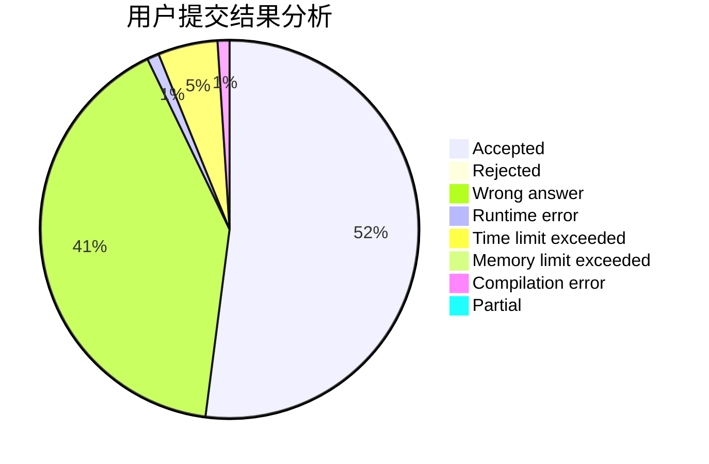
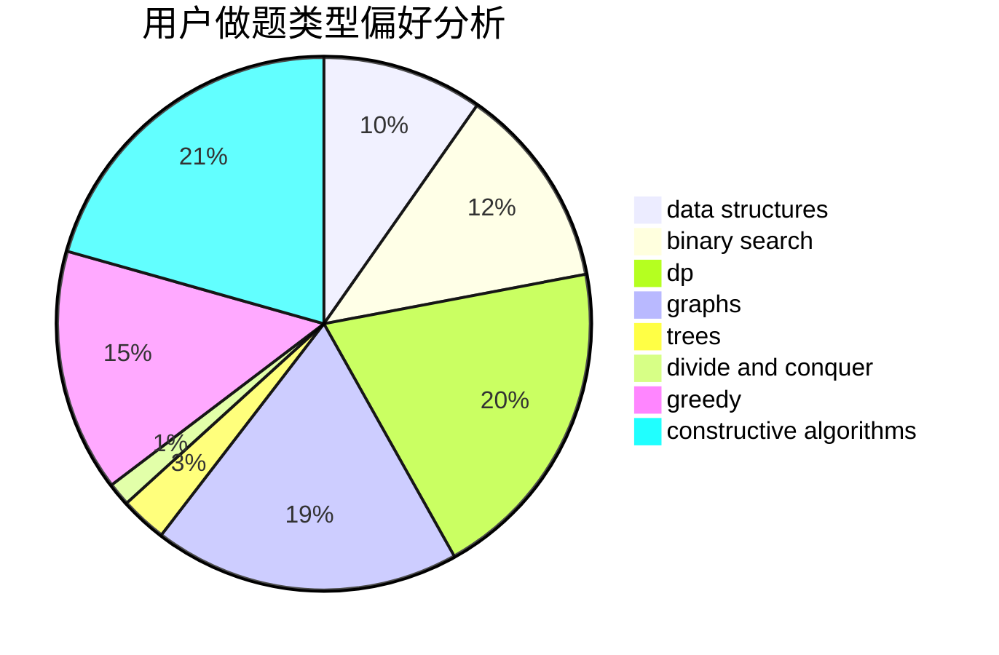
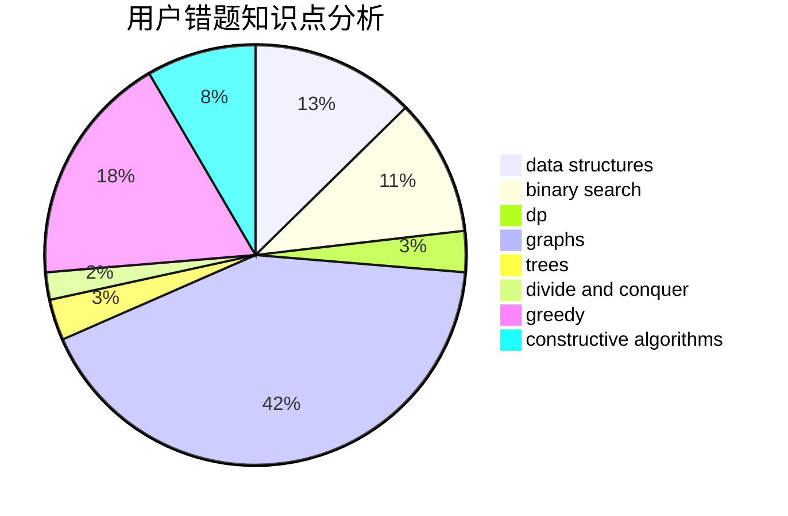

# Ahaooops

<!-- tabs:start -->

#### **用户提交结果分析**

#### **用户做题类型偏好分析**

#### **用户错题知识点分析**

<!-- tabs:end -->
# 推荐题目
[1077A](https://codeforces.com/contest/1077/problem/A)		math		  
[198B](https://codeforces.com/contest/198/problem/B)		shortest paths		  
[113D](https://codeforces.com/contest/113/problem/D)		math,
                        matrices,
                        probabilities		  
[1003F](https://codeforces.com/contest/1003/problem/F)		dp,
                        hashing,
                        strings		  
[199E](https://codeforces.com/contest/199/problem/E)		dsu,graphs,sortings,trees		  
[199D](https://codeforces.com/contest/199/problem/D)		dsu,graphs,sortings,trees		  
[1350D](https://codeforces.com/contest/1350/problem/D)		dsu,graphs,sortings,trees		  
[1110H](https://codeforces.com/contest/1110/problem/H)		dp,
                        strings		  
[197A](https://codeforces.com/contest/197/problem/A)		constructive algorithms,
                        games,
                        math		  
[1116D3](https://codeforces.com/contest/1116D/problem/3)		nan		  
