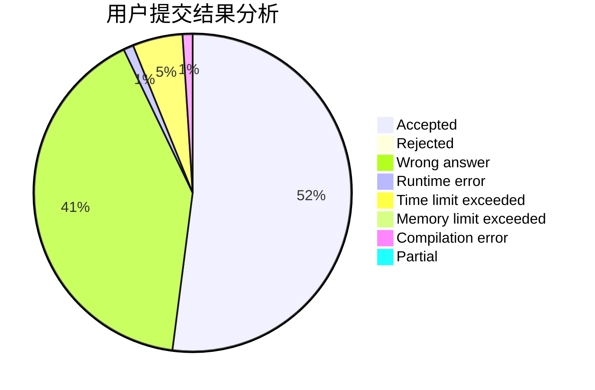
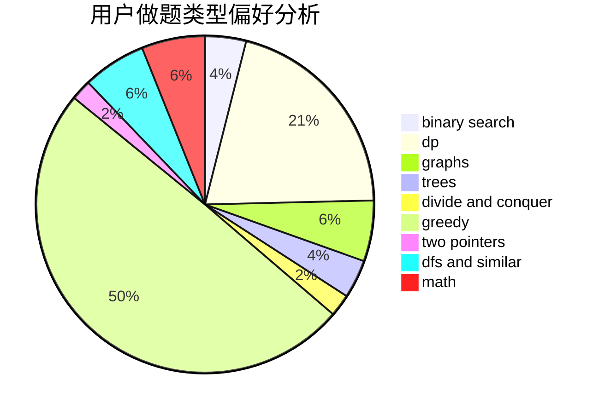

# Ahaooops

<!-- tabs:start -->

#### **用户提交结果分析**

#### **用户做题类型偏好分析**

<!-- tabs:end -->
# 推荐题目
[1077B](https://codeforces.com/contest/1077/problem/B)
[219D](https://codeforces.com/contest/219/problem/D)
[1141D](https://codeforces.com/contest/1141/problem/D)
[1004C](https://codeforces.com/contest/1004/problem/C)
[220E](https://codeforces.com/contest/220/problem/E)
[220C](https://codeforces.com/contest/220/problem/C)
[13577](https://codeforces.com/contest/1357/problem/7)
[1111C](https://codeforces.com/contest/1111/problem/C)
[219A](https://codeforces.com/contest/219/problem/A)
[1118C](https://codeforces.com/contest/1118/problem/C)
