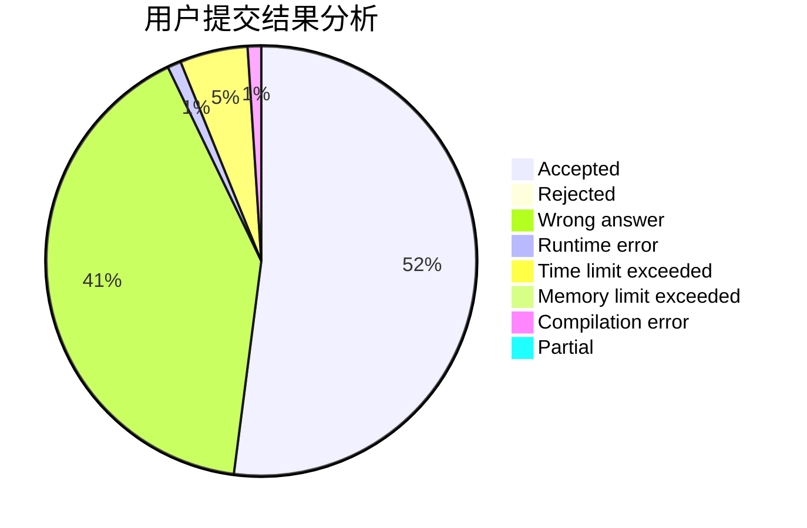
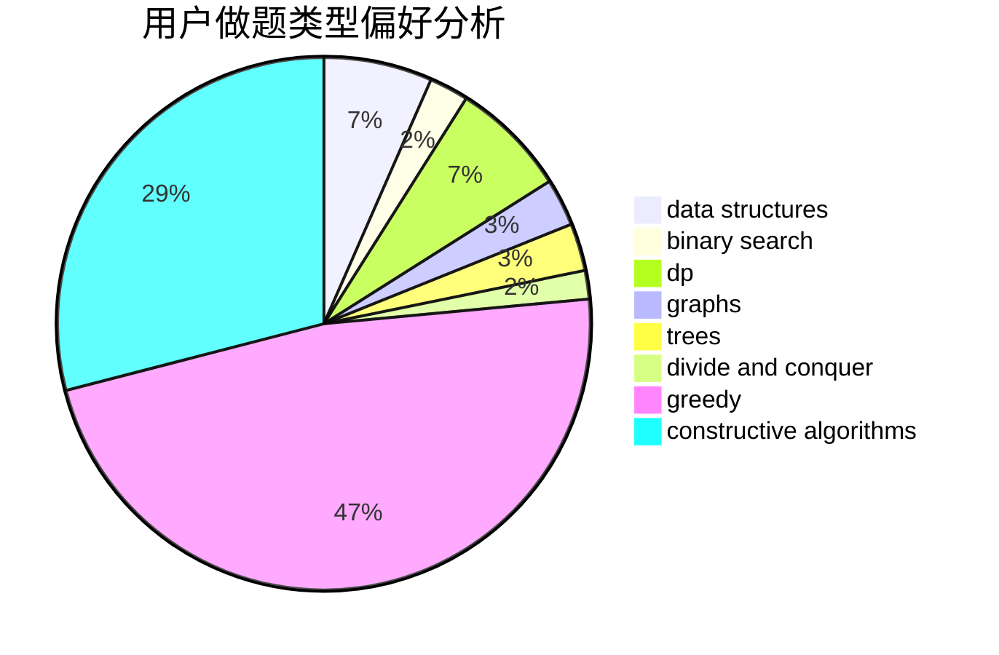
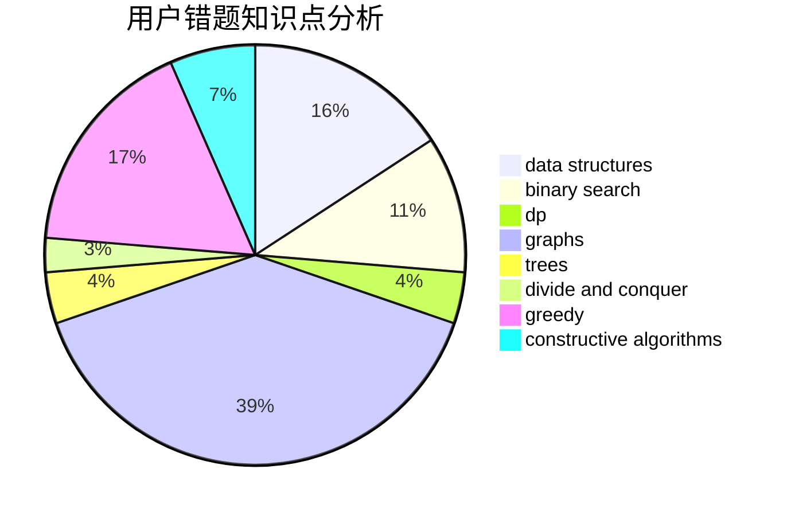

# Ahaooops

<!-- tabs:start -->

#### **用户提交结果分析**

#### **用户做题类型偏好分析**

#### **用户错题知识点分析**

<!-- tabs:end -->
# 推荐题目
[1077B](https://codeforces.com/contest/1077/problem/B)		greedy		  
[219D](https://codeforces.com/contest/219/problem/D)		dfs and similar,
                        dp,
                        graphs,
                        trees		  
[1141D](https://codeforces.com/contest/1141/problem/D)		greedy,
                        implementation		  
[1004C](https://codeforces.com/contest/1004/problem/C)		constructive algorithms,
                        implementation		  
[220E](https://codeforces.com/contest/220/problem/E)		data structures,
                        two pointers		  
[220C](https://codeforces.com/contest/220/problem/C)		data structures		  
[13577](https://codeforces.com/contest/1357/problem/7)		dsu,graphs,sortings,trees		  
[1111C](https://codeforces.com/contest/1111/problem/C)		binary search,
                        brute force,
                        divide and conquer,
                        math		  
[219A](https://codeforces.com/contest/219/problem/A)		implementation,
                        strings		  
[1118C](https://codeforces.com/contest/1118/problem/C)		constructive algorithms,
                        implementation		  
