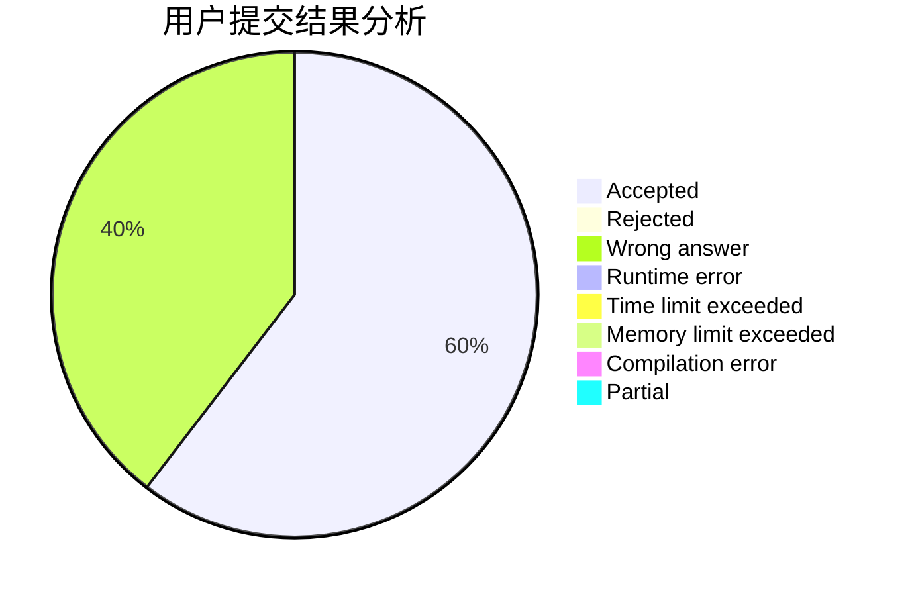
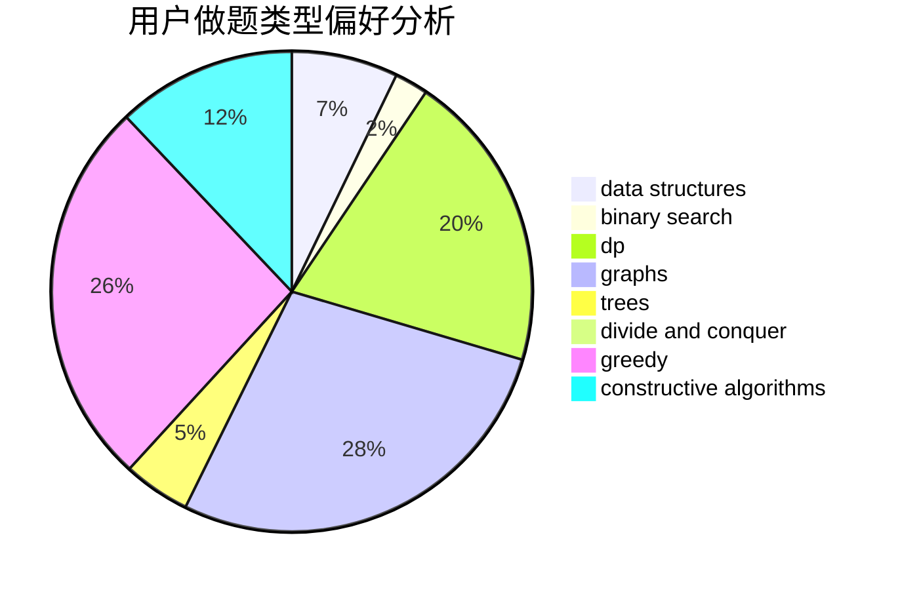
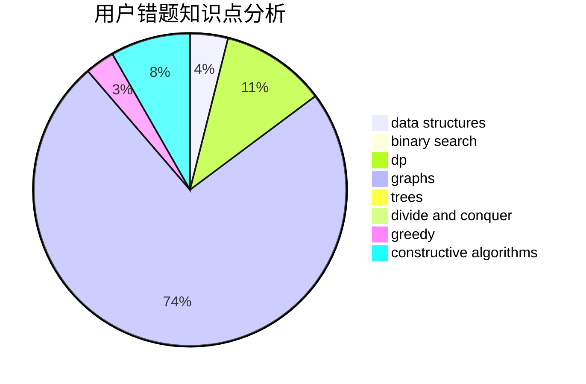

# Unstoppable728

<!-- tabs:start -->

#### **用户提交结果分析**

#### **用户做题类型偏好分析**

#### **用户错题知识点分析**

<!-- tabs:end -->
# 推荐题目
[1454F](https://codeforces.com/contest/1454/problem/F)		binary search,
                        data structures,
                        greedy,
                        two pointers		  
[197A](https://codeforces.com/contest/197/problem/A)		constructive algorithms,
                        games,
                        math		  
[165C](https://codeforces.com/contest/165/problem/C)		binary search,
                        brute force,
                        dp,
                        math,
                        strings,
                        two pointers		  
[1034A](https://codeforces.com/contest/1034/problem/A)		number theory		  
[715B](https://codeforces.com/contest/715/problem/B)		binary search,
                        constructive algorithms,
                        graphs,
                        shortest paths		  
[967C](https://codeforces.com/contest/967/problem/C)		dsu,graphs,sortings,trees		  
[1380E](https://codeforces.com/contest/1380/problem/E)		data structures,
                        dsu,
                        implementation,
                        trees		  
[319C](https://codeforces.com/contest/319/problem/C)		dp,
                        geometry		  
[245A](https://codeforces.com/contest/245/problem/A)		implementation		  
[1355A](https://codeforces.com/contest/1355/problem/A)		brute force,
                        implementation,
                        math		  
