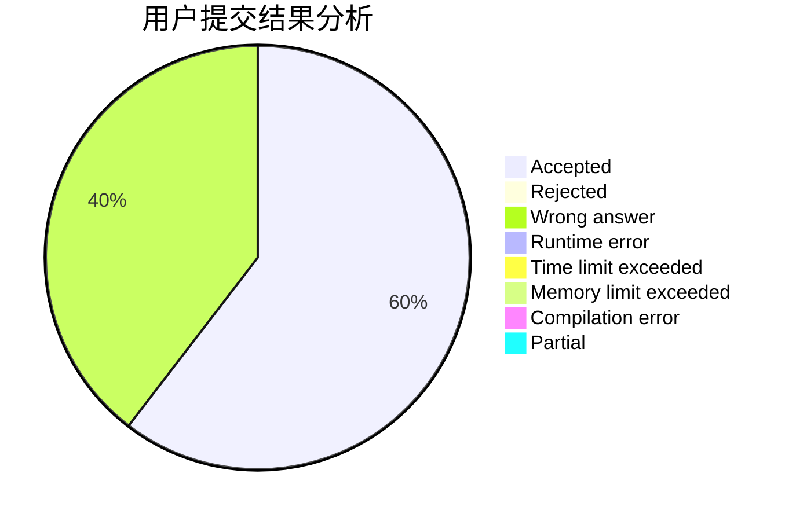
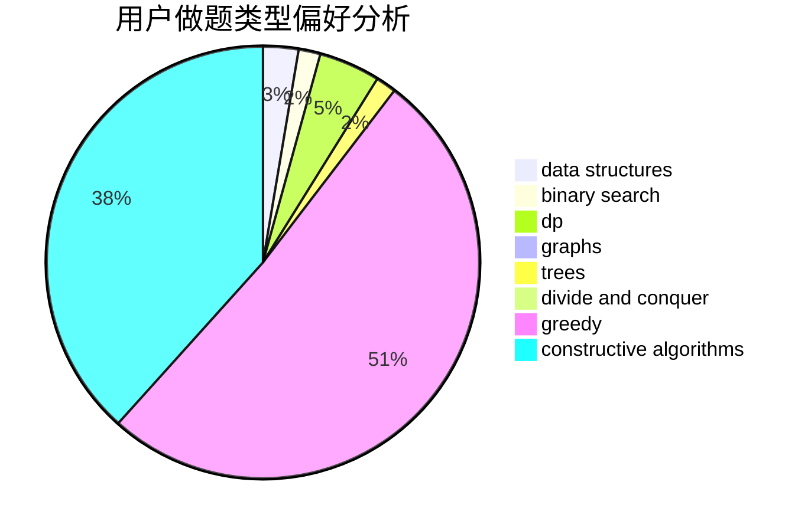
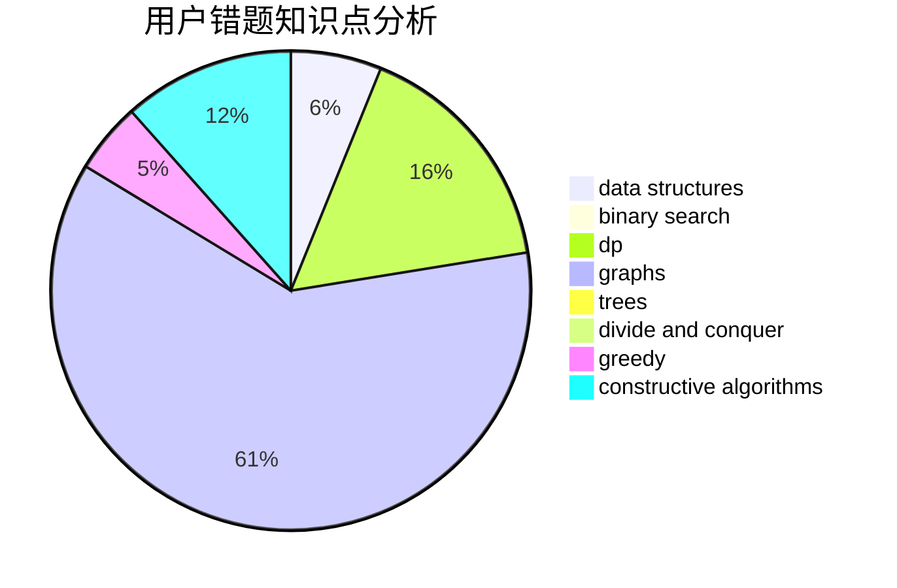

# Unstoppable728

<!-- tabs:start -->

#### **用户提交结果分析**

#### **用户做题类型偏好分析**

#### **用户错题知识点分析**

<!-- tabs:end -->
# 推荐题目
[1464C](https://codeforces.com/contest/1464/problem/C)		dsu,graphs,sortings,trees		  
[219A](https://codeforces.com/contest/219/problem/A)		implementation,
                        strings		  
[18E](https://codeforces.com/contest/18/problem/E)		dp		  
[1034D](https://codeforces.com/contest/1034/problem/D)		binary search,
                        data structures,
                        two pointers		  
[733D](https://codeforces.com/contest/733/problem/D)		data structures,
                        hashing		  
[988F](https://codeforces.com/contest/988/problem/F)		dp		  
[138C](https://codeforces.com/contest/138/problem/C)		binary search,
                        data structures,
                        probabilities,
                        sortings		  
[34C](https://codeforces.com/contest/34/problem/C)		expression parsing,
                        implementation,
                        sortings,
                        strings		  
[266A](https://codeforces.com/contest/266/problem/A)		implementation		  
[1361E](https://codeforces.com/contest/1361/problem/E)		dfs and similar,
                        graphs,
                        probabilities,
                        trees		  
