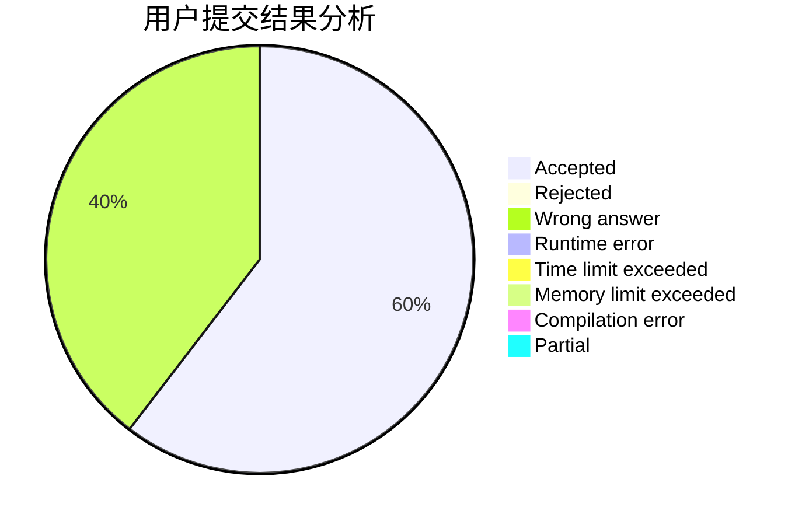
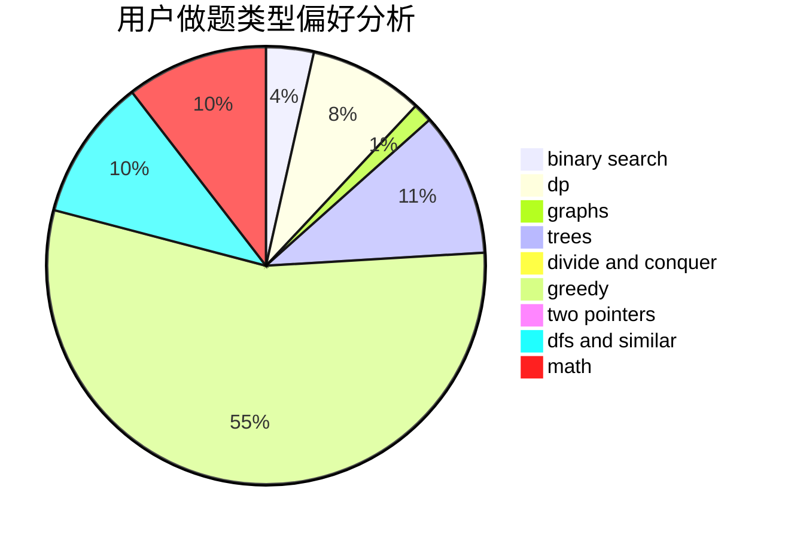

# Unstoppable728

<!-- tabs:start -->

#### **用户提交结果分析**

#### **用户做题类型偏好分析**

<!-- tabs:end -->
# 推荐题目
[1464C](https://codeforces.com/contest/1464/problem/C)
[219A](https://codeforces.com/contest/219/problem/A)
[18E](https://codeforces.com/contest/18/problem/E)
[1034D](https://codeforces.com/contest/1034/problem/D)
[733D](https://codeforces.com/contest/733/problem/D)
[988F](https://codeforces.com/contest/988/problem/F)
[138C](https://codeforces.com/contest/138/problem/C)
[34C](https://codeforces.com/contest/34/problem/C)
[266A](https://codeforces.com/contest/266/problem/A)
[1361E](https://codeforces.com/contest/1361/problem/E)
