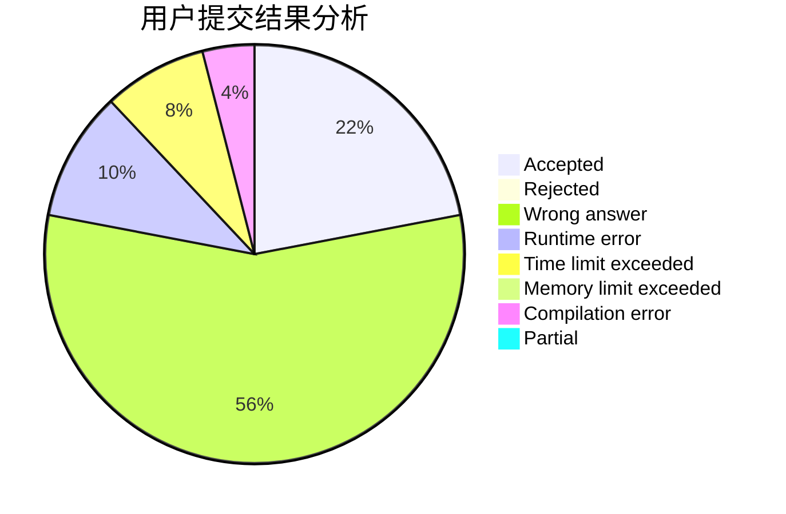
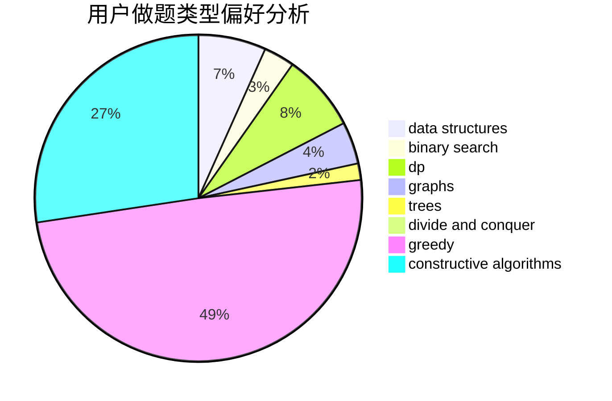
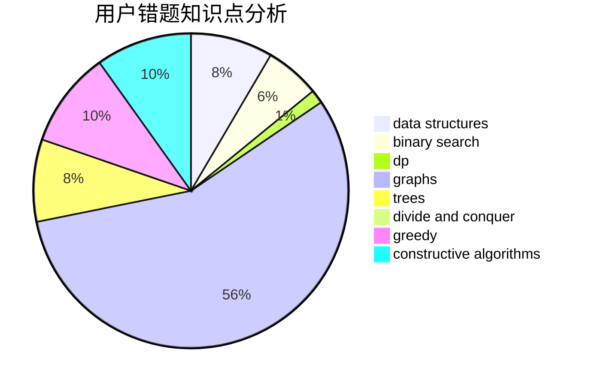

# UpMing

<!-- tabs:start -->

#### **用户提交结果分析**

#### **用户做题类型偏好分析**

#### **用户错题知识点分析**

<!-- tabs:end -->
# 推荐题目
[1375D](https://codeforces.com/contest/1375/problem/D)		brute force,
                        constructive algorithms,
                        sortings		  
[392B](https://codeforces.com/contest/392/problem/B)		dp		  
[1380C](https://codeforces.com/contest/1380/problem/C)		brute force,
                        dp,
                        greedy,
                        implementation,
                        sortings		  
[621C](https://codeforces.com/contest/621/problem/C)		combinatorics,
                        math,
                        number theory,
                        probabilities		  
[1162E](https://codeforces.com/contest/1162/problem/E)		dsu,graphs,sortings,trees		  
[1113A](https://codeforces.com/contest/1113/problem/A)		dp,
                        greedy,
                        math		  
[507B](https://codeforces.com/contest/507/problem/B)		geometry,
                        math		  
[1374C](https://codeforces.com/contest/1374/problem/C)		greedy,
                        strings		  
[808F](https://codeforces.com/contest/808/problem/F)		binary search,
                        flows,
                        graphs		  
[1072D](https://codeforces.com/contest/1072/problem/D)		dsu,graphs,sortings,trees		  
