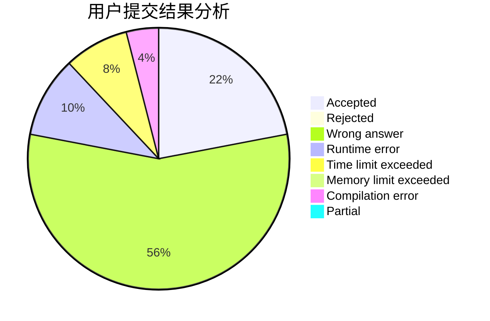
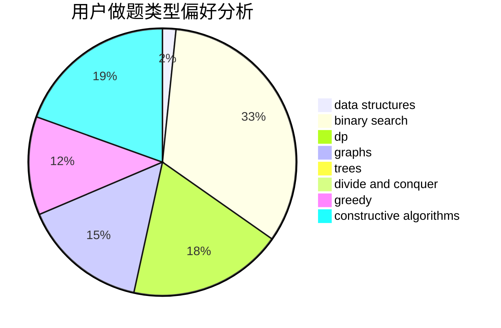
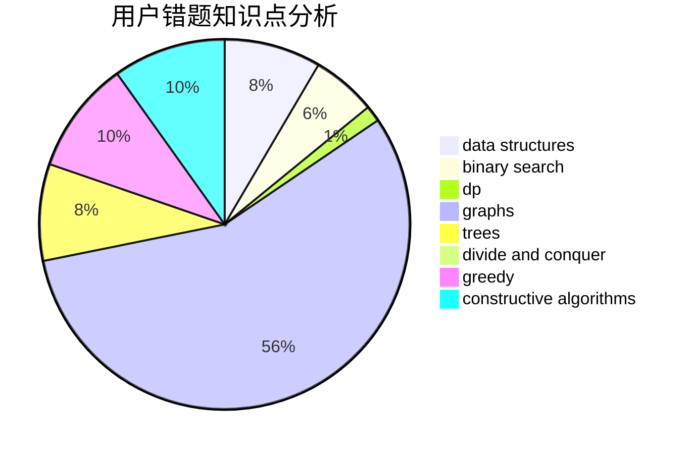

# UpMing

<!-- tabs:start -->

#### **用户提交结果分析**

#### **用户做题类型偏好分析**

#### **用户错题知识点分析**

<!-- tabs:end -->
# 推荐题目
[1368E](https://codeforces.com/contest/1368/problem/E)		constructive algorithms,
                        graphs,
                        greedy		  
[364E](https://codeforces.com/contest/364/problem/E)		divide and conquer,
                        two pointers		  
[1371E1](https://codeforces.com/contest/1371E/problem/1)		binary search,
                        brute force,
                        combinatorics,
                        math,
                        number theory,
                        sortings		  
[602C](https://codeforces.com/contest/602/problem/C)		dsu,graphs,sortings,trees		  
[115A](https://codeforces.com/contest/115/problem/A)		dfs and similar,
                        graphs,
                        trees		  
[1111B](https://codeforces.com/contest/1111/problem/B)		brute force,
                        implementation,
                        math		  
[486C](https://codeforces.com/contest/486/problem/C)		brute force,
                        greedy,
                        implementation		  
[1367F1](https://codeforces.com/contest/1367F/problem/1)		dp,
                        greedy,
                        two pointers		  
[793D](https://codeforces.com/contest/793/problem/D)		dp,
                        graphs,
                        shortest paths		  
[1072A](https://codeforces.com/contest/1072/problem/A)		dsu,graphs,sortings,trees		  
