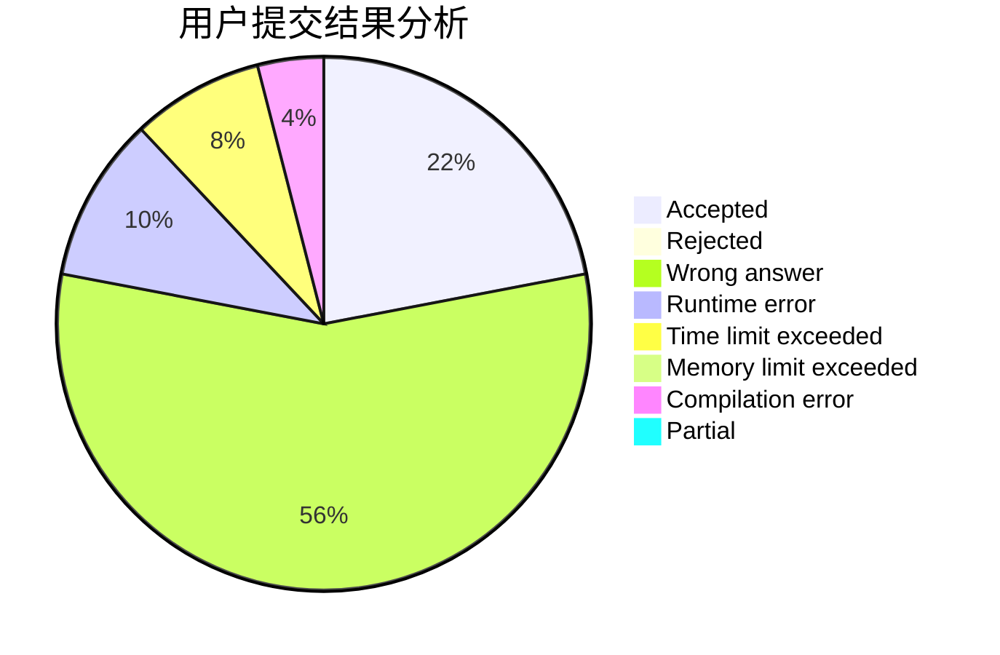
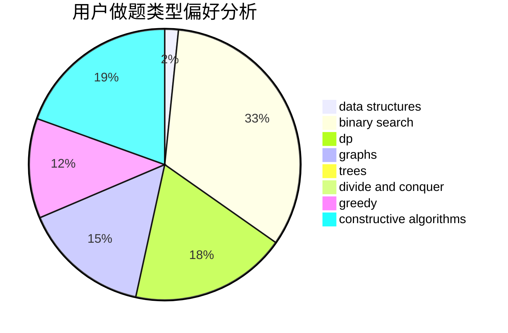
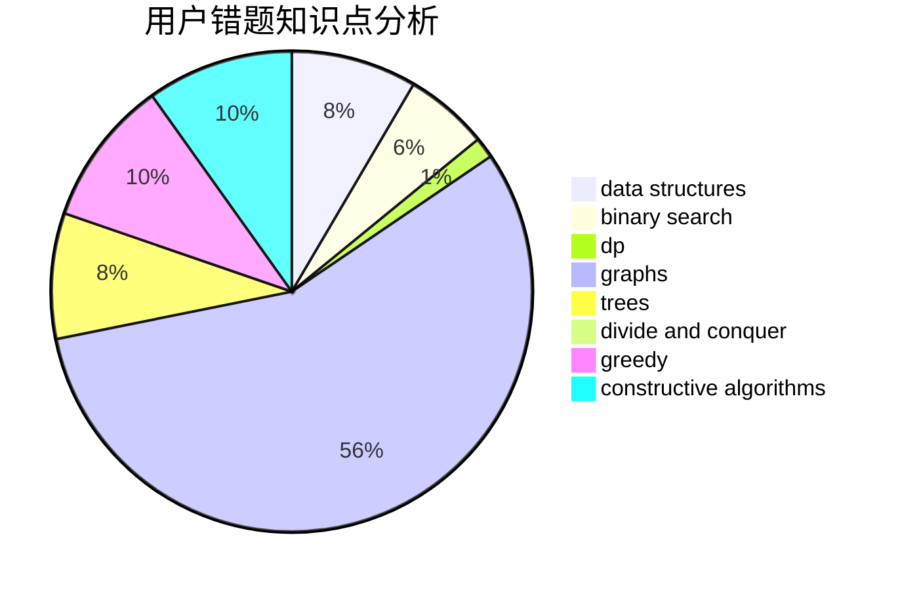

# UpMing
<!-- tabs:start -->
#### **用户提交结果分析**

#### **用户做题类型偏好分析**

#### **用户错题知识点分析**

<!-- tabs:end -->
# 推荐题目
[Asterism (Easy Version)](http://codeforces.com/problemset/problem/1371/E1)		binary search,
                        brute force,
                        combinatorics,
                        math,
                        number theory,
                        sortings		  
[Ski Accidents](http://codeforces.com/problemset/problem/1368/E)		constructive algorithms,
                        graphs,
                        greedy		  
[Presents in Bankopolis](http://codeforces.com/problemset/problem/793/D)		dp,
                        graphs,
                        shortest paths		  
[Palindrome Transformation](http://codeforces.com/problemset/problem/486/C)		brute force,
                        greedy,
                        implementation		  
[Anton and Polyhedrons](http://codeforces.com/problemset/problem/785/A)		implementation,
                        strings		  
[Letters Cyclic Shift](http://codeforces.com/problemset/problem/708/A)		constructive algorithms,
                        greedy,
                        implementation,
                        strings		  
[Mr. Kitayuta vs. Bamboos](https://codeforces.com/contest/506/problem/C)		binary search,
                        greedy		  
[Flying Sort (Easy Version)](http://codeforces.com/problemset/problem/1367/F1)		dp,
                        greedy,
                        two pointers		  
[Beads](http://codeforces.com/problemset/problem/8/E)		dp,
                        graphs		  
[Average Superhero Gang Power](http://codeforces.com/problemset/problem/1111/B)		brute force,
                        implementation,
                        math		  
<!-- tabs:start -->
#### **data structures**
[Asterism (Easy Version)](http://codeforces.com/problemset/problem/551/E)		binary search,
                        data structures,
                        implementation		  
[Ski Accidents](https://codeforces.com/contest/879/problem/D)		data structures,
                        implementation		  
[Presents in Bankopolis](http://codeforces.com/problemset/problem/720/D)		data structures,
                        dp,
                        sortings		  
[Palindrome Transformation](https://codeforces.com/contest/1504/problem/F)		2-sat,
                        constructive algorithms,
                        data structures,
                        greedy,
                        sortings,
                        two pointers		  
[Anton and Polyhedrons](http://codeforces.com/problemset/problem/763/D)		data structures,
                        graphs,
                        hashing,
                        shortest paths,
                        trees		  
[Letters Cyclic Shift](http://codeforces.com/problemset/problem/1430/D)		binary search,
                        data structures,
                        greedy,
                        two pointers		  
[Mr. Kitayuta vs. Bamboos](http://codeforces.com/problemset/problem/739/E)		brute force,
                        data structures,
                        dp,
                        flows,
                        math,
                        probabilities,
                        sortings		  
[Flying Sort (Easy Version)](http://codeforces.com/problemset/problem/1335/E1)		binary search,
                        brute force,
                        data structures,
                        dp,
                        two pointers		  
[Beads](http://codeforces.com/problemset/problem/1257/E)		data structures,
                        dp,
                        greedy		  
[Average Superhero Gang Power](http://codeforces.com/problemset/problem/1473/D)		data structures,
                        dp,
                        implementation,
                        strings		  
#### **binary search**
[Asterism (Easy Version)](http://codeforces.com/problemset/problem/1371/E1)		binary search,
                        brute force,
                        combinatorics,
                        math,
                        number theory,
                        sortings		  
[Ski Accidents](https://codeforces.com/contest/506/problem/C)		binary search,
                        greedy		  
[Presents in Bankopolis](http://codeforces.com/problemset/problem/551/E)		binary search,
                        data structures,
                        implementation		  
[Palindrome Transformation](http://codeforces.com/problemset/problem/1430/D)		binary search,
                        data structures,
                        greedy,
                        two pointers		  
[Anton and Polyhedrons](http://codeforces.com/problemset/problem/1335/E1)		binary search,
                        brute force,
                        data structures,
                        dp,
                        two pointers		  
[Letters Cyclic Shift](http://codeforces.com/problemset/problem/912/E)		binary search,
                        dfs and similar,
                        math,
                        meet-in-the-middle,
                        number theory,
                        two pointers		  
[Mr. Kitayuta vs. Bamboos](http://codeforces.com/problemset/problem/1492/C)		binary search,
                        data structures,
                        dp,
                        greedy,
                        two pointers		  
[Flying Sort (Easy Version)](http://codeforces.com/problemset/problem/1463/D)		binary search,
                        constructive algorithms,
                        greedy,
                        two pointers		  
[Beads](http://codeforces.com/problemset/problem/1490/G)		binary search,
                        data structures,
                        math		  
[Average Superhero Gang Power](http://codeforces.com/problemset/problem/1479/D)		binary search,
                        bitmasks,
                        brute force,
                        data structures,
                        probabilities,
                        trees		  
#### **dp**
[Asterism (Easy Version)](http://codeforces.com/problemset/problem/793/D)		dp,
                        graphs,
                        shortest paths		  
[Ski Accidents](http://codeforces.com/problemset/problem/1367/F1)		dp,
                        greedy,
                        two pointers		  
[Presents in Bankopolis](http://codeforces.com/problemset/problem/8/E)		dp,
                        graphs		  
[Palindrome Transformation](http://codeforces.com/problemset/problem/1185/G2)		combinatorics,
                        dp		  
[Anton and Polyhedrons](http://codeforces.com/problemset/problem/1040/B)		dp,
                        greedy,
                        math		  
[Letters Cyclic Shift](http://codeforces.com/problemset/problem/786/A)		dfs and similar,
                        dp,
                        games		  
[Mr. Kitayuta vs. Bamboos](http://codeforces.com/problemset/problem/720/D)		data structures,
                        dp,
                        sortings		  
[Flying Sort (Easy Version)](http://codeforces.com/problemset/problem/1093/F)		dp		  
[Beads](http://codeforces.com/problemset/problem/337/D)		dfs and similar,
                        divide and conquer,
                        dp,
                        trees		  
[Average Superhero Gang Power](http://codeforces.com/problemset/problem/375/E)		dp,
                        implementation,
                        math		  
#### **graph**
[Asterism (Easy Version)](http://codeforces.com/problemset/problem/1368/E)		constructive algorithms,
                        graphs,
                        greedy		  
[Ski Accidents](http://codeforces.com/problemset/problem/793/D)		dp,
                        graphs,
                        shortest paths		  
[Presents in Bankopolis](http://codeforces.com/problemset/problem/8/E)		dp,
                        graphs		  
[Palindrome Transformation](http://codeforces.com/problemset/problem/1144/F)		dfs and similar,
                        graphs		  
[Anton and Polyhedrons](https://codeforces.com/contest/602/problem/C)		graphs,
                        shortest paths		  
[Letters Cyclic Shift](http://codeforces.com/problemset/problem/115/A)		dfs and similar,
                        graphs,
                        trees		  
[Mr. Kitayuta vs. Bamboos](http://codeforces.com/problemset/problem/763/D)		data structures,
                        graphs,
                        hashing,
                        shortest paths,
                        trees		  
[Flying Sort (Easy Version)](http://codeforces.com/problemset/problem/1487/C)		brute force,
                        constructive algorithms,
                        dfs and similar,
                        graphs,
                        greedy,
                        implementation,
                        math		  
[Beads](http://codeforces.com/problemset/problem/1437/C)		dp,
                        flows,
                        graph matchings,
                        greedy,
                        math,
                        sortings		  
[Average Superhero Gang Power](http://codeforces.com/problemset/problem/1470/D)		constructive algorithms,
                        dfs and similar,
                        graph matchings,
                        graphs,
                        greedy		  
#### **trees**
[Asterism (Easy Version)](http://codeforces.com/problemset/problem/115/A)		dfs and similar,
                        graphs,
                        trees		  
[Ski Accidents](http://codeforces.com/problemset/problem/337/D)		dfs and similar,
                        divide and conquer,
                        dp,
                        trees		  
[Presents in Bankopolis](http://codeforces.com/problemset/problem/763/D)		data structures,
                        graphs,
                        hashing,
                        shortest paths,
                        trees		  
[Palindrome Transformation](http://codeforces.com/problemset/problem/1479/D)		binary search,
                        bitmasks,
                        brute force,
                        data structures,
                        probabilities,
                        trees		  
[Anton and Polyhedrons](http://codeforces.com/problemset/problem/1511/C)		brute force,
                        data structures,
                        implementation,
                        trees		  
[Letters Cyclic Shift](http://codeforces.com/problemset/problem/1499/F)		combinatorics,
                        dfs and similar,
                        dp,
                        trees		  
[Mr. Kitayuta vs. Bamboos](http://codeforces.com/problemset/problem/1491/E)		brute force,
                        dfs and similar,
                        divide and conquer,
                        number theory,
                        trees		  
[Flying Sort (Easy Version)](http://codeforces.com/problemset/problem/1466/D)		data structures,
                        greedy,
                        sortings,
                        trees		  
[Beads](http://codeforces.com/problemset/problem/1495/D)		combinatorics,
                        dfs and similar,
                        graphs,
                        math,
                        shortest paths,
                        trees		  
[Average Superhero Gang Power](http://codeforces.com/problemset/problem/1303/G)		data structures,
                        divide and conquer,
                        geometry,
                        trees		  
#### **divide and conquer**
[Asterism (Easy Version)](http://codeforces.com/problemset/problem/337/D)		dfs and similar,
                        divide and conquer,
                        dp,
                        trees		  
[Ski Accidents](http://codeforces.com/problemset/problem/364/E)		divide and conquer,
                        two pointers		  
[Presents in Bankopolis](http://codeforces.com/problemset/problem/1461/D)		binary search,
                        brute force,
                        data structures,
                        divide and conquer,
                        implementation,
                        sortings		  
[Palindrome Transformation](http://codeforces.com/problemset/problem/1466/G)		combinatorics,
                        divide and conquer,
                        hashing,
                        math,
                        string suffix structures,
                        strings		  
[Anton and Polyhedrons](http://codeforces.com/problemset/problem/1490/D)		dfs and similar,
                        divide and conquer,
                        implementation		  
[Letters Cyclic Shift](https://codeforces.com/contest/1483/problem/C)		data structures,
                        divide and conquer,
                        dp		  
[Mr. Kitayuta vs. Bamboos](http://codeforces.com/problemset/problem/1491/E)		brute force,
                        dfs and similar,
                        divide and conquer,
                        number theory,
                        trees		  
[Flying Sort (Easy Version)](http://codeforces.com/problemset/problem/1303/G)		data structures,
                        divide and conquer,
                        geometry,
                        trees		  
[Beads](http://codeforces.com/problemset/problem/1494/D)		constructive algorithms,
                        data structures,
                        dfs and similar,
                        divide and conquer,
                        dsu,
                        greedy,
                        sortings,
                        trees		  
[Average Superhero Gang Power](http://codeforces.com/problemset/problem/1482/E)		data structures,
                        divide and conquer,
                        dp		  
#### **greedy**
[Asterism (Easy Version)](http://codeforces.com/problemset/problem/1368/E)		constructive algorithms,
                        graphs,
                        greedy		  
[Ski Accidents](http://codeforces.com/problemset/problem/486/C)		brute force,
                        greedy,
                        implementation		  
[Presents in Bankopolis](http://codeforces.com/problemset/problem/708/A)		constructive algorithms,
                        greedy,
                        implementation,
                        strings		  
[Palindrome Transformation](https://codeforces.com/contest/506/problem/C)		binary search,
                        greedy		  
[Anton and Polyhedrons](http://codeforces.com/problemset/problem/1367/F1)		dp,
                        greedy,
                        two pointers		  
[Letters Cyclic Shift](http://codeforces.com/problemset/problem/1040/B)		dp,
                        greedy,
                        math		  
[Mr. Kitayuta vs. Bamboos](https://codeforces.com/contest/1504/problem/F)		2-sat,
                        constructive algorithms,
                        data structures,
                        greedy,
                        sortings,
                        two pointers		  
[Flying Sort (Easy Version)](http://codeforces.com/problemset/problem/1077/B)		greedy		  
[Beads](http://codeforces.com/problemset/problem/389/B)		greedy,
                        implementation		  
[Average Superhero Gang Power](http://codeforces.com/problemset/problem/1430/D)		binary search,
                        data structures,
                        greedy,
                        two pointers		  
#### **constructive algorithms**
[Asterism (Easy Version)](http://codeforces.com/problemset/problem/1368/E)		constructive algorithms,
                        graphs,
                        greedy		  
[Ski Accidents](http://codeforces.com/problemset/problem/708/A)		constructive algorithms,
                        greedy,
                        implementation,
                        strings		  
[Presents in Bankopolis](http://codeforces.com/problemset/problem/347/A)		constructive algorithms,
                        implementation,
                        sortings		  
[Palindrome Transformation](https://codeforces.com/contest/1504/problem/F)		2-sat,
                        constructive algorithms,
                        data structures,
                        greedy,
                        sortings,
                        two pointers		  
[Anton and Polyhedrons](http://codeforces.com/problemset/problem/1335/D)		constructive algorithms,
                        implementation		  
[Letters Cyclic Shift](http://codeforces.com/problemset/problem/1292/B)		brute force,
                        constructive algorithms,
                        geometry,
                        greedy,
                        implementation		  
[Mr. Kitayuta vs. Bamboos](http://codeforces.com/problemset/problem/1469/A)		constructive algorithms,
                        greedy		  
[Flying Sort (Easy Version)](http://codeforces.com/problemset/problem/1493/A)		constructive algorithms,
                        greedy		  
[Beads](http://codeforces.com/problemset/problem/1463/D)		binary search,
                        constructive algorithms,
                        greedy,
                        two pointers		  
[Average Superhero Gang Power](https://codeforces.com/contest/1456/problem/B)		bitmasks,
                        brute force,
                        constructive algorithms		  
#### **sortings**
[Asterism (Easy Version)](http://codeforces.com/problemset/problem/1371/E1)		binary search,
                        brute force,
                        combinatorics,
                        math,
                        number theory,
                        sortings		  
[Ski Accidents](http://codeforces.com/problemset/problem/347/A)		constructive algorithms,
                        implementation,
                        sortings		  
[Presents in Bankopolis](http://codeforces.com/problemset/problem/720/D)		data structures,
                        dp,
                        sortings		  
[Palindrome Transformation](https://codeforces.com/contest/1504/problem/F)		2-sat,
                        constructive algorithms,
                        data structures,
                        greedy,
                        sortings,
                        two pointers		  
[Anton and Polyhedrons](http://codeforces.com/problemset/problem/739/E)		brute force,
                        data structures,
                        dp,
                        flows,
                        math,
                        probabilities,
                        sortings		  
[Letters Cyclic Shift](https://codeforces.com/contest/1496/problem/C)		geometry,
                        greedy,
                        math,
                        sortings		  
[Mr. Kitayuta vs. Bamboos](http://codeforces.com/problemset/problem/1495/A)		geometry,
                        greedy,
                        math,
                        sortings		  
[Flying Sort (Easy Version)](http://codeforces.com/problemset/problem/1497/A)		brute force,
                        data structures,
                        greedy,
                        sortings		  
[Beads](http://codeforces.com/problemset/problem/1427/A)		math,
                        sortings		  
[Average Superhero Gang Power](http://codeforces.com/problemset/problem/1461/D)		binary search,
                        brute force,
                        data structures,
                        divide and conquer,
                        implementation,
                        sortings		  
<!-- tabs:end -->
