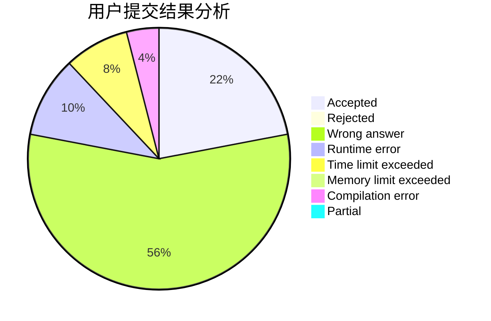
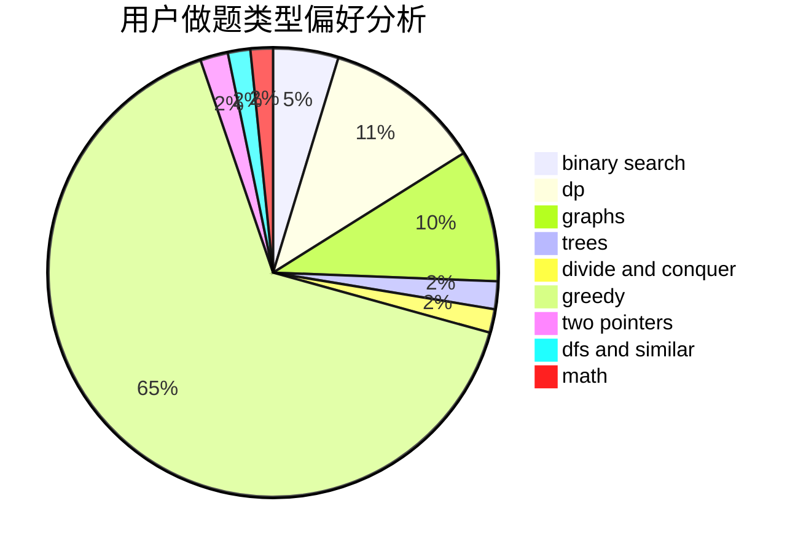

# UpMing

<!-- tabs:start -->

#### **用户提交结果分析**

#### **用户做题类型偏好分析**

<!-- tabs:end -->
# 推荐题目
[1375D](https://codeforces.com/contest/1375/problem/D)
[392B](https://codeforces.com/contest/392/problem/B)
[1380C](https://codeforces.com/contest/1380/problem/C)
[621C](https://codeforces.com/contest/621/problem/C)
[1162E](https://codeforces.com/contest/1162/problem/E)
[1113A](https://codeforces.com/contest/1113/problem/A)
[507B](https://codeforces.com/contest/507/problem/B)
[1374C](https://codeforces.com/contest/1374/problem/C)
[808F](https://codeforces.com/contest/808/problem/F)
[1072D](https://codeforces.com/contest/1072/problem/D)
