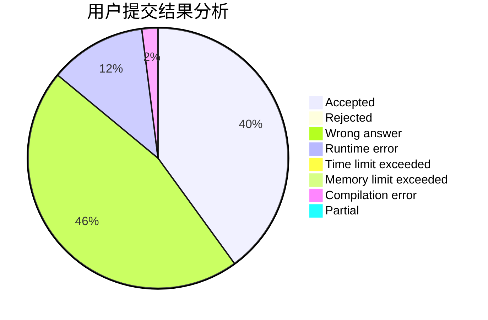
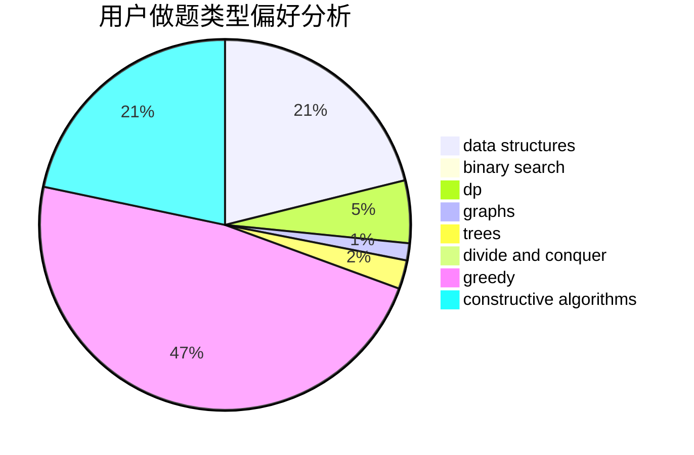

# VISITOR_OVO
<!-- tabs:start -->
#### **用户提交结果分析**

#### **用户做题类型偏好分析**

#### **用户错题知识点分析**

<!-- tabs:end -->
# 推荐题目
[The Great Hero](http://codeforces.com/problemset/problem/1480/B)		greedy,
                        implementation,
                        sortings		  
[Island Puzzle](http://codeforces.com/problemset/problem/627/F)		dfs and similar,
                        dsu,
                        graphs,
                        trees		  
[Lineland Mail](http://codeforces.com/problemset/problem/567/A)		greedy,
                        implementation		  
[Middle of the Contest](http://codeforces.com/problemset/problem/1133/A)		implementation		  
[Arrangement](http://codeforces.com/problemset/problem/107/C)		bitmasks,
                        dp		  
[Design Tutorial: Make It Nondeterministic](http://codeforces.com/problemset/problem/472/C)		greedy		  
[Rational Resistance](http://codeforces.com/problemset/problem/343/A)		math,
                        number theory		  
[Vasya and Templates](https://codeforces.com/contest/1087/problem/E)		greedy,
                        implementation,
                        strings		  
[Wizard's Tour](https://codeforces.com/contest/860/problem/D)		constructive algorithms,
                        dfs and similar,
                        graphs		  
[Diverse Substring](http://codeforces.com/problemset/problem/1073/A)		implementation,
                        strings		  
<!-- tabs:start -->
#### **data structures**
[The Great Hero](http://codeforces.com/problemset/problem/543/E)		constructive algorithms,
                        data structures		  
[Island Puzzle](https://codeforces.com/contest/281/problem/D)		data structures,
                        implementation,
                        two pointers		  
[Lineland Mail](http://codeforces.com/problemset/problem/855/B)		brute force,
                        data structures,
                        dp		  
[Middle of the Contest](http://codeforces.com/problemset/problem/1320/A)		data structures,
                        dp,
                        greedy,
                        math,
                        sortings		  
[Arrangement](http://codeforces.com/problemset/problem/260/E)		binary search,
                        brute force,
                        data structures		  
[Design Tutorial: Make It Nondeterministic](http://codeforces.com/problemset/problem/341/D)		data structures		  
[Rational Resistance](http://codeforces.com/problemset/problem/460/C)		binary search,
                        data structures,
                        greedy		  
[Vasya and Templates](http://codeforces.com/problemset/problem/1495/F)		constructive algorithms,
                        data structures,
                        dp,
                        graphs,
                        trees		  
[Wizard's Tour](http://codeforces.com/problemset/problem/1335/E1)		binary search,
                        brute force,
                        data structures,
                        dp,
                        two pointers		  
[Diverse Substring](http://codeforces.com/problemset/problem/1492/C)		binary search,
                        data structures,
                        dp,
                        greedy,
                        two pointers		  
#### **binary search**
[The Great Hero](http://codeforces.com/problemset/problem/260/E)		binary search,
                        brute force,
                        data structures		  
[Island Puzzle](http://codeforces.com/problemset/problem/822/E)		binary search,
                        dp,
                        hashing,
                        string suffix structures		  
[Lineland Mail](http://codeforces.com/problemset/problem/620/D)		binary search,
                        two pointers		  
[Middle of the Contest](http://codeforces.com/problemset/problem/460/C)		binary search,
                        data structures,
                        greedy		  
[Arrangement](http://codeforces.com/problemset/problem/1335/E1)		binary search,
                        brute force,
                        data structures,
                        dp,
                        two pointers		  
[Design Tutorial: Make It Nondeterministic](http://codeforces.com/problemset/problem/1492/C)		binary search,
                        data structures,
                        dp,
                        greedy,
                        two pointers		  
[Rational Resistance](http://codeforces.com/problemset/problem/1463/D)		binary search,
                        constructive algorithms,
                        greedy,
                        two pointers		  
[Vasya and Templates](http://codeforces.com/problemset/problem/1490/G)		binary search,
                        data structures,
                        math		  
[Wizard's Tour](http://codeforces.com/problemset/problem/1479/D)		binary search,
                        bitmasks,
                        brute force,
                        data structures,
                        probabilities,
                        trees		  
[Diverse Substring](http://codeforces.com/problemset/problem/1436/E)		binary search,
                        data structures,
                        two pointers		  
#### **dp**
[The Great Hero](http://codeforces.com/problemset/problem/107/C)		bitmasks,
                        dp		  
[Island Puzzle](http://codeforces.com/problemset/problem/238/C)		dfs and similar,
                        dp,
                        greedy,
                        trees		  
[Lineland Mail](http://codeforces.com/problemset/problem/1168/C)		bitmasks,
                        dp		  
[Middle of the Contest](http://codeforces.com/problemset/problem/295/B)		dp,
                        graphs,
                        shortest paths		  
[Arrangement](http://codeforces.com/problemset/problem/232/E)		bitmasks,
                        divide and conquer,
                        dp		  
[Design Tutorial: Make It Nondeterministic](http://codeforces.com/problemset/problem/95/B)		dp,
                        greedy		  
[Rational Resistance](http://codeforces.com/problemset/problem/855/B)		brute force,
                        data structures,
                        dp		  
[Vasya and Templates](http://codeforces.com/problemset/problem/706/C)		dp,
                        strings		  
[Wizard's Tour](http://codeforces.com/problemset/problem/786/A)		dfs and similar,
                        dp,
                        games		  
[Diverse Substring](http://codeforces.com/problemset/problem/1320/A)		data structures,
                        dp,
                        greedy,
                        math,
                        sortings		  
#### **graph**
[The Great Hero](http://codeforces.com/problemset/problem/627/F)		dfs and similar,
                        dsu,
                        graphs,
                        trees		  
[Island Puzzle](https://codeforces.com/contest/860/problem/D)		constructive algorithms,
                        dfs and similar,
                        graphs		  
[Lineland Mail](http://codeforces.com/problemset/problem/883/B)		constructive algorithms,
                        graphs,
                        greedy		  
[Middle of the Contest](http://codeforces.com/problemset/problem/266/D)		graphs,
                        math,
                        shortest paths		  
[Arrangement](http://codeforces.com/problemset/problem/295/B)		dp,
                        graphs,
                        shortest paths		  
[Design Tutorial: Make It Nondeterministic](http://codeforces.com/problemset/problem/1389/G)		dfs and similar,
                        dp,
                        graphs,
                        trees		  
[Rational Resistance](http://codeforces.com/problemset/problem/1290/D)		constructive algorithms,
                        graphs,
                        interactive		  
[Vasya and Templates](http://codeforces.com/problemset/problem/730/I)		dp,
                        flows,
                        graphs,
                        greedy		  
[Wizard's Tour](https://codeforces.com/contest/782/problem/E)		constructive algorithms,
                        dfs and similar,
                        graphs		  
[Diverse Substring](http://codeforces.com/problemset/problem/160/D)		dfs and similar,
                        dsu,
                        graphs,
                        sortings		  
#### **trees**
[The Great Hero](http://codeforces.com/problemset/problem/627/F)		dfs and similar,
                        dsu,
                        graphs,
                        trees		  
[Island Puzzle](http://codeforces.com/problemset/problem/238/C)		dfs and similar,
                        dp,
                        greedy,
                        trees		  
[Lineland Mail](http://codeforces.com/problemset/problem/1389/G)		dfs and similar,
                        dp,
                        graphs,
                        trees		  
[Middle of the Contest](http://codeforces.com/problemset/problem/1361/D)		greedy,
                        implementation,
                        math,
                        trees		  
[Arrangement](http://codeforces.com/problemset/problem/1495/F)		constructive algorithms,
                        data structures,
                        dp,
                        graphs,
                        trees		  
[Design Tutorial: Make It Nondeterministic](http://codeforces.com/problemset/problem/1479/D)		binary search,
                        bitmasks,
                        brute force,
                        data structures,
                        probabilities,
                        trees		  
[Rational Resistance](http://codeforces.com/problemset/problem/1511/C)		brute force,
                        data structures,
                        implementation,
                        trees		  
[Vasya and Templates](http://codeforces.com/problemset/problem/1499/F)		combinatorics,
                        dfs and similar,
                        dp,
                        trees		  
[Wizard's Tour](http://codeforces.com/problemset/problem/1491/E)		brute force,
                        dfs and similar,
                        divide and conquer,
                        number theory,
                        trees		  
[Diverse Substring](http://codeforces.com/problemset/problem/1466/D)		data structures,
                        greedy,
                        sortings,
                        trees		  
#### **divide and conquer**
[The Great Hero](http://codeforces.com/problemset/problem/850/E)		bitmasks,
                        brute force,
                        divide and conquer,
                        fft,
                        math		  
[Island Puzzle](http://codeforces.com/problemset/problem/513/B2)		bitmasks,
                        divide and conquer,
                        math		  
[Lineland Mail](http://codeforces.com/problemset/problem/232/E)		bitmasks,
                        divide and conquer,
                        dp		  
[Middle of the Contest](http://codeforces.com/problemset/problem/1461/D)		binary search,
                        brute force,
                        data structures,
                        divide and conquer,
                        implementation,
                        sortings		  
[Arrangement](http://codeforces.com/problemset/problem/1466/G)		combinatorics,
                        divide and conquer,
                        hashing,
                        math,
                        string suffix structures,
                        strings		  
[Design Tutorial: Make It Nondeterministic](http://codeforces.com/problemset/problem/1490/D)		dfs and similar,
                        divide and conquer,
                        implementation		  
[Rational Resistance](https://codeforces.com/contest/1483/problem/C)		data structures,
                        divide and conquer,
                        dp		  
[Vasya and Templates](http://codeforces.com/problemset/problem/1491/E)		brute force,
                        dfs and similar,
                        divide and conquer,
                        number theory,
                        trees		  
[Wizard's Tour](http://codeforces.com/problemset/problem/1303/G)		data structures,
                        divide and conquer,
                        geometry,
                        trees		  
[Diverse Substring](http://codeforces.com/problemset/problem/1494/D)		constructive algorithms,
                        data structures,
                        dfs and similar,
                        divide and conquer,
                        dsu,
                        greedy,
                        sortings,
                        trees		  
#### **greedy**
[The Great Hero](http://codeforces.com/problemset/problem/1480/B)		greedy,
                        implementation,
                        sortings		  
[Island Puzzle](http://codeforces.com/problemset/problem/567/A)		greedy,
                        implementation		  
[Lineland Mail](http://codeforces.com/problemset/problem/472/C)		greedy		  
[Middle of the Contest](https://codeforces.com/contest/1087/problem/E)		greedy,
                        implementation,
                        strings		  
[Arrangement](http://codeforces.com/problemset/problem/883/B)		constructive algorithms,
                        graphs,
                        greedy		  
[Design Tutorial: Make It Nondeterministic](http://codeforces.com/problemset/problem/238/C)		dfs and similar,
                        dp,
                        greedy,
                        trees		  
[Rational Resistance](https://codeforces.com/contest/950/problem/C)		greedy		  
[Vasya and Templates](http://codeforces.com/problemset/problem/95/B)		dp,
                        greedy		  
[Wizard's Tour](http://codeforces.com/problemset/problem/774/C)		*special problem,
                        constructive algorithms,
                        greedy,
                        implementation		  
[Diverse Substring](http://codeforces.com/problemset/problem/1108/E1)		brute force,
                        greedy,
                        implementation		  
#### **constructive algorithms**
[The Great Hero](https://codeforces.com/contest/860/problem/D)		constructive algorithms,
                        dfs and similar,
                        graphs		  
[Island Puzzle](http://codeforces.com/problemset/problem/883/B)		constructive algorithms,
                        graphs,
                        greedy		  
[Lineland Mail](http://codeforces.com/problemset/problem/543/E)		constructive algorithms,
                        data structures		  
[Middle of the Contest](https://codeforces.com/contest/312/problem/C)		constructive algorithms,
                        implementation		  
[Arrangement](http://codeforces.com/problemset/problem/1213/E)		brute force,
                        constructive algorithms		  
[Design Tutorial: Make It Nondeterministic](http://codeforces.com/problemset/problem/894/B)		combinatorics,
                        constructive algorithms,
                        math,
                        number theory		  
[Rational Resistance](http://codeforces.com/problemset/problem/774/C)		*special problem,
                        constructive algorithms,
                        greedy,
                        implementation		  
[Vasya and Templates](http://codeforces.com/problemset/problem/1290/D)		constructive algorithms,
                        graphs,
                        interactive		  
[Wizard's Tour](https://codeforces.com/contest/782/problem/E)		constructive algorithms,
                        dfs and similar,
                        graphs		  
[Diverse Substring](https://codeforces.com/contest/1440/problem/C1)		constructive algorithms,
                        implementation		  
#### **sortings**
[The Great Hero](http://codeforces.com/problemset/problem/1480/B)		greedy,
                        implementation,
                        sortings		  
[Island Puzzle](http://codeforces.com/problemset/problem/558/A)		brute force,
                        implementation,
                        sortings		  
[Lineland Mail](http://codeforces.com/problemset/problem/1320/A)		data structures,
                        dp,
                        greedy,
                        math,
                        sortings		  
[Middle of the Contest](http://codeforces.com/problemset/problem/160/D)		dfs and similar,
                        dsu,
                        graphs,
                        sortings		  
[Arrangement](https://codeforces.com/contest/1496/problem/C)		geometry,
                        greedy,
                        math,
                        sortings		  
[Design Tutorial: Make It Nondeterministic](http://codeforces.com/problemset/problem/1495/A)		geometry,
                        greedy,
                        math,
                        sortings		  
[Rational Resistance](http://codeforces.com/problemset/problem/1497/A)		brute force,
                        data structures,
                        greedy,
                        sortings		  
[Vasya and Templates](http://codeforces.com/problemset/problem/1427/A)		math,
                        sortings		  
[Wizard's Tour](http://codeforces.com/problemset/problem/1461/D)		binary search,
                        brute force,
                        data structures,
                        divide and conquer,
                        implementation,
                        sortings		  
[Diverse Substring](http://codeforces.com/problemset/problem/1437/C)		dp,
                        flows,
                        graph matchings,
                        greedy,
                        math,
                        sortings		  
<!-- tabs:end -->
