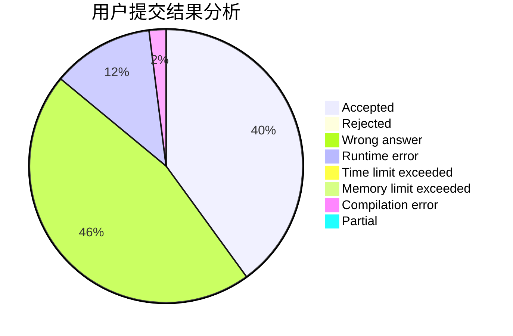
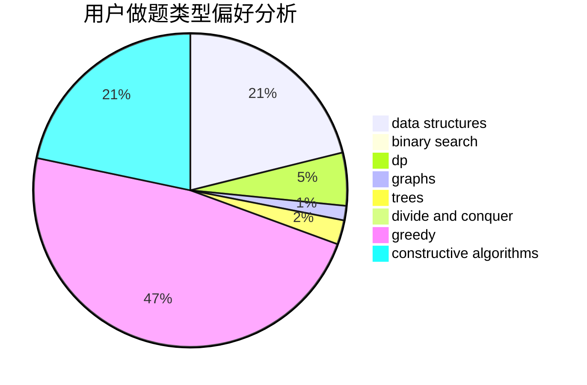

# VISITOR_OVO

<!-- tabs:start -->

#### **用户提交结果分析**

#### **用户做题类型偏好分析**

#### **用户错题知识点分析**

<!-- tabs:end -->
# 推荐题目
[567A](https://codeforces.com/contest/567/problem/A)		greedy,
                        implementation		  
[1073A](https://codeforces.com/contest/1073/problem/A)		implementation,
                        strings		  
[266D](https://codeforces.com/contest/266/problem/D)		graphs,
                        math,
                        shortest paths		  
[719A](https://codeforces.com/contest/719/problem/A)		implementation		  
[1087E](https://codeforces.com/contest/1087/problem/E)		dsu,graphs,sortings,trees		  
[472C](https://codeforces.com/contest/472/problem/C)		greedy		  
[343A](https://codeforces.com/contest/343/problem/A)		math,
                        number theory		  
[203B](https://codeforces.com/contest/203/problem/B)		brute force,
                        implementation		  
[1290D](https://codeforces.com/contest/1290/problem/D)		constructive algorithms,
                        graphs,
                        interactive		  
[860D](https://codeforces.com/contest/860/problem/D)		dsu,graphs,sortings,trees		  
