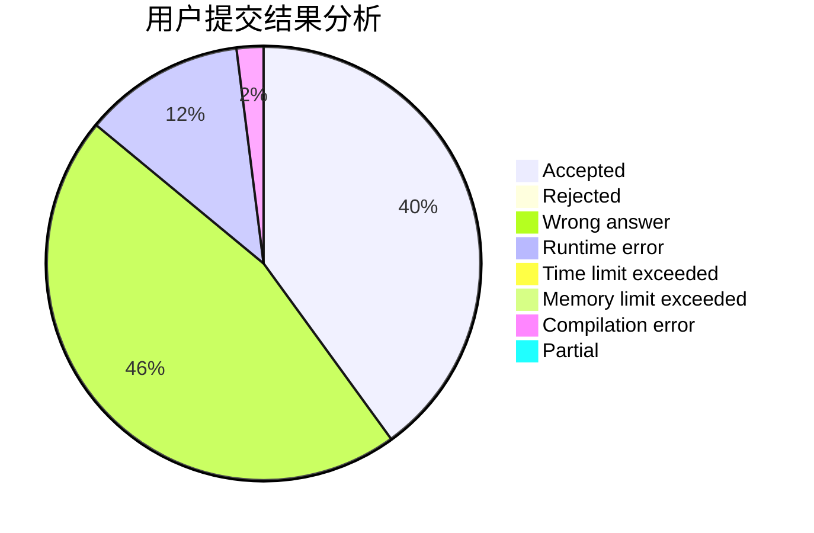
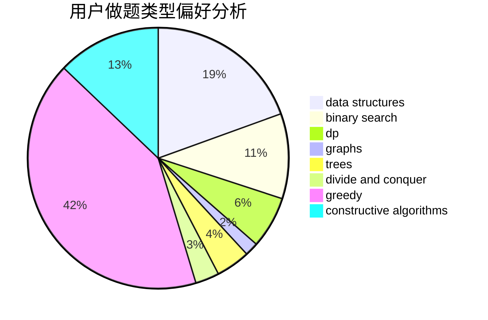

# VISITOR_OVO

<!-- tabs:start -->

#### **用户提交结果分析**

#### **用户做题类型偏好分析**

#### **用户错题知识点分析**

<!-- tabs:end -->
# 推荐题目
[585F](https://codeforces.com/contest/585/problem/F)		dp,
                        implementation,
                        strings		  
[1073D](https://codeforces.com/contest/1073/problem/D)		binary search,
                        brute force,
                        data structures,
                        greedy		  
[282C](https://codeforces.com/contest/282/problem/C)		constructive algorithms,
                        implementation,
                        math		  
[736B](https://codeforces.com/contest/736/problem/B)		dsu,graphs,sortings,trees		  
[1088B](https://codeforces.com/contest/1088/problem/B)		implementation,
                        sortings		  
[490F](https://codeforces.com/contest/490/problem/F)		data structures,
                        dfs and similar,
                        dp,
                        trees		  
[36B](https://codeforces.com/contest/36/problem/B)		implementation		  
[227A](https://codeforces.com/contest/227/problem/A)		geometry		  
[1297A](https://codeforces.com/contest/1297/problem/A)		*special problem,
                        implementation		  
[878D](https://codeforces.com/contest/878/problem/D)		bitmasks		  
