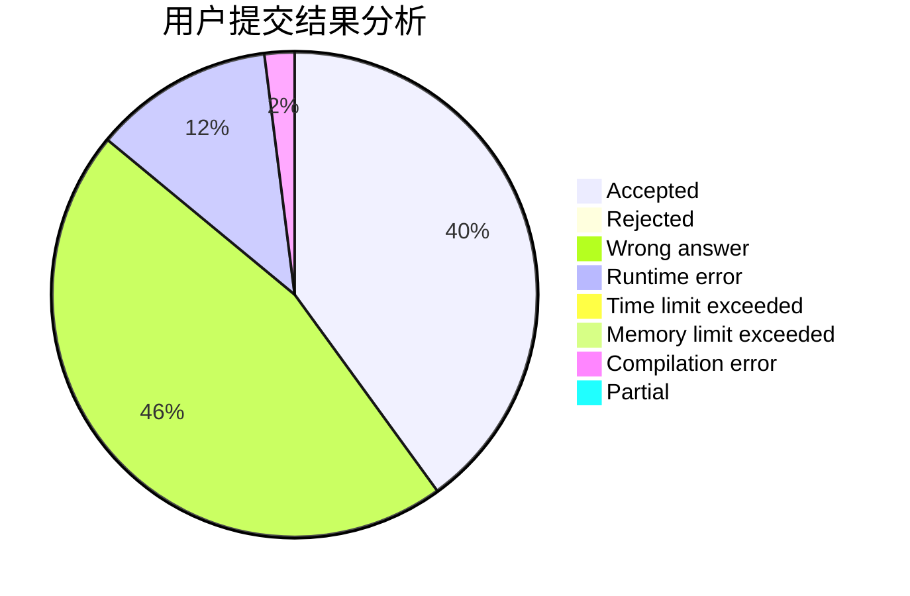
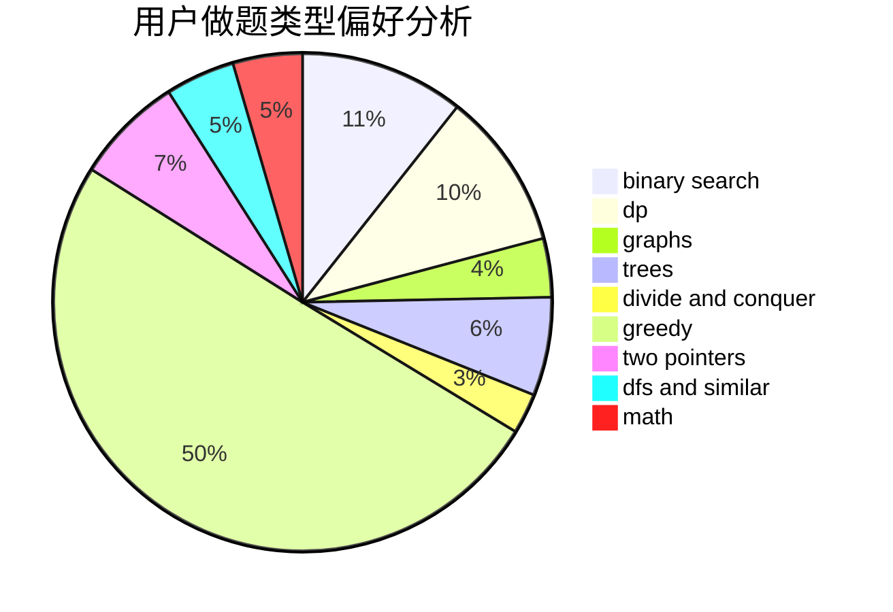

# VISITOR_OVO

<!-- tabs:start -->

#### **用户提交结果分析**

#### **用户做题类型偏好分析**

<!-- tabs:end -->
# 推荐题目
[585F](https://codeforces.com/contest/585/problem/F)
[1073D](https://codeforces.com/contest/1073/problem/D)
[282C](https://codeforces.com/contest/282/problem/C)
[736B](https://codeforces.com/contest/736/problem/B)
[1088B](https://codeforces.com/contest/1088/problem/B)
[490F](https://codeforces.com/contest/490/problem/F)
[36B](https://codeforces.com/contest/36/problem/B)
[227A](https://codeforces.com/contest/227/problem/A)
[1297A](https://codeforces.com/contest/1297/problem/A)
[878D](https://codeforces.com/contest/878/problem/D)
