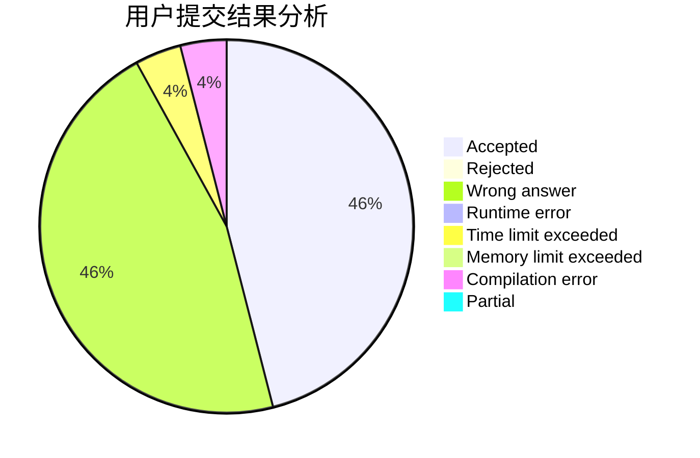
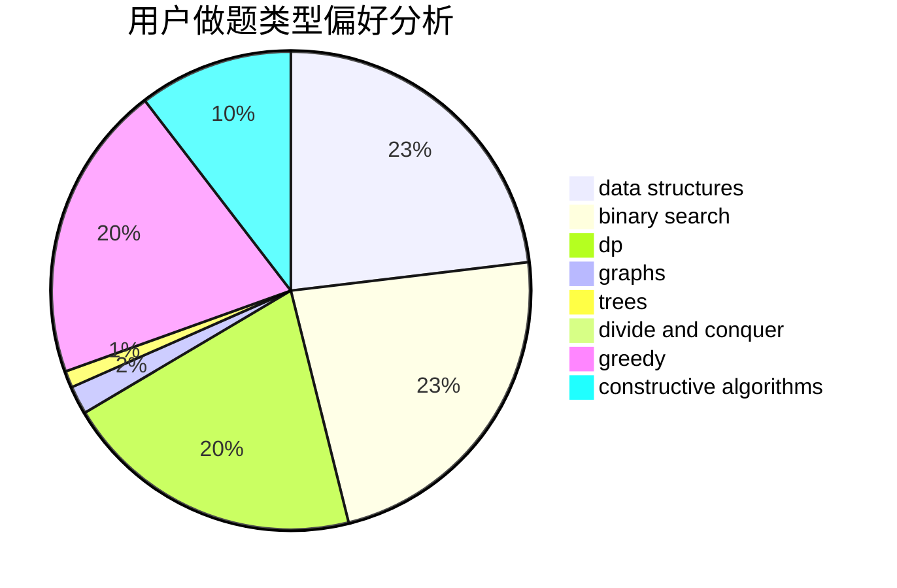
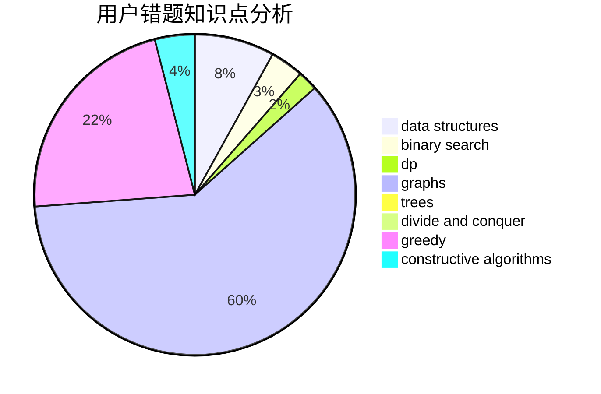

# Vainglory

<!-- tabs:start -->

#### **用户提交结果分析**

#### **用户做题类型偏好分析**

#### **用户错题知识点分析**

<!-- tabs:end -->
# 推荐题目
[1254D](https://codeforces.com/contest/1254/problem/D)		data structures,
                        probabilities,
                        trees		  
[392B](https://codeforces.com/contest/392/problem/B)		dp		  
[1286B](https://codeforces.com/contest/1286/problem/B)		constructive algorithms,
                        data structures,
                        dfs and similar,
                        graphs,
                        greedy,
                        trees		  
[1005C](https://codeforces.com/contest/1005/problem/C)		brute force,
                        greedy,
                        implementation		  
[109A](https://codeforces.com/contest/109/problem/A)		brute force,
                        implementation		  
[774G](https://codeforces.com/contest/774/problem/G)		*special problem,
                        number theory		  
[1271A](https://codeforces.com/contest/1271/problem/A)		brute force,
                        greedy,
                        math		  
[63C](https://codeforces.com/contest/63/problem/C)		brute force,
                        implementation		  
[833D](https://codeforces.com/contest/833/problem/D)		data structures,
                        divide and conquer,
                        implementation,
                        trees		  
[474F](https://codeforces.com/contest/474/problem/F)		data structures,
                        math,
                        number theory		  
