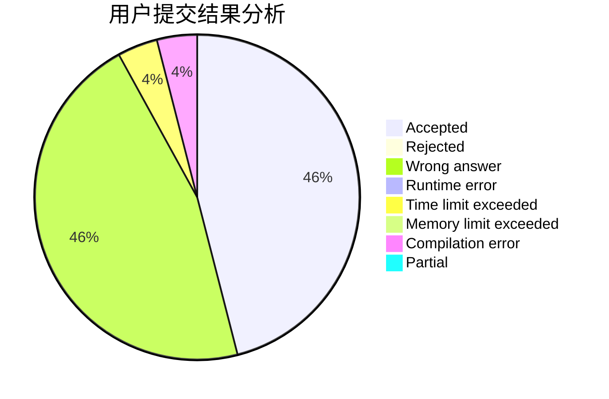
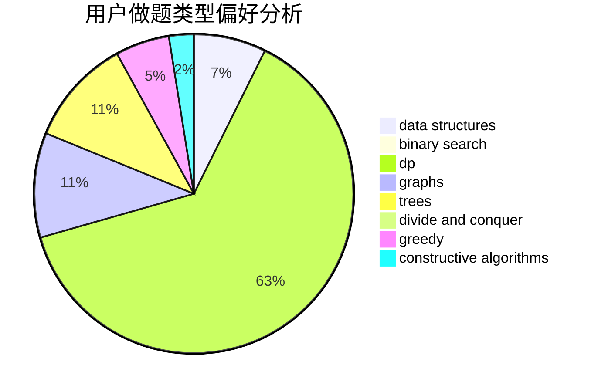
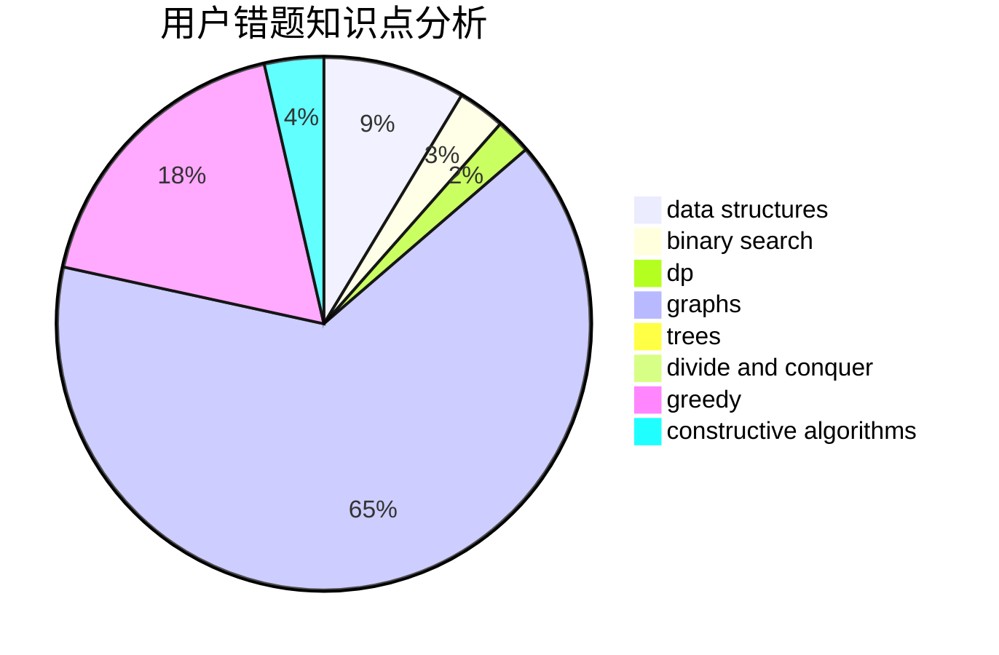

# Vainglory

<!-- tabs:start -->

#### **用户提交结果分析**

#### **用户做题类型偏好分析**

#### **用户错题知识点分析**

<!-- tabs:end -->
# 推荐题目
[12621](https://codeforces.com/contest/1262/problem/1)		dsu,graphs,sortings,trees		  
[421A](https://codeforces.com/contest/421/problem/A)		constructive algorithms,
                        implementation		  
[1293C](https://codeforces.com/contest/1293/problem/C)		dsu,graphs,sortings,trees		  
[1005D](https://codeforces.com/contest/1005/problem/D)		dp,
                        greedy,
                        number theory		  
[10C](https://codeforces.com/contest/10/problem/C)		number theory		  
[793F](https://codeforces.com/contest/793/problem/F)		data structures,
                        divide and conquer,
                        dp		  
[1280C](https://codeforces.com/contest/1280/problem/C)		dfs and similar,
                        graphs,
                        greedy,
                        trees		  
[6701](https://codeforces.com/contest/670/problem/1)		dsu,graphs,sortings,trees		  
[851D](https://codeforces.com/contest/851/problem/D)		dsu,graphs,sortings,trees		  
[493E](https://codeforces.com/contest/493/problem/E)		math		  
