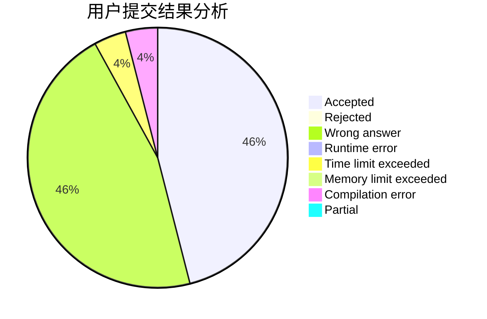
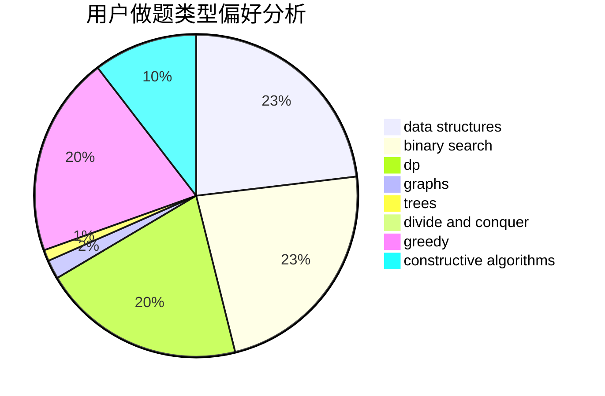
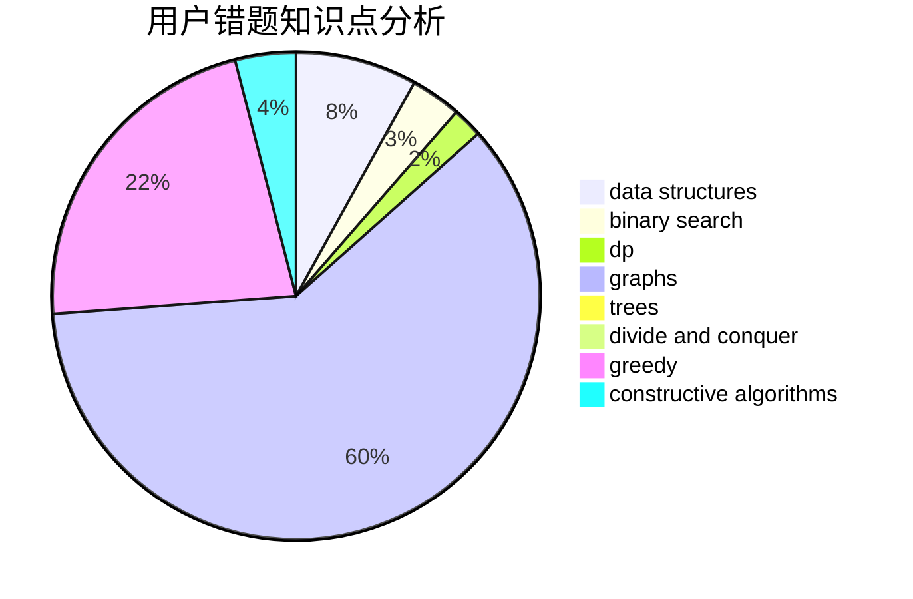

# Vainglory
<!-- tabs:start -->
#### **用户提交结果分析**

#### **用户做题类型偏好分析**

#### **用户错题知识点分析**

<!-- tabs:end -->
# 推荐题目
[Tower of Hanoi](http://codeforces.com/problemset/problem/392/B)		dp		  
[Tree Queries](http://codeforces.com/problemset/problem/1254/D)		data structures,
                        probabilities,
                        trees		  
[Summarize to the Power of Two](http://codeforces.com/problemset/problem/1005/C)		brute force,
                        greedy,
                        implementation		  
[Bulls and Cows](http://codeforces.com/problemset/problem/63/C)		brute force,
                        implementation		  
[Lucky Sum of Digits](http://codeforces.com/problemset/problem/109/A)		brute force,
                        implementation		  
[Red-Black Cobweb](http://codeforces.com/problemset/problem/833/D)		data structures,
                        divide and conquer,
                        implementation,
                        trees		  
[Chess Championship](http://codeforces.com/problemset/problem/736/E)		constructive algorithms,
                        flows,
                        greedy,
                        math		  
[Ant colony](http://codeforces.com/problemset/problem/474/F)		data structures,
                        math,
                        number theory		  
[Superhero Transformation](http://codeforces.com/problemset/problem/1111/A)		implementation,
                        strings		  
[Identify the Operations](https://codeforces.com/contest/1443/problem/F)		combinatorics,
                        data structures,
                        dsu,
                        greedy,
                        implementation		  
<!-- tabs:start -->
#### **data structures**
[Tower of Hanoi](http://codeforces.com/problemset/problem/1254/D)		data structures,
                        probabilities,
                        trees		  
[Tree Queries](http://codeforces.com/problemset/problem/833/D)		data structures,
                        divide and conquer,
                        implementation,
                        trees		  
[Summarize to the Power of Two](http://codeforces.com/problemset/problem/474/F)		data structures,
                        math,
                        number theory		  
[Bulls and Cows](https://codeforces.com/contest/1443/problem/F)		combinatorics,
                        data structures,
                        dsu,
                        greedy,
                        implementation		  
[Lucky Sum of Digits](http://codeforces.com/problemset/problem/946/G)		data structures,
                        dp		  
[Red-Black Cobweb](https://codeforces.com/contest/831/problem/E)		data structures,
                        implementation,
                        sortings		  
[Chess Championship](http://codeforces.com/problemset/problem/524/E)		data structures,
                        sortings		  
[Ant colony](http://codeforces.com/problemset/problem/414/E)		data structures		  
[Superhero Transformation](http://codeforces.com/problemset/problem/1286/B)		constructive algorithms,
                        data structures,
                        dfs and similar,
                        graphs,
                        greedy,
                        trees		  
[Identify the Operations](http://codeforces.com/problemset/problem/733/E)		constructive algorithms,
                        data structures,
                        math,
                        two pointers		  
#### **binary search**
[Tower of Hanoi](http://codeforces.com/problemset/problem/1055/E)		binary search,
                        dp		  
[Tree Queries](http://codeforces.com/problemset/problem/981/F)		binary search,
                        graph matchings,
                        greedy		  
[Summarize to the Power of Two](https://codeforces.com/contest/1504/problem/E)		binary search,
                        data structures,
                        dp,
                        greedy,
                        shortest paths,
                        sortings,
                        two pointers		  
[Bulls and Cows](http://codeforces.com/problemset/problem/1408/D)		binary search,
                        brute force,
                        data structures,
                        dp,
                        implementation,
                        sortings,
                        two pointers		  
[Lucky Sum of Digits](http://codeforces.com/problemset/problem/1492/C)		binary search,
                        data structures,
                        dp,
                        greedy,
                        two pointers		  
[Red-Black Cobweb](http://codeforces.com/problemset/problem/1463/D)		binary search,
                        constructive algorithms,
                        greedy,
                        two pointers		  
[Chess Championship](http://codeforces.com/problemset/problem/1490/G)		binary search,
                        data structures,
                        math		  
[Ant colony](http://codeforces.com/problemset/problem/1479/D)		binary search,
                        bitmasks,
                        brute force,
                        data structures,
                        probabilities,
                        trees		  
[Superhero Transformation](http://codeforces.com/problemset/problem/1436/E)		binary search,
                        data structures,
                        two pointers		  
[Identify the Operations](http://codeforces.com/problemset/problem/1461/D)		binary search,
                        brute force,
                        data structures,
                        divide and conquer,
                        implementation,
                        sortings		  
#### **dp**
[Tower of Hanoi](http://codeforces.com/problemset/problem/392/B)		dp		  
[Tree Queries](http://codeforces.com/problemset/problem/946/G)		data structures,
                        dp		  
[Summarize to the Power of Two](http://codeforces.com/problemset/problem/567/F)		dp		  
[Bulls and Cows](http://codeforces.com/problemset/problem/316/D2)		dp		  
[Lucky Sum of Digits](http://codeforces.com/problemset/problem/264/B)		dp,
                        number theory		  
[Red-Black Cobweb](http://codeforces.com/problemset/problem/1055/E)		binary search,
                        dp		  
[Chess Championship](http://codeforces.com/problemset/problem/431/C)		dp,
                        implementation,
                        trees		  
[Ant colony](https://codeforces.com/contest/1504/problem/E)		binary search,
                        data structures,
                        dp,
                        greedy,
                        shortest paths,
                        sortings,
                        two pointers		  
[Superhero Transformation](http://codeforces.com/problemset/problem/1408/D)		binary search,
                        brute force,
                        data structures,
                        dp,
                        implementation,
                        sortings,
                        two pointers		  
[Identify the Operations](http://codeforces.com/problemset/problem/1492/C)		binary search,
                        data structures,
                        dp,
                        greedy,
                        two pointers		  
#### **graph**
[Tower of Hanoi](http://codeforces.com/problemset/problem/1286/B)		constructive algorithms,
                        data structures,
                        dfs and similar,
                        graphs,
                        greedy,
                        trees		  
[Tree Queries](http://codeforces.com/problemset/problem/981/F)		binary search,
                        graph matchings,
                        greedy		  
[Summarize to the Power of Two](https://codeforces.com/contest/218/problem/C)		brute force,
                        dfs and similar,
                        dsu,
                        graphs		  
[Bulls and Cows](http://codeforces.com/problemset/problem/1139/C)		dfs and similar,
                        dsu,
                        graphs,
                        math,
                        trees		  
[Lucky Sum of Digits](http://codeforces.com/problemset/problem/1487/C)		brute force,
                        constructive algorithms,
                        dfs and similar,
                        graphs,
                        greedy,
                        implementation,
                        math		  
[Red-Black Cobweb](http://codeforces.com/problemset/problem/1437/C)		dp,
                        flows,
                        graph matchings,
                        greedy,
                        math,
                        sortings		  
[Chess Championship](http://codeforces.com/problemset/problem/1470/D)		constructive algorithms,
                        dfs and similar,
                        graph matchings,
                        graphs,
                        greedy		  
[Ant colony](http://codeforces.com/problemset/problem/1476/C)		dp,
                        graphs,
                        greedy		  
[Superhero Transformation](http://codeforces.com/problemset/problem/1304/D)		constructive algorithms,
                        graphs,
                        greedy,
                        two pointers		  
[Identify the Operations](http://codeforces.com/problemset/problem/1475/C)		combinatorics,
                        graphs,
                        math		  
#### **trees**
[Tower of Hanoi](http://codeforces.com/problemset/problem/1254/D)		data structures,
                        probabilities,
                        trees		  
[Tree Queries](http://codeforces.com/problemset/problem/833/D)		data structures,
                        divide and conquer,
                        implementation,
                        trees		  
[Summarize to the Power of Two](http://codeforces.com/problemset/problem/1286/B)		constructive algorithms,
                        data structures,
                        dfs and similar,
                        graphs,
                        greedy,
                        trees		  
[Bulls and Cows](http://codeforces.com/problemset/problem/431/C)		dp,
                        implementation,
                        trees		  
[Lucky Sum of Digits](http://codeforces.com/problemset/problem/1192/B)		*special problem,
                        data structures,
                        dfs and similar,
                        divide and conquer,
                        trees		  
[Red-Black Cobweb](http://codeforces.com/problemset/problem/1076/E)		data structures,
                        trees		  
[Chess Championship](http://codeforces.com/problemset/problem/1139/C)		dfs and similar,
                        dsu,
                        graphs,
                        math,
                        trees		  
[Ant colony](http://codeforces.com/problemset/problem/1479/D)		binary search,
                        bitmasks,
                        brute force,
                        data structures,
                        probabilities,
                        trees		  
[Superhero Transformation](http://codeforces.com/problemset/problem/1511/C)		brute force,
                        data structures,
                        implementation,
                        trees		  
[Identify the Operations](http://codeforces.com/problemset/problem/1499/F)		combinatorics,
                        dfs and similar,
                        dp,
                        trees		  
#### **divide and conquer**
[Tower of Hanoi](http://codeforces.com/problemset/problem/833/D)		data structures,
                        divide and conquer,
                        implementation,
                        trees		  
[Tree Queries](http://codeforces.com/problemset/problem/1192/B)		*special problem,
                        data structures,
                        dfs and similar,
                        divide and conquer,
                        trees		  
[Summarize to the Power of Two](http://codeforces.com/problemset/problem/364/E)		divide and conquer,
                        two pointers		  
[Bulls and Cows](http://codeforces.com/problemset/problem/1461/D)		binary search,
                        brute force,
                        data structures,
                        divide and conquer,
                        implementation,
                        sortings		  
[Lucky Sum of Digits](http://codeforces.com/problemset/problem/1466/G)		combinatorics,
                        divide and conquer,
                        hashing,
                        math,
                        string suffix structures,
                        strings		  
[Red-Black Cobweb](http://codeforces.com/problemset/problem/1490/D)		dfs and similar,
                        divide and conquer,
                        implementation		  
[Chess Championship](https://codeforces.com/contest/1483/problem/C)		data structures,
                        divide and conquer,
                        dp		  
[Ant colony](http://codeforces.com/problemset/problem/1491/E)		brute force,
                        dfs and similar,
                        divide and conquer,
                        number theory,
                        trees		  
[Superhero Transformation](http://codeforces.com/problemset/problem/1303/G)		data structures,
                        divide and conquer,
                        geometry,
                        trees		  
[Identify the Operations](http://codeforces.com/problemset/problem/1494/D)		constructive algorithms,
                        data structures,
                        dfs and similar,
                        divide and conquer,
                        dsu,
                        greedy,
                        sortings,
                        trees		  
#### **greedy**
[Tower of Hanoi](http://codeforces.com/problemset/problem/1005/C)		brute force,
                        greedy,
                        implementation		  
[Tree Queries](http://codeforces.com/problemset/problem/736/E)		constructive algorithms,
                        flows,
                        greedy,
                        math		  
[Summarize to the Power of Two](https://codeforces.com/contest/1443/problem/F)		combinatorics,
                        data structures,
                        dsu,
                        greedy,
                        implementation		  
[Bulls and Cows](http://codeforces.com/problemset/problem/1271/A)		brute force,
                        greedy,
                        math		  
[Lucky Sum of Digits](http://codeforces.com/problemset/problem/845/B)		brute force,
                        greedy,
                        implementation		  
[Red-Black Cobweb](http://codeforces.com/problemset/problem/1286/B)		constructive algorithms,
                        data structures,
                        dfs and similar,
                        graphs,
                        greedy,
                        trees		  
[Chess Championship](http://codeforces.com/problemset/problem/981/F)		binary search,
                        graph matchings,
                        greedy		  
[Ant colony](https://codeforces.com/contest/1504/problem/E)		binary search,
                        data structures,
                        dp,
                        greedy,
                        shortest paths,
                        sortings,
                        two pointers		  
[Superhero Transformation](http://codeforces.com/problemset/problem/1450/B)		brute force,
                        geometry,
                        greedy		  
[Identify the Operations](http://codeforces.com/problemset/problem/1492/C)		binary search,
                        data structures,
                        dp,
                        greedy,
                        two pointers		  
#### **constructive algorithms**
[Tower of Hanoi](http://codeforces.com/problemset/problem/736/E)		constructive algorithms,
                        flows,
                        greedy,
                        math		  
[Tree Queries](http://codeforces.com/problemset/problem/1286/B)		constructive algorithms,
                        data structures,
                        dfs and similar,
                        graphs,
                        greedy,
                        trees		  
[Summarize to the Power of Two](http://codeforces.com/problemset/problem/733/E)		constructive algorithms,
                        data structures,
                        math,
                        two pointers		  
[Bulls and Cows](http://codeforces.com/problemset/problem/711/B)		constructive algorithms,
                        implementation		  
[Lucky Sum of Digits](http://codeforces.com/problemset/problem/1038/B)		constructive algorithms,
                        math		  
[Red-Black Cobweb](http://codeforces.com/problemset/problem/1493/A)		constructive algorithms,
                        greedy		  
[Chess Championship](http://codeforces.com/problemset/problem/1463/D)		binary search,
                        constructive algorithms,
                        greedy,
                        two pointers		  
[Ant colony](https://codeforces.com/contest/1456/problem/B)		bitmasks,
                        brute force,
                        constructive algorithms		  
[Superhero Transformation](http://codeforces.com/problemset/problem/1492/D)		bitmasks,
                        constructive algorithms,
                        greedy,
                        math		  
[Identify the Operations](https://codeforces.com/contest/1504/problem/D)		constructive algorithms,
                        games,
                        interactive		  
#### **sortings**
[Tower of Hanoi](https://codeforces.com/contest/831/problem/E)		data structures,
                        implementation,
                        sortings		  
[Tree Queries](http://codeforces.com/problemset/problem/524/E)		data structures,
                        sortings		  
[Summarize to the Power of Two](https://codeforces.com/contest/1504/problem/E)		binary search,
                        data structures,
                        dp,
                        greedy,
                        shortest paths,
                        sortings,
                        two pointers		  
[Bulls and Cows](http://codeforces.com/problemset/problem/1284/E)		combinatorics,
                        geometry,
                        math,
                        sortings		  
[Lucky Sum of Digits](http://codeforces.com/problemset/problem/1408/D)		binary search,
                        brute force,
                        data structures,
                        dp,
                        implementation,
                        sortings,
                        two pointers		  
[Red-Black Cobweb](https://codeforces.com/contest/1496/problem/C)		geometry,
                        greedy,
                        math,
                        sortings		  
[Chess Championship](http://codeforces.com/problemset/problem/1495/A)		geometry,
                        greedy,
                        math,
                        sortings		  
[Ant colony](http://codeforces.com/problemset/problem/1497/A)		brute force,
                        data structures,
                        greedy,
                        sortings		  
[Superhero Transformation](http://codeforces.com/problemset/problem/1427/A)		math,
                        sortings		  
[Identify the Operations](http://codeforces.com/problemset/problem/1461/D)		binary search,
                        brute force,
                        data structures,
                        divide and conquer,
                        implementation,
                        sortings		  
<!-- tabs:end -->
