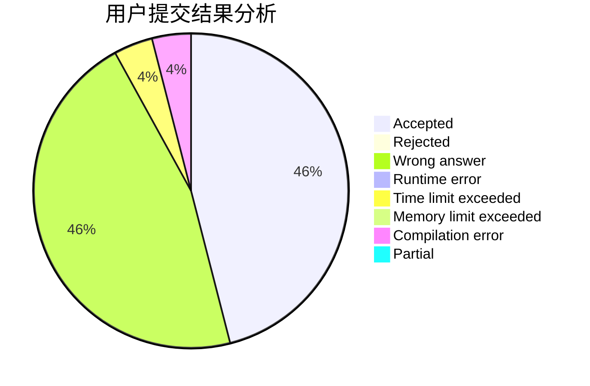
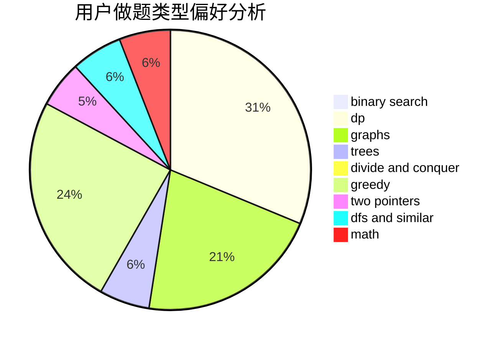

# Vainglory

<!-- tabs:start -->

#### **用户提交结果分析**

#### **用户做题类型偏好分析**

<!-- tabs:end -->
# 推荐题目
[12621](https://codeforces.com/contest/1262/problem/1)
[421A](https://codeforces.com/contest/421/problem/A)
[1293C](https://codeforces.com/contest/1293/problem/C)
[1005D](https://codeforces.com/contest/1005/problem/D)
[10C](https://codeforces.com/contest/10/problem/C)
[793F](https://codeforces.com/contest/793/problem/F)
[1280C](https://codeforces.com/contest/1280/problem/C)
[6701](https://codeforces.com/contest/670/problem/1)
[851D](https://codeforces.com/contest/851/problem/D)
[493E](https://codeforces.com/contest/493/problem/E)
