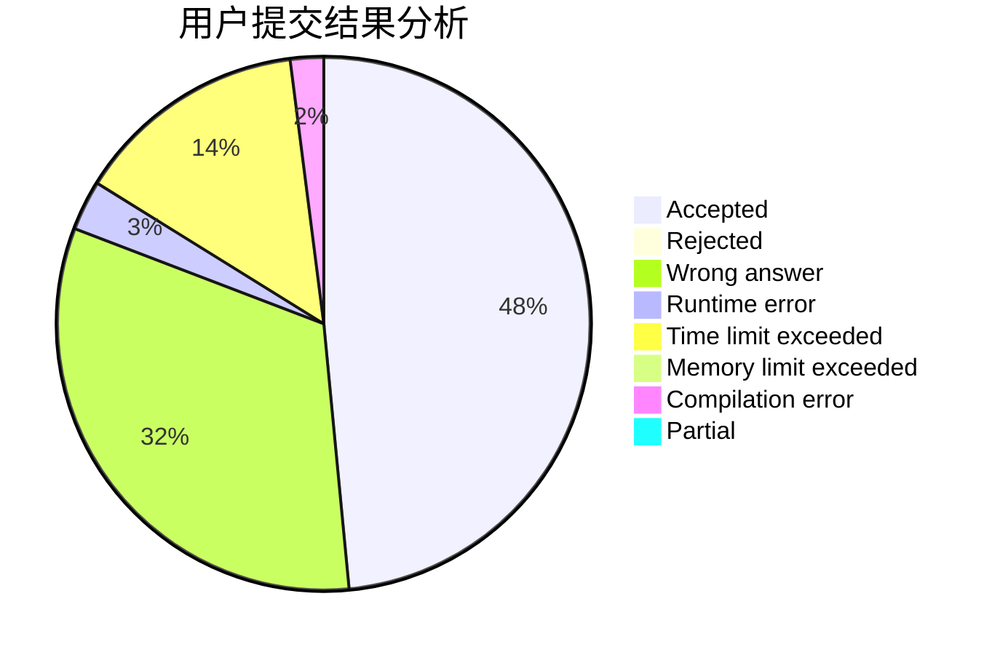
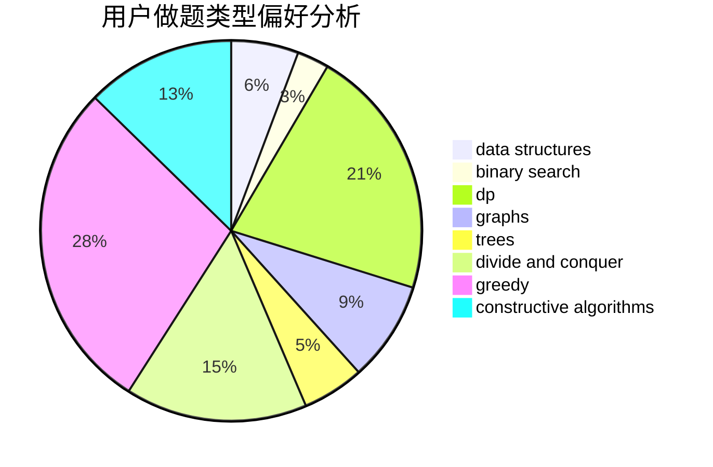
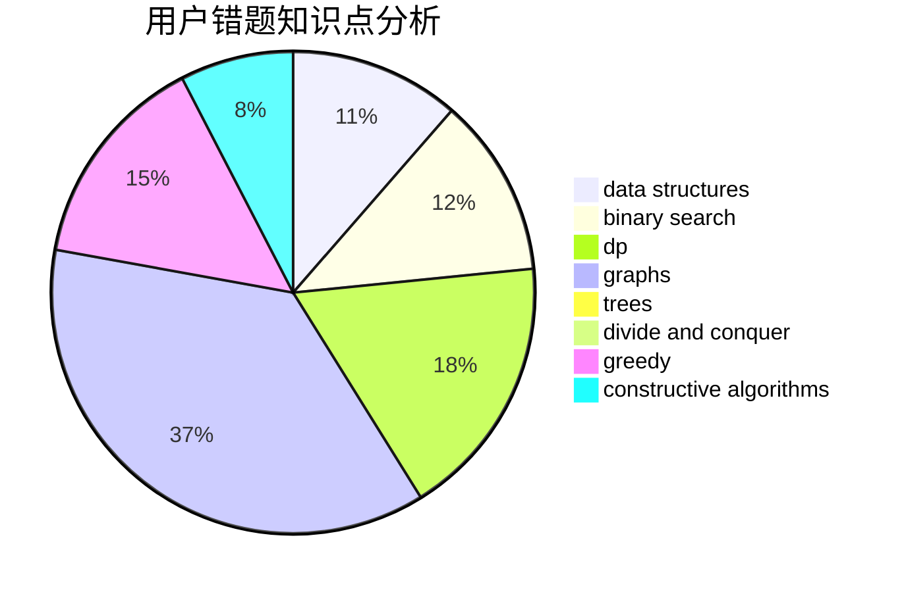

# Valour616
<!-- tabs:start -->
#### **用户提交结果分析**

#### **用户做题类型偏好分析**

#### **用户错题知识点分析**

<!-- tabs:end -->
# 推荐题目
[Captain America](http://codeforces.com/problemset/problem/704/D)		flows,
                        greedy		  
[Johnny and Grandmaster](http://codeforces.com/problemset/problem/1361/B)		greedy,
                        implementation,
                        math,
                        sortings		  
[Xor-tree](http://codeforces.com/problemset/problem/429/A)		dfs and similar,
                        trees		  
[Lookup Tables](http://codeforces.com/problemset/problem/1423/I)		bitmasks		  
[Instant Noodles](http://codeforces.com/problemset/problem/1322/C)		graphs,
                        hashing,
                        math,
                        number theory		  
[Vanya and Brackets](http://codeforces.com/problemset/problem/552/E)		brute force,
                        dp,
                        expression parsing,
                        greedy,
                        implementation,
                        strings		  
[Secret Combination](http://codeforces.com/problemset/problem/496/B)		brute force,
                        constructive algorithms,
                        implementation		  
[Bash Plays with Functions](http://codeforces.com/problemset/problem/757/E)		brute force,
                        combinatorics,
                        dp,
                        number theory		  
[Paper Airplanes](http://codeforces.com/problemset/problem/965/A)		math		  
[Submarine in the Rybinsk Sea (hard edition)](http://codeforces.com/problemset/problem/1195/D2)		combinatorics,
                        math,
                        number theory		  
<!-- tabs:start -->
#### **data structures**
[Captain America](http://codeforces.com/problemset/problem/827/A)		data structures,
                        greedy,
                        sortings,
                        strings		  
[Johnny and Grandmaster](https://codeforces.com/contest/90/problem/E)		brute force,
                        data structures,
                        implementation		  
[Xor-tree](http://codeforces.com/problemset/problem/1367/F2)		binary search,
                        data structures,
                        dp,
                        greedy,
                        sortings,
                        two pointers		  
[Lookup Tables](http://codeforces.com/problemset/problem/1213/B)		data structures,
                        implementation		  
[Instant Noodles](http://codeforces.com/problemset/problem/486/E)		data structures,
                        dp,
                        greedy,
                        hashing,
                        math		  
[Vanya and Brackets](http://codeforces.com/problemset/problem/1216/F)		data structures,
                        dp,
                        greedy		  
[Secret Combination](http://codeforces.com/problemset/problem/527/D)		data structures,
                        dp,
                        greedy,
                        implementation,
                        sortings		  
[Bash Plays with Functions](http://codeforces.com/problemset/problem/1198/B)		binary search,
                        brute force,
                        data structures,
                        sortings		  
[Paper Airplanes](http://codeforces.com/problemset/problem/1492/C)		binary search,
                        data structures,
                        dp,
                        greedy,
                        two pointers		  
[Submarine in the Rybinsk Sea (hard edition)](http://codeforces.com/problemset/problem/1490/G)		binary search,
                        data structures,
                        math		  
#### **binary search**
[Captain America](http://codeforces.com/problemset/problem/883/C)		binary search,
                        implementation		  
[Johnny and Grandmaster](http://codeforces.com/problemset/problem/1367/F2)		binary search,
                        data structures,
                        dp,
                        greedy,
                        sortings,
                        two pointers		  
[Xor-tree](http://codeforces.com/problemset/problem/309/A)		binary search,
                        math,
                        two pointers		  
[Lookup Tables](http://codeforces.com/problemset/problem/1198/B)		binary search,
                        brute force,
                        data structures,
                        sortings		  
[Instant Noodles](http://codeforces.com/problemset/problem/468/C)		binary search,
                        constructive algorithms,
                        math		  
[Vanya and Brackets](http://codeforces.com/problemset/problem/1492/C)		binary search,
                        data structures,
                        dp,
                        greedy,
                        two pointers		  
[Secret Combination](http://codeforces.com/problemset/problem/1463/D)		binary search,
                        constructive algorithms,
                        greedy,
                        two pointers		  
[Bash Plays with Functions](http://codeforces.com/problemset/problem/1490/G)		binary search,
                        data structures,
                        math		  
[Paper Airplanes](http://codeforces.com/problemset/problem/1479/D)		binary search,
                        bitmasks,
                        brute force,
                        data structures,
                        probabilities,
                        trees		  
[Submarine in the Rybinsk Sea (hard edition)](http://codeforces.com/problemset/problem/1436/E)		binary search,
                        data structures,
                        two pointers		  
#### **dp**
[Captain America](http://codeforces.com/problemset/problem/552/E)		brute force,
                        dp,
                        expression parsing,
                        greedy,
                        implementation,
                        strings		  
[Johnny and Grandmaster](http://codeforces.com/problemset/problem/757/E)		brute force,
                        combinatorics,
                        dp,
                        number theory		  
[Xor-tree](http://codeforces.com/problemset/problem/838/E)		dp		  
[Lookup Tables](http://codeforces.com/problemset/problem/1367/F2)		binary search,
                        data structures,
                        dp,
                        greedy,
                        sortings,
                        two pointers		  
[Instant Noodles](http://codeforces.com/problemset/problem/1381/D)		dfs and similar,
                        dp,
                        greedy,
                        trees,
                        two pointers		  
[Vanya and Brackets](http://codeforces.com/problemset/problem/486/E)		data structures,
                        dp,
                        greedy,
                        hashing,
                        math		  
[Secret Combination](http://codeforces.com/problemset/problem/1216/F)		data structures,
                        dp,
                        greedy		  
[Bash Plays with Functions](http://codeforces.com/problemset/problem/593/E)		dp,
                        matrices		  
[Paper Airplanes](http://codeforces.com/problemset/problem/527/D)		data structures,
                        dp,
                        greedy,
                        implementation,
                        sortings		  
[Submarine in the Rybinsk Sea (hard edition)](http://codeforces.com/problemset/problem/431/C)		dp,
                        implementation,
                        trees		  
#### **graph**
[Captain America](http://codeforces.com/problemset/problem/1322/C)		graphs,
                        hashing,
                        math,
                        number theory		  
[Johnny and Grandmaster](http://codeforces.com/problemset/problem/380/B)		graphs,
                        implementation		  
[Xor-tree](http://codeforces.com/problemset/problem/1344/B)		constructive algorithms,
                        dfs and similar,
                        dsu,
                        graphs		  
[Lookup Tables](http://codeforces.com/problemset/problem/724/G)		bitmasks,
                        graphs,
                        math,
                        number theory,
                        trees		  
[Instant Noodles](http://codeforces.com/problemset/problem/1487/C)		brute force,
                        constructive algorithms,
                        dfs and similar,
                        graphs,
                        greedy,
                        implementation,
                        math		  
[Vanya and Brackets](http://codeforces.com/problemset/problem/1437/C)		dp,
                        flows,
                        graph matchings,
                        greedy,
                        math,
                        sortings		  
[Secret Combination](http://codeforces.com/problemset/problem/1470/D)		constructive algorithms,
                        dfs and similar,
                        graph matchings,
                        graphs,
                        greedy		  
[Bash Plays with Functions](http://codeforces.com/problemset/problem/1476/C)		dp,
                        graphs,
                        greedy		  
[Paper Airplanes](http://codeforces.com/problemset/problem/1304/D)		constructive algorithms,
                        graphs,
                        greedy,
                        two pointers		  
[Submarine in the Rybinsk Sea (hard edition)](http://codeforces.com/problemset/problem/1475/C)		combinatorics,
                        graphs,
                        math		  
#### **trees**
[Captain America](http://codeforces.com/problemset/problem/429/A)		dfs and similar,
                        trees		  
[Johnny and Grandmaster](http://codeforces.com/problemset/problem/1381/D)		dfs and similar,
                        dp,
                        greedy,
                        trees,
                        two pointers		  
[Xor-tree](http://codeforces.com/problemset/problem/754/E)		bitmasks,
                        brute force,
                        fft,
                        strings,
                        trees		  
[Lookup Tables](http://codeforces.com/problemset/problem/431/C)		dp,
                        implementation,
                        trees		  
[Instant Noodles](http://codeforces.com/problemset/problem/724/G)		bitmasks,
                        graphs,
                        math,
                        number theory,
                        trees		  
[Vanya and Brackets](http://codeforces.com/problemset/problem/1479/D)		binary search,
                        bitmasks,
                        brute force,
                        data structures,
                        probabilities,
                        trees		  
[Secret Combination](http://codeforces.com/problemset/problem/1511/C)		brute force,
                        data structures,
                        implementation,
                        trees		  
[Bash Plays with Functions](http://codeforces.com/problemset/problem/1499/F)		combinatorics,
                        dfs and similar,
                        dp,
                        trees		  
[Paper Airplanes](http://codeforces.com/problemset/problem/1491/E)		brute force,
                        dfs and similar,
                        divide and conquer,
                        number theory,
                        trees		  
[Submarine in the Rybinsk Sea (hard edition)](http://codeforces.com/problemset/problem/1466/D)		data structures,
                        greedy,
                        sortings,
                        trees		  
#### **divide and conquer**
[Captain America](http://codeforces.com/problemset/problem/97/B)		constructive algorithms,
                        divide and conquer		  
[Johnny and Grandmaster](http://codeforces.com/problemset/problem/1461/D)		binary search,
                        brute force,
                        data structures,
                        divide and conquer,
                        implementation,
                        sortings		  
[Xor-tree](http://codeforces.com/problemset/problem/1466/G)		combinatorics,
                        divide and conquer,
                        hashing,
                        math,
                        string suffix structures,
                        strings		  
[Lookup Tables](http://codeforces.com/problemset/problem/1490/D)		dfs and similar,
                        divide and conquer,
                        implementation		  
[Instant Noodles](https://codeforces.com/contest/1483/problem/C)		data structures,
                        divide and conquer,
                        dp		  
[Vanya and Brackets](http://codeforces.com/problemset/problem/1491/E)		brute force,
                        dfs and similar,
                        divide and conquer,
                        number theory,
                        trees		  
[Secret Combination](http://codeforces.com/problemset/problem/1303/G)		data structures,
                        divide and conquer,
                        geometry,
                        trees		  
[Bash Plays with Functions](http://codeforces.com/problemset/problem/1494/D)		constructive algorithms,
                        data structures,
                        dfs and similar,
                        divide and conquer,
                        dsu,
                        greedy,
                        sortings,
                        trees		  
[Paper Airplanes](http://codeforces.com/problemset/problem/1482/E)		data structures,
                        divide and conquer,
                        dp		  
[Submarine in the Rybinsk Sea (hard edition)](http://codeforces.com/problemset/problem/566/C)		dfs and similar,
                        divide and conquer,
                        trees		  
#### **greedy**
[Captain America](http://codeforces.com/problemset/problem/704/D)		flows,
                        greedy		  
[Johnny and Grandmaster](http://codeforces.com/problemset/problem/1361/B)		greedy,
                        implementation,
                        math,
                        sortings		  
[Xor-tree](http://codeforces.com/problemset/problem/552/E)		brute force,
                        dp,
                        expression parsing,
                        greedy,
                        implementation,
                        strings		  
[Lookup Tables](http://codeforces.com/problemset/problem/827/A)		data structures,
                        greedy,
                        sortings,
                        strings		  
[Instant Noodles](http://codeforces.com/problemset/problem/1367/F2)		binary search,
                        data structures,
                        dp,
                        greedy,
                        sortings,
                        two pointers		  
[Vanya and Brackets](http://codeforces.com/problemset/problem/1381/D)		dfs and similar,
                        dp,
                        greedy,
                        trees,
                        two pointers		  
[Secret Combination](http://codeforces.com/problemset/problem/486/E)		data structures,
                        dp,
                        greedy,
                        hashing,
                        math		  
[Bash Plays with Functions](http://codeforces.com/problemset/problem/1216/F)		data structures,
                        dp,
                        greedy		  
[Paper Airplanes](http://codeforces.com/problemset/problem/103/C)		constructive algorithms,
                        greedy		  
[Submarine in the Rybinsk Sea (hard edition)](http://codeforces.com/problemset/problem/527/D)		data structures,
                        dp,
                        greedy,
                        implementation,
                        sortings		  
#### **constructive algorithms**
[Captain America](http://codeforces.com/problemset/problem/496/B)		brute force,
                        constructive algorithms,
                        implementation		  
[Johnny and Grandmaster](http://codeforces.com/problemset/problem/1372/A)		constructive algorithms,
                        implementation		  
[Xor-tree](http://codeforces.com/problemset/problem/103/C)		constructive algorithms,
                        greedy		  
[Lookup Tables](http://codeforces.com/problemset/problem/1038/B)		constructive algorithms,
                        math		  
[Instant Noodles](http://codeforces.com/problemset/problem/97/B)		constructive algorithms,
                        divide and conquer		  
[Vanya and Brackets](http://codeforces.com/problemset/problem/1245/B)		constructive algorithms,
                        dp,
                        greedy		  
[Secret Combination](http://codeforces.com/problemset/problem/1028/E)		constructive algorithms		  
[Bash Plays with Functions](http://codeforces.com/problemset/problem/42/D)		constructive algorithms,
                        math		  
[Paper Airplanes](http://codeforces.com/problemset/problem/339/E)		constructive algorithms,
                        dfs and similar,
                        greedy		  
[Submarine in the Rybinsk Sea (hard edition)](http://codeforces.com/problemset/problem/1344/B)		constructive algorithms,
                        dfs and similar,
                        dsu,
                        graphs		  
#### **sortings**
[Captain America](http://codeforces.com/problemset/problem/1361/B)		greedy,
                        implementation,
                        math,
                        sortings		  
[Johnny and Grandmaster](http://codeforces.com/problemset/problem/827/A)		data structures,
                        greedy,
                        sortings,
                        strings		  
[Xor-tree](http://codeforces.com/problemset/problem/1367/F2)		binary search,
                        data structures,
                        dp,
                        greedy,
                        sortings,
                        two pointers		  
[Lookup Tables](http://codeforces.com/problemset/problem/527/D)		data structures,
                        dp,
                        greedy,
                        implementation,
                        sortings		  
[Instant Noodles](http://codeforces.com/problemset/problem/732/E)		greedy,
                        sortings		  
[Vanya and Brackets](http://codeforces.com/problemset/problem/1198/B)		binary search,
                        brute force,
                        data structures,
                        sortings		  
[Secret Combination](https://codeforces.com/contest/1496/problem/C)		geometry,
                        greedy,
                        math,
                        sortings		  
[Bash Plays with Functions](http://codeforces.com/problemset/problem/1495/A)		geometry,
                        greedy,
                        math,
                        sortings		  
[Paper Airplanes](http://codeforces.com/problemset/problem/1497/A)		brute force,
                        data structures,
                        greedy,
                        sortings		  
[Submarine in the Rybinsk Sea (hard edition)](http://codeforces.com/problemset/problem/1427/A)		math,
                        sortings		  
<!-- tabs:end -->
