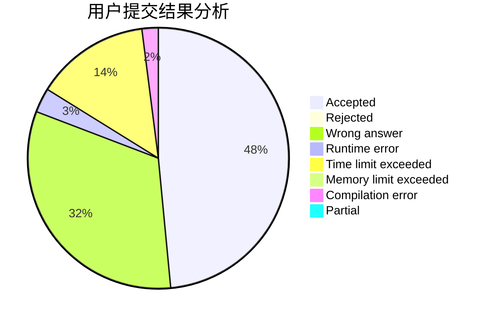
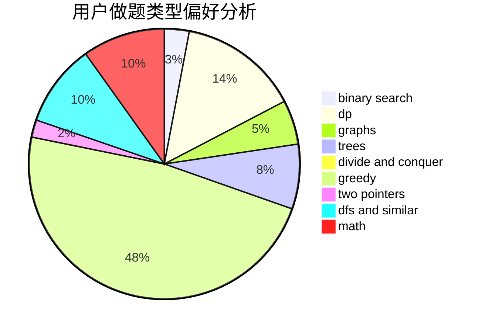

# Valour616

<!-- tabs:start -->

#### **用户提交结果分析**

#### **用户做题类型偏好分析**

<!-- tabs:end -->
# 推荐题目
[1329B](https://codeforces.com/contest/1329/problem/B)
[578B](https://codeforces.com/contest/578/problem/B)
[219D](https://codeforces.com/contest/219/problem/D)
[1040A](https://codeforces.com/contest/1040/problem/A)
[1380F](https://codeforces.com/contest/1380/problem/F)
[723D](https://codeforces.com/contest/723/problem/D)
[1431D](https://codeforces.com/contest/1431/problem/D)
[900B](https://codeforces.com/contest/900/problem/B)
[987A](https://codeforces.com/contest/987/problem/A)
[776D](https://codeforces.com/contest/776/problem/D)
