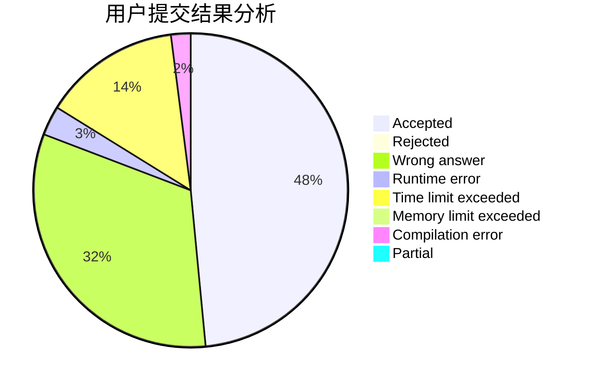
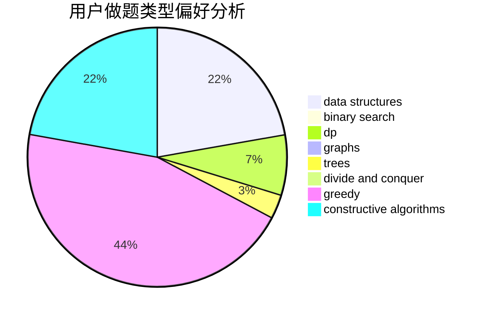
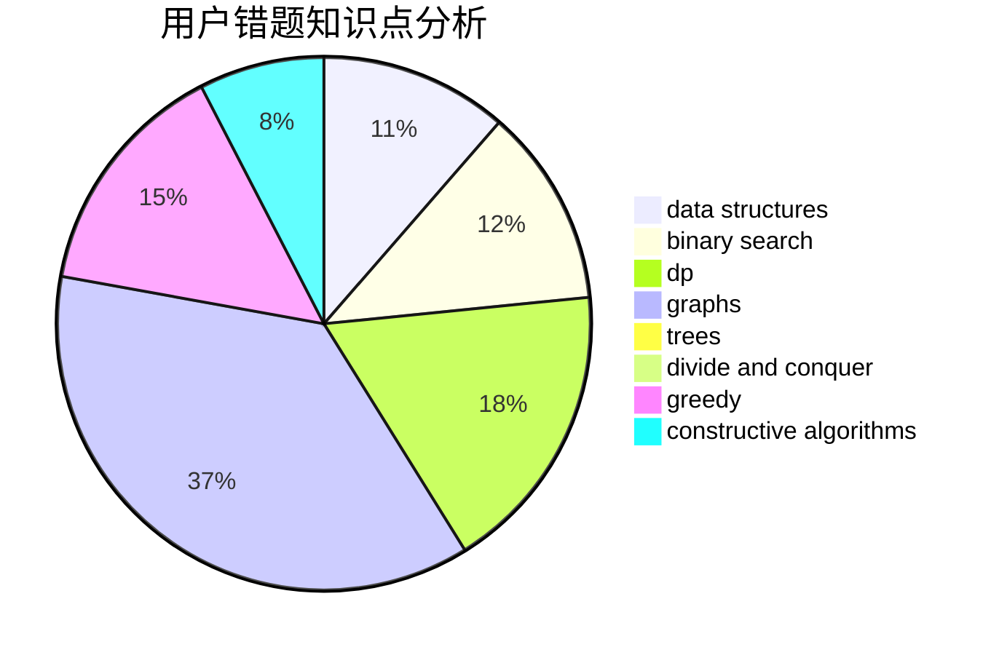

# Valour616

<!-- tabs:start -->

#### **用户提交结果分析**

#### **用户做题类型偏好分析**

#### **用户错题知识点分析**

<!-- tabs:end -->
# 推荐题目
[1329B](https://codeforces.com/contest/1329/problem/B)		bitmasks,
                        combinatorics,
                        math		  
[578B](https://codeforces.com/contest/578/problem/B)		brute force,
                        greedy		  
[219D](https://codeforces.com/contest/219/problem/D)		dfs and similar,
                        dp,
                        graphs,
                        trees		  
[1040A](https://codeforces.com/contest/1040/problem/A)		greedy		  
[1380F](https://codeforces.com/contest/1380/problem/F)		data structures,
                        dp,
                        matrices		  
[723D](https://codeforces.com/contest/723/problem/D)		dfs and similar,
                        dsu,
                        graphs,
                        greedy,
                        implementation		  
[1431D](https://codeforces.com/contest/1431/problem/D)		*special problem,
                        greedy		  
[900B](https://codeforces.com/contest/900/problem/B)		math,
                        number theory		  
[987A](https://codeforces.com/contest/987/problem/A)		implementation		  
[776D](https://codeforces.com/contest/776/problem/D)		2-sat,
                        dfs and similar,
                        dsu,
                        graphs		  
