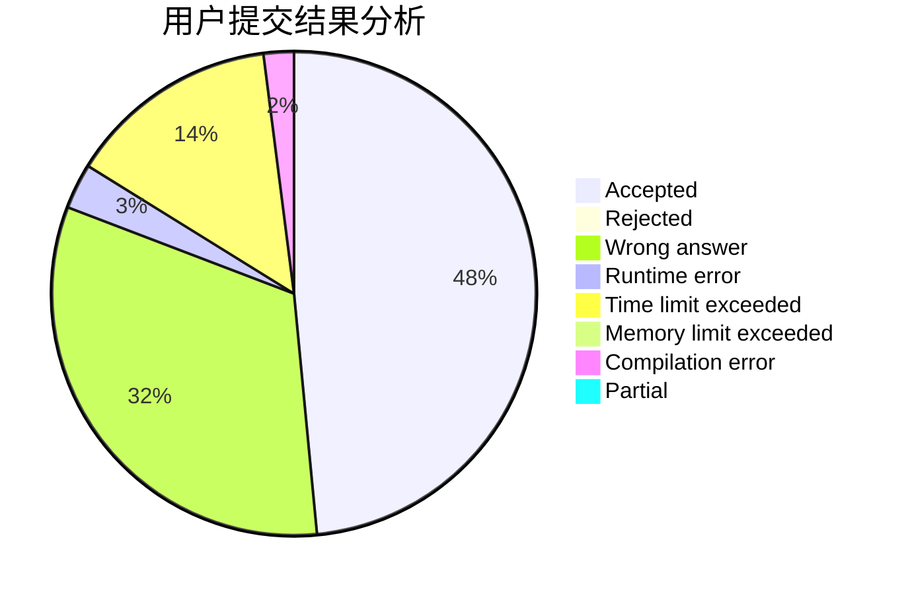
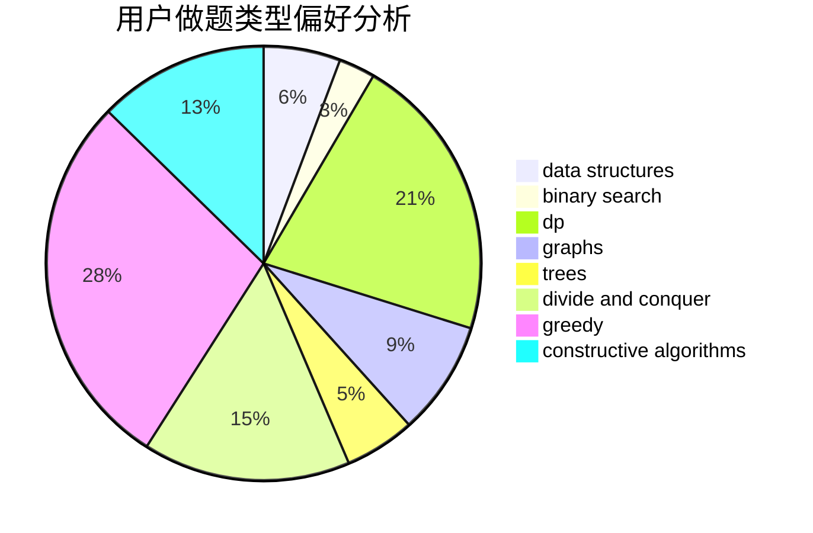
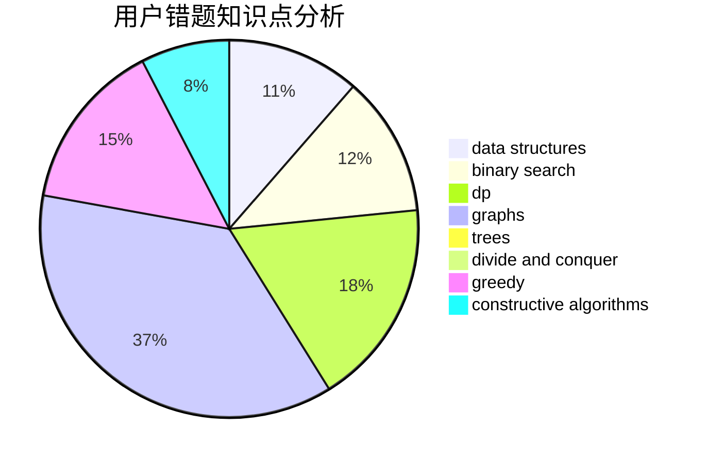

# Valour616

<!-- tabs:start -->

#### **用户提交结果分析**

#### **用户做题类型偏好分析**

#### **用户错题知识点分析**

<!-- tabs:end -->
# 推荐题目
[1322C](https://codeforces.com/contest/1322/problem/C)		graphs,
                        hashing,
                        math,
                        number theory		  
[552E](https://codeforces.com/contest/552/problem/E)		brute force,
                        dp,
                        expression parsing,
                        greedy,
                        implementation,
                        strings		  
[198B](https://codeforces.com/contest/198/problem/B)		shortest paths		  
[103C](https://codeforces.com/contest/103/problem/C)		constructive algorithms,
                        greedy		  
[1372A](https://codeforces.com/contest/1372/problem/A)		constructive algorithms,
                        implementation		  
[704D](https://codeforces.com/contest/704/problem/D)		flows,
                        greedy		  
[1423I](https://codeforces.com/contest/1423/problem/I)		bitmasks		  
[883C](https://codeforces.com/contest/883/problem/C)		binary search,
                        implementation		  
[965A](https://codeforces.com/contest/965/problem/A)		math		  
[757E](https://codeforces.com/contest/757/problem/E)		brute force,
                        combinatorics,
                        dp,
                        number theory		  
