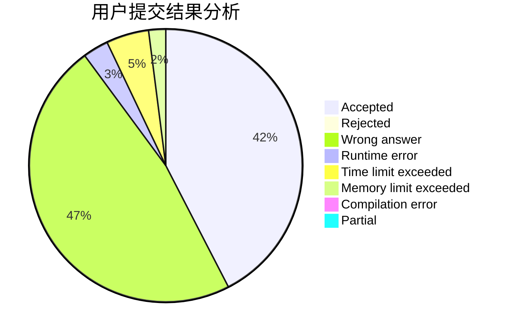
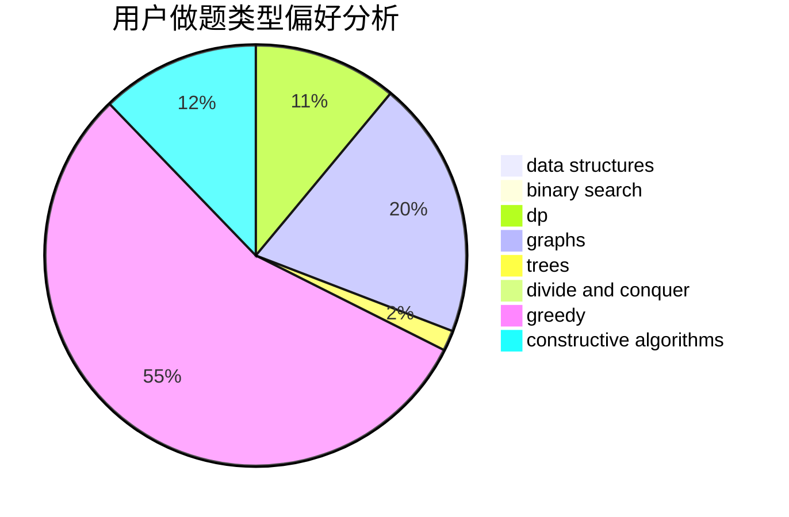
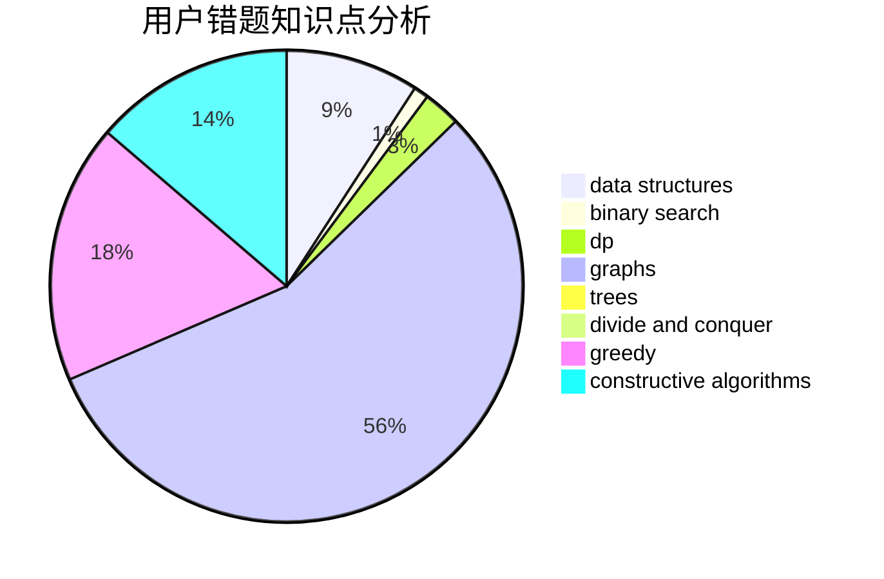

# Vareal

<!-- tabs:start -->

#### **用户提交结果分析**

#### **用户做题类型偏好分析**

#### **用户错题知识点分析**

<!-- tabs:end -->
# 推荐题目
[767B](https://codeforces.com/contest/767/problem/B)		brute force,
                        greedy		  
[1389A](https://codeforces.com/contest/1389/problem/A)		constructive algorithms,
                        greedy,
                        math,
                        number theory		  
[920A](https://codeforces.com/contest/920/problem/A)		implementation		  
[750G](https://codeforces.com/contest/750/problem/G)		bitmasks,
                        brute force,
                        combinatorics,
                        dp		  
[311D](https://codeforces.com/contest/311/problem/D)		data structures,
                        math		  
[878C](https://codeforces.com/contest/878/problem/C)		data structures,
                        graphs		  
[409G](https://codeforces.com/contest/409/problem/G)		*special problem,
                        geometry		  
[1167D](https://codeforces.com/contest/1167/problem/D)		constructive algorithms,
                        greedy		  
[1400F](https://codeforces.com/contest/1400/problem/F)		brute force,
                        dfs and similar,
                        dp,
                        string suffix structures,
                        strings		  
[1505C](https://codeforces.com/contest/1505/problem/C)		implementation		  
