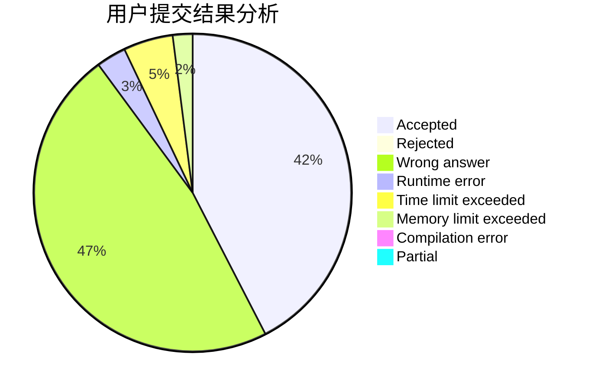
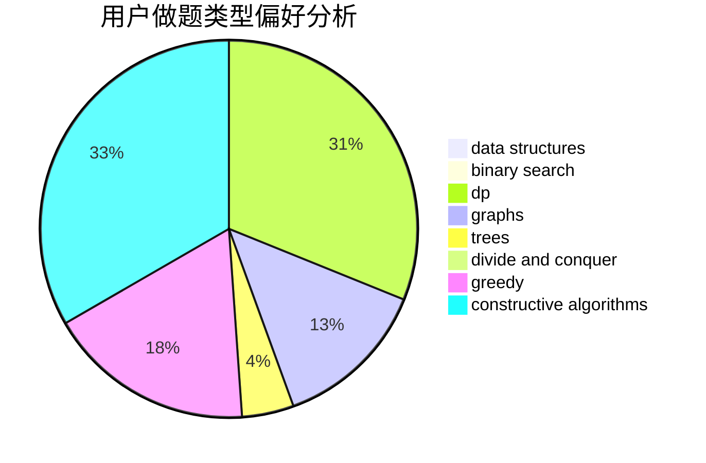
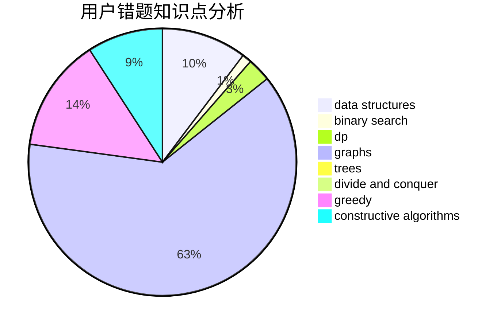

# Vareal

<!-- tabs:start -->

#### **用户提交结果分析**

#### **用户做题类型偏好分析**

#### **用户错题知识点分析**

<!-- tabs:end -->
# 推荐题目
[786D](https://codeforces.com/contest/786/problem/D)		data structures,
                        dfs and similar,
                        hashing,
                        strings,
                        trees		  
[1398D](https://codeforces.com/contest/1398/problem/D)		dp,
                        greedy,
                        sortings		  
[940A](https://codeforces.com/contest/940/problem/A)		brute force,
                        greedy,
                        sortings		  
[771C](https://codeforces.com/contest/771/problem/C)		dfs and similar,
                        dp,
                        trees		  
[335A](https://codeforces.com/contest/335/problem/A)		binary search,
                        constructive algorithms,
                        greedy		  
[899B](https://codeforces.com/contest/899/problem/B)		implementation		  
[437A](https://codeforces.com/contest/437/problem/A)		implementation		  
[1172A](https://codeforces.com/contest/1172/problem/A)		greedy,
                        implementation		  
[1411A](https://codeforces.com/contest/1411/problem/A)		implementation		  
[152D](https://codeforces.com/contest/152/problem/D)		brute force		  
