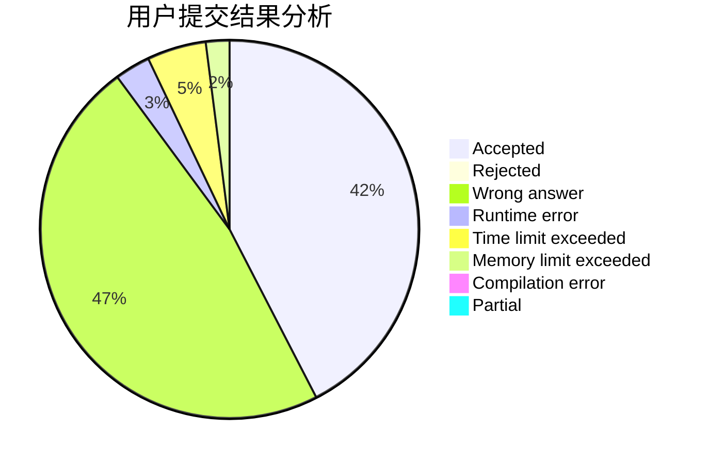
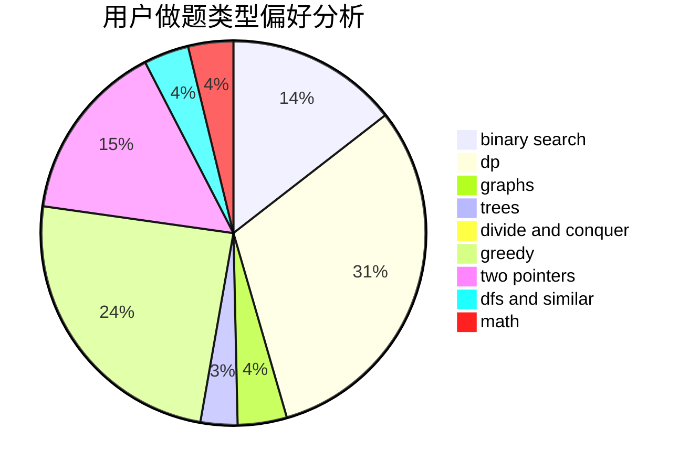

# Vareal

<!-- tabs:start -->

#### **用户提交结果分析**

#### **用户做题类型偏好分析**

<!-- tabs:end -->
# 推荐题目
[786D](https://codeforces.com/contest/786/problem/D)
[1398D](https://codeforces.com/contest/1398/problem/D)
[940A](https://codeforces.com/contest/940/problem/A)
[771C](https://codeforces.com/contest/771/problem/C)
[335A](https://codeforces.com/contest/335/problem/A)
[899B](https://codeforces.com/contest/899/problem/B)
[437A](https://codeforces.com/contest/437/problem/A)
[1172A](https://codeforces.com/contest/1172/problem/A)
[1411A](https://codeforces.com/contest/1411/problem/A)
[152D](https://codeforces.com/contest/152/problem/D)
