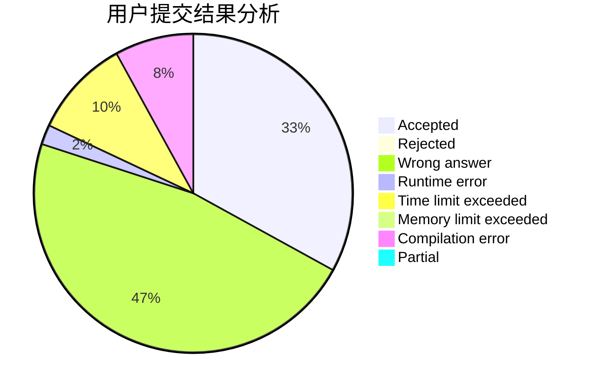
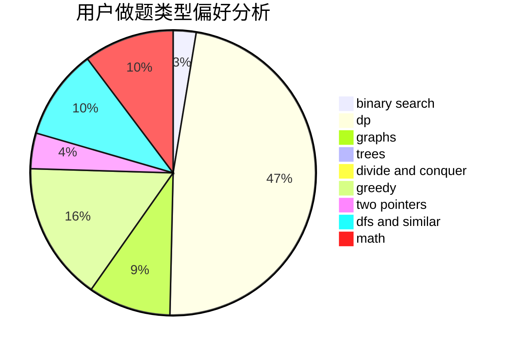

# Vc_NightMu

<!-- tabs:start -->

#### **用户提交结果分析**

#### **用户做题类型偏好分析**

<!-- tabs:end -->
# 推荐题目
[982A](https://codeforces.com/contest/982/problem/A)
[515A](https://codeforces.com/contest/515/problem/A)
[868D](https://codeforces.com/contest/868/problem/D)
[1298D](https://codeforces.com/contest/1298/problem/D)
[1236B](https://codeforces.com/contest/1236/problem/B)
[730B](https://codeforces.com/contest/730/problem/B)
[1198F](https://codeforces.com/contest/1198/problem/F)
[356A](https://codeforces.com/contest/356/problem/A)
[915D](https://codeforces.com/contest/915/problem/D)
[13A](https://codeforces.com/contest/13/problem/A)
