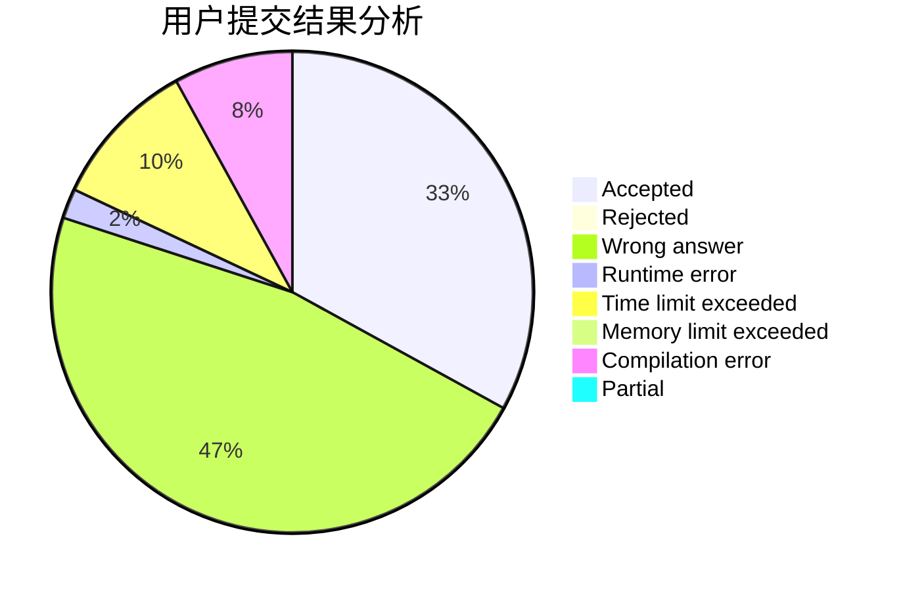
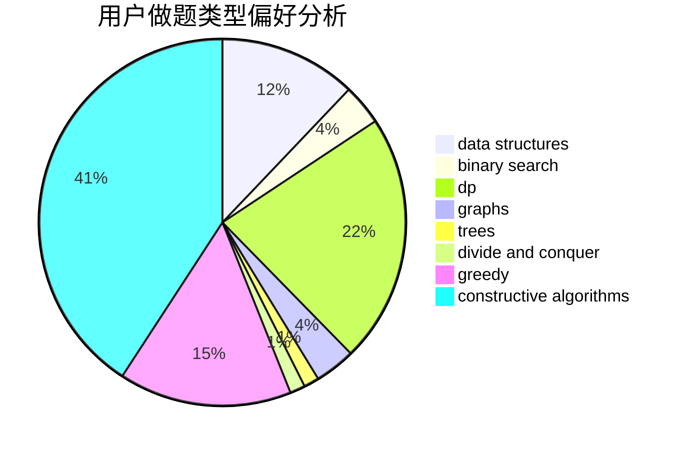

# Vc_NightMu

<!-- tabs:start -->

#### **用户提交结果分析**

#### **用户做题类型偏好分析**

#### **用户错题知识点分析**

<!-- tabs:end -->
# 推荐题目
[982A](https://codeforces.com/contest/982/problem/A)		brute force,
                        constructive algorithms		  
[515A](https://codeforces.com/contest/515/problem/A)		math		  
[868D](https://codeforces.com/contest/868/problem/D)		bitmasks,
                        brute force,
                        dp,
                        implementation,
                        strings		  
[1298D](https://codeforces.com/contest/1298/problem/D)		dsu,graphs,sortings,trees		  
[1236B](https://codeforces.com/contest/1236/problem/B)		combinatorics,
                        math		  
[730B](https://codeforces.com/contest/730/problem/B)		constructive algorithms,
                        interactive		  
[1198F](https://codeforces.com/contest/1198/problem/F)		greedy,
                        number theory,
                        probabilities		  
[356A](https://codeforces.com/contest/356/problem/A)		data structures,
                        dsu		  
[915D](https://codeforces.com/contest/915/problem/D)		dfs and similar,
                        graphs		  
[13A](https://codeforces.com/contest/13/problem/A)		implementation,
                        math		  
