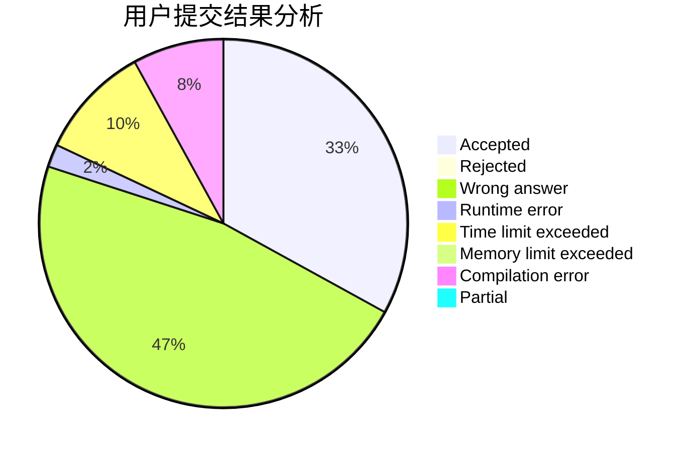
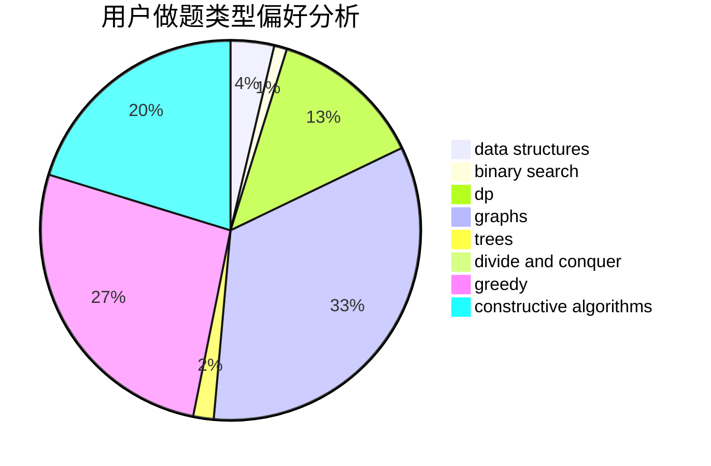

# Vc_NightMu

<!-- tabs:start -->

#### **用户提交结果分析**

#### **用户做题类型偏好分析**

#### **用户错题知识点分析**

<!-- tabs:end -->
# 推荐题目
[960B](https://codeforces.com/contest/960/problem/B)		data structures,
                        greedy,
                        sortings		  
[494E](https://codeforces.com/contest/494/problem/E)		data structures,
                        games		  
[849B](https://codeforces.com/contest/849/problem/B)		brute force,
                        geometry		  
[1291E](https://codeforces.com/contest/1291/problem/E)		dsu,graphs,sortings,trees		  
[1227D2](https://codeforces.com/contest/1227D/problem/2)		data structures,
                        greedy		  
[70D](https://codeforces.com/contest/70/problem/D)		data structures,
                        geometry		  
[1194D](https://codeforces.com/contest/1194/problem/D)		games,
                        math		  
[325E](https://codeforces.com/contest/325/problem/E)		combinatorics,
                        dfs and similar,
                        dsu,
                        graphs,
                        greedy		  
[899D](https://codeforces.com/contest/899/problem/D)		constructive algorithms,
                        math		  
[1391D](https://codeforces.com/contest/1391/problem/D)		bitmasks,
                        brute force,
                        constructive algorithms,
                        dp,
                        greedy,
                        implementation		  
