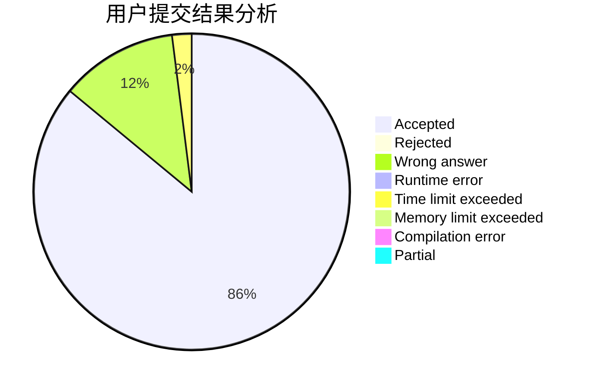
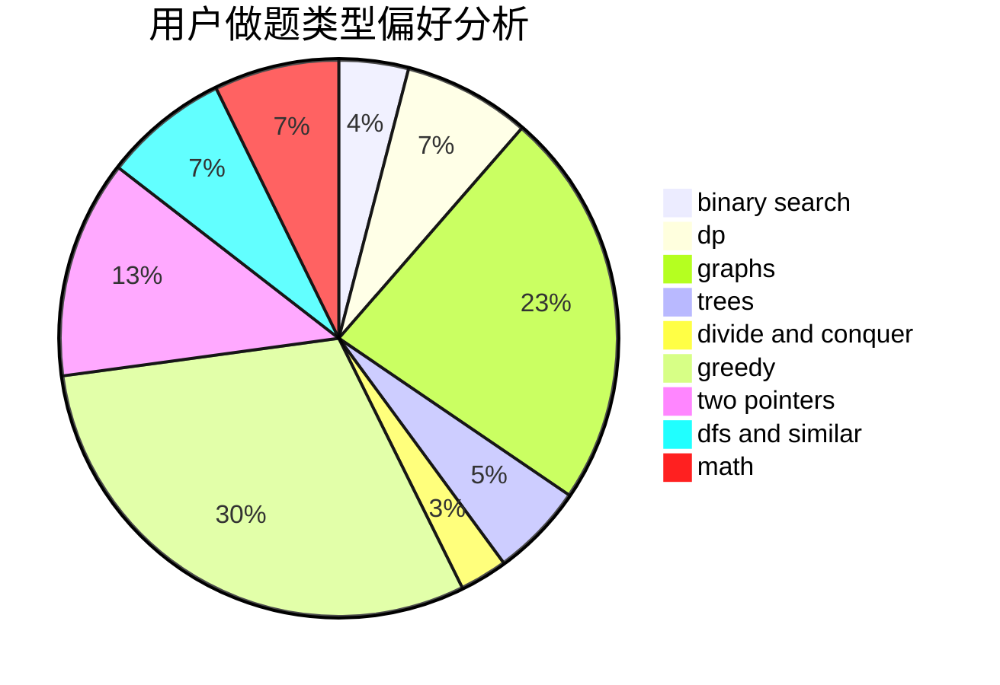

# Vector__

<!-- tabs:start -->

#### **用户提交结果分析**

#### **用户做题类型偏好分析**

<!-- tabs:end -->
# 推荐题目
[952E](https://codeforces.com/contest/952/problem/E)
[11882](https://codeforces.com/contest/1188/problem/2)
[429D](https://codeforces.com/contest/429/problem/D)
[98D](https://codeforces.com/contest/98/problem/D)
[1121B](https://codeforces.com/contest/1121/problem/B)
[1037G](https://codeforces.com/contest/1037/problem/G)
[235A](https://codeforces.com/contest/235/problem/A)
[937A](https://codeforces.com/contest/937/problem/A)
[205C](https://codeforces.com/contest/205/problem/C)
[1251D](https://codeforces.com/contest/1251/problem/D)
