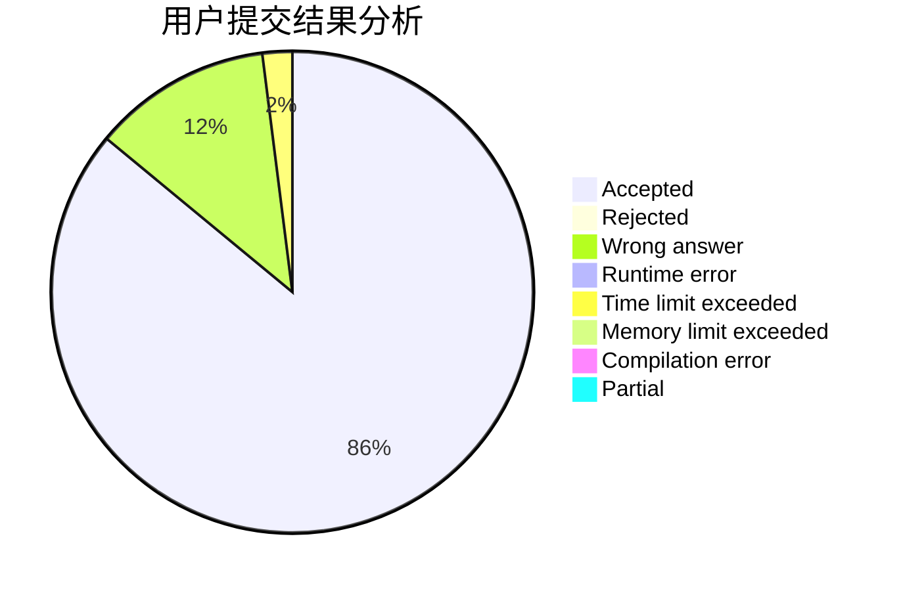
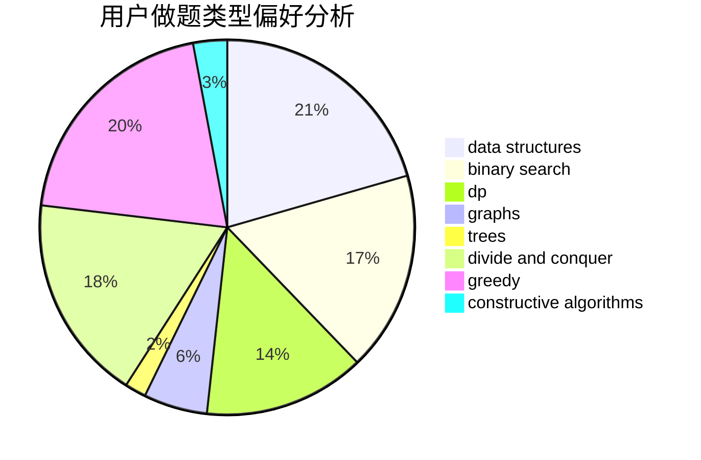
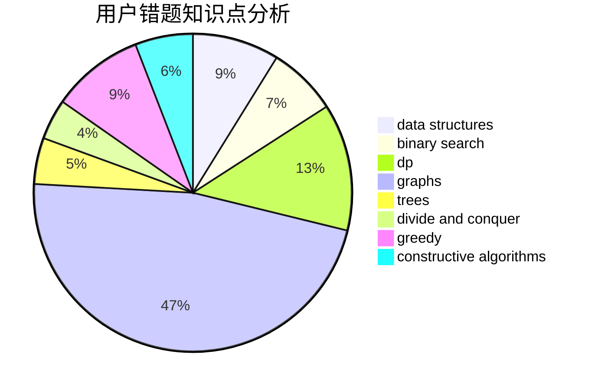

# Vector__

<!-- tabs:start -->

#### **用户提交结果分析**

#### **用户做题类型偏好分析**

#### **用户错题知识点分析**

<!-- tabs:end -->
# 推荐题目
[931F](https://codeforces.com/contest/931/problem/F)		dsu,graphs,sortings,trees		  
[1184C3](https://codeforces.com/contest/1184C/problem/3)		nan		  
[3C](https://codeforces.com/contest/3/problem/C)		brute force,
                        games,
                        implementation		  
[975E](https://codeforces.com/contest/975/problem/E)		geometry		  
[1119B](https://codeforces.com/contest/1119/problem/B)		binary search,
                        flows,
                        greedy,
                        sortings		  
[1037D](https://codeforces.com/contest/1037/problem/D)		dfs and similar,
                        graphs,
                        shortest paths,
                        trees		  
[215D](https://codeforces.com/contest/215/problem/D)		greedy		  
[916E](https://codeforces.com/contest/916/problem/E)		data structures,
                        trees		  
[17E](https://codeforces.com/contest/17/problem/E)		strings		  
[1247E](https://codeforces.com/contest/1247/problem/E)		dsu,graphs,sortings,trees		  
