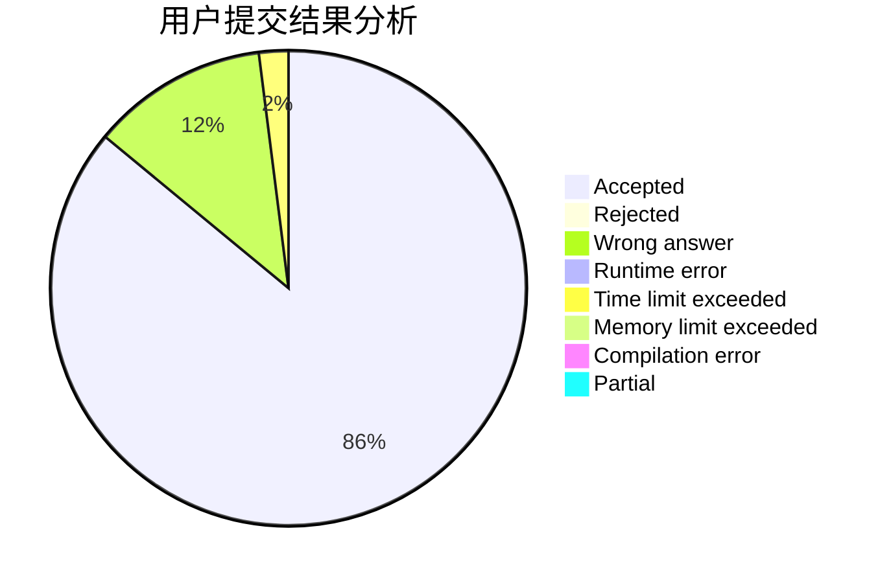
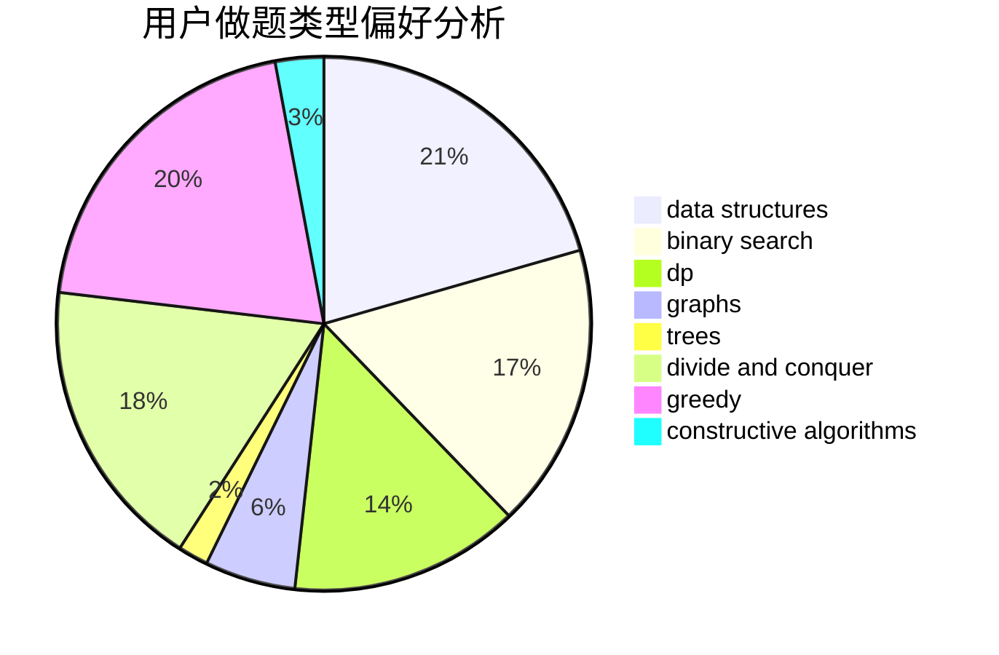
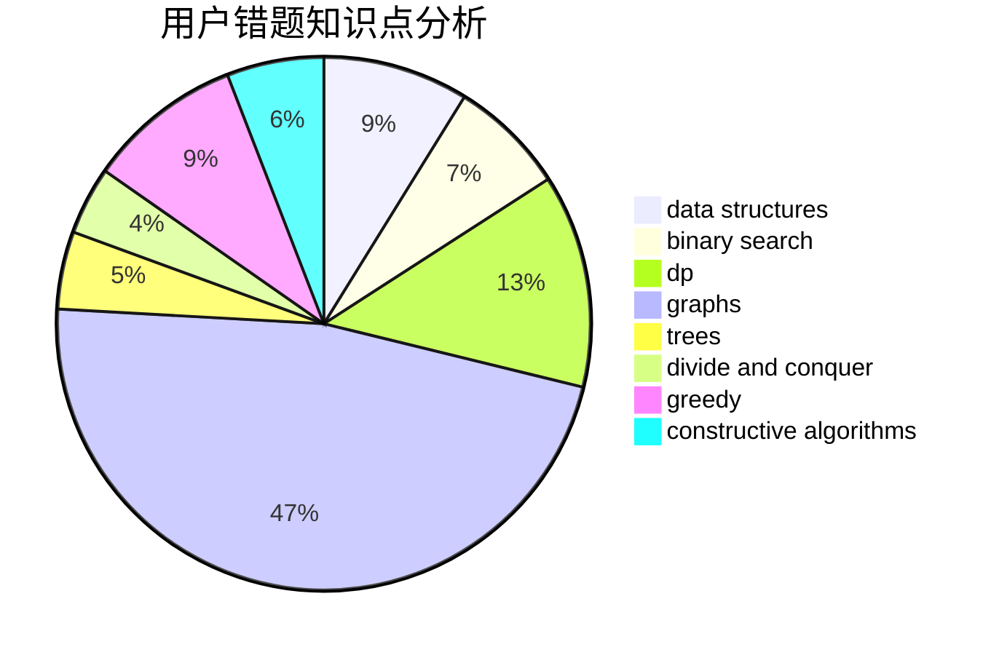

# Vector__
<!-- tabs:start -->
#### **用户提交结果分析**

#### **用户做题类型偏好分析**

#### **用户错题知识点分析**

<!-- tabs:end -->
# 推荐题目
[Big Secret](http://codeforces.com/problemset/problem/925/C)		constructive algorithms,
                        math		  
[Tic-tac-toe](http://codeforces.com/problemset/problem/3/C)		brute force,
                        games,
                        implementation		  
[Teodor is not a liar!](https://codeforces.com/contest/931/problem/F)		data structures,
                        dp		  
[Heidi and the Turing Test (Hard)](http://codeforces.com/problemset/problem/1184/C3)		nan		  
[Hot Days](http://codeforces.com/problemset/problem/215/D)		greedy		  
[Classroom Watch](http://codeforces.com/problemset/problem/875/A)		brute force,
                        math		  
[Karen and Neighborhood](http://codeforces.com/problemset/problem/815/E)		binary search,
                        constructive algorithms,
                        implementation		  
[Guess the Root](http://codeforces.com/problemset/problem/1155/E)		brute force,
                        interactive,
                        math		  
[Rescue Nibel!](http://codeforces.com/problemset/problem/1420/D)		combinatorics,
                        data structures,
                        sortings		  
[Lamps on a Circle](http://codeforces.com/problemset/problem/1368/F)		games,
                        implementation,
                        interactive,
                        math		  
<!-- tabs:start -->
#### **data structures**
[Big Secret](https://codeforces.com/contest/931/problem/F)		data structures,
                        dp		  
[Tic-tac-toe](http://codeforces.com/problemset/problem/1420/D)		combinatorics,
                        data structures,
                        sortings		  
[Teodor is not a liar!](http://codeforces.com/problemset/problem/916/E)		data structures,
                        trees		  
[Heidi and the Turing Test (Hard)](http://codeforces.com/problemset/problem/403/E)		data structures,
                        implementation,
                        trees		  
[Hot Days](http://codeforces.com/problemset/problem/1213/B)		data structures,
                        implementation		  
[Classroom Watch](http://codeforces.com/problemset/problem/748/D)		constructive algorithms,
                        data structures,
                        greedy		  
[Karen and Neighborhood](http://codeforces.com/problemset/problem/671/E)		data structures,
                        greedy		  
[Guess the Root](http://codeforces.com/problemset/problem/1492/C)		binary search,
                        data structures,
                        dp,
                        greedy,
                        two pointers		  
[Rescue Nibel!](http://codeforces.com/problemset/problem/1490/G)		binary search,
                        data structures,
                        math		  
[Lamps on a Circle](http://codeforces.com/problemset/problem/1479/D)		binary search,
                        bitmasks,
                        brute force,
                        data structures,
                        probabilities,
                        trees		  
#### **binary search**
[Big Secret](http://codeforces.com/problemset/problem/815/E)		binary search,
                        constructive algorithms,
                        implementation		  
[Tic-tac-toe](http://codeforces.com/problemset/problem/1119/B)		binary search,
                        flows,
                        greedy,
                        sortings		  
[Teodor is not a liar!](https://codeforces.com/contest/1011/problem/D)		binary search,
                        interactive		  
[Heidi and the Turing Test (Hard)](https://codeforces.com/contest/1247/problem/E)		binary search,
                        dp		  
[Hot Days](http://codeforces.com/problemset/problem/1108/F)		binary search,
                        dsu,
                        graphs,
                        greedy		  
[Classroom Watch](http://codeforces.com/problemset/problem/1492/C)		binary search,
                        data structures,
                        dp,
                        greedy,
                        two pointers		  
[Karen and Neighborhood](http://codeforces.com/problemset/problem/1463/D)		binary search,
                        constructive algorithms,
                        greedy,
                        two pointers		  
[Guess the Root](http://codeforces.com/problemset/problem/1490/G)		binary search,
                        data structures,
                        math		  
[Rescue Nibel!](http://codeforces.com/problemset/problem/1479/D)		binary search,
                        bitmasks,
                        brute force,
                        data structures,
                        probabilities,
                        trees		  
[Lamps on a Circle](http://codeforces.com/problemset/problem/1436/E)		binary search,
                        data structures,
                        two pointers		  
#### **dp**
[Big Secret](https://codeforces.com/contest/931/problem/F)		data structures,
                        dp		  
[Tic-tac-toe](http://codeforces.com/problemset/problem/300/D)		dp,
                        fft		  
[Teodor is not a liar!](http://codeforces.com/problemset/problem/1109/D)		brute force,
                        combinatorics,
                        dp,
                        math,
                        trees		  
[Heidi and the Turing Test (Hard)](http://codeforces.com/problemset/problem/500/F)		divide and conquer,
                        dp		  
[Hot Days](http://codeforces.com/problemset/problem/1389/G)		dfs and similar,
                        dp,
                        graphs,
                        trees		  
[Classroom Watch](https://codeforces.com/contest/1247/problem/E)		binary search,
                        dp		  
[Karen and Neighborhood](http://codeforces.com/problemset/problem/1381/D)		dfs and similar,
                        dp,
                        greedy,
                        trees,
                        two pointers		  
[Guess the Root](http://codeforces.com/problemset/problem/1492/C)		binary search,
                        data structures,
                        dp,
                        greedy,
                        two pointers		  
[Rescue Nibel!](https://codeforces.com/contest/1457/problem/C)		brute force,
                        dp,
                        implementation		  
[Lamps on a Circle](http://codeforces.com/problemset/problem/1491/C)		brute force,
                        data structures,
                        dp,
                        greedy,
                        implementation		  
#### **graph**
[Big Secret](http://codeforces.com/problemset/problem/863/C)		graphs,
                        implementation		  
[Tic-tac-toe](http://codeforces.com/problemset/problem/567/E)		dfs and similar,
                        graphs,
                        hashing,
                        shortest paths		  
[Teodor is not a liar!](http://codeforces.com/problemset/problem/402/E)		graphs,
                        math		  
[Heidi and the Turing Test (Hard)](http://codeforces.com/problemset/problem/1037/D)		dfs and similar,
                        graphs,
                        shortest paths,
                        trees		  
[Hot Days](http://codeforces.com/problemset/problem/1389/G)		dfs and similar,
                        dp,
                        graphs,
                        trees		  
[Classroom Watch](http://codeforces.com/problemset/problem/723/E)		constructive algorithms,
                        dfs and similar,
                        flows,
                        graphs,
                        greedy		  
[Karen and Neighborhood](http://codeforces.com/problemset/problem/870/E)		dfs and similar,
                        dsu,
                        graphs,
                        trees		  
[Guess the Root](http://codeforces.com/problemset/problem/1108/F)		binary search,
                        dsu,
                        graphs,
                        greedy		  
[Rescue Nibel!](http://codeforces.com/problemset/problem/1487/C)		brute force,
                        constructive algorithms,
                        dfs and similar,
                        graphs,
                        greedy,
                        implementation,
                        math		  
[Lamps on a Circle](http://codeforces.com/problemset/problem/1437/C)		dp,
                        flows,
                        graph matchings,
                        greedy,
                        math,
                        sortings		  
#### **trees**
[Big Secret](http://codeforces.com/problemset/problem/1109/D)		brute force,
                        combinatorics,
                        dp,
                        math,
                        trees		  
[Tic-tac-toe](http://codeforces.com/problemset/problem/916/E)		data structures,
                        trees		  
[Teodor is not a liar!](http://codeforces.com/problemset/problem/1037/D)		dfs and similar,
                        graphs,
                        shortest paths,
                        trees		  
[Heidi and the Turing Test (Hard)](http://codeforces.com/problemset/problem/403/E)		data structures,
                        implementation,
                        trees		  
[Hot Days](http://codeforces.com/problemset/problem/1389/G)		dfs and similar,
                        dp,
                        graphs,
                        trees		  
[Classroom Watch](http://codeforces.com/problemset/problem/870/E)		dfs and similar,
                        dsu,
                        graphs,
                        trees		  
[Karen and Neighborhood](http://codeforces.com/problemset/problem/1381/D)		dfs and similar,
                        dp,
                        greedy,
                        trees,
                        two pointers		  
[Guess the Root](http://codeforces.com/problemset/problem/1479/D)		binary search,
                        bitmasks,
                        brute force,
                        data structures,
                        probabilities,
                        trees		  
[Rescue Nibel!](http://codeforces.com/problemset/problem/1511/C)		brute force,
                        data structures,
                        implementation,
                        trees		  
[Lamps on a Circle](http://codeforces.com/problemset/problem/1499/F)		combinatorics,
                        dfs and similar,
                        dp,
                        trees		  
#### **divide and conquer**
[Big Secret](http://codeforces.com/problemset/problem/500/F)		divide and conquer,
                        dp		  
[Tic-tac-toe](http://codeforces.com/problemset/problem/1461/D)		binary search,
                        brute force,
                        data structures,
                        divide and conquer,
                        implementation,
                        sortings		  
[Teodor is not a liar!](http://codeforces.com/problemset/problem/1466/G)		combinatorics,
                        divide and conquer,
                        hashing,
                        math,
                        string suffix structures,
                        strings		  
[Heidi and the Turing Test (Hard)](http://codeforces.com/problemset/problem/1490/D)		dfs and similar,
                        divide and conquer,
                        implementation		  
[Hot Days](https://codeforces.com/contest/1483/problem/C)		data structures,
                        divide and conquer,
                        dp		  
[Classroom Watch](http://codeforces.com/problemset/problem/1491/E)		brute force,
                        dfs and similar,
                        divide and conquer,
                        number theory,
                        trees		  
[Karen and Neighborhood](http://codeforces.com/problemset/problem/1303/G)		data structures,
                        divide and conquer,
                        geometry,
                        trees		  
[Guess the Root](http://codeforces.com/problemset/problem/1494/D)		constructive algorithms,
                        data structures,
                        dfs and similar,
                        divide and conquer,
                        dsu,
                        greedy,
                        sortings,
                        trees		  
[Rescue Nibel!](http://codeforces.com/problemset/problem/1482/E)		data structures,
                        divide and conquer,
                        dp		  
[Lamps on a Circle](http://codeforces.com/problemset/problem/566/C)		dfs and similar,
                        divide and conquer,
                        trees		  
#### **greedy**
[Big Secret](http://codeforces.com/problemset/problem/215/D)		greedy		  
[Tic-tac-toe](http://codeforces.com/problemset/problem/1119/B)		binary search,
                        flows,
                        greedy,
                        sortings		  
[Teodor is not a liar!](http://codeforces.com/problemset/problem/1264/A)		greedy,
                        implementation		  
[Heidi and the Turing Test (Hard)](http://codeforces.com/problemset/problem/1106/C)		greedy,
                        implementation,
                        math,
                        sortings		  
[Hot Days](http://codeforces.com/problemset/problem/723/E)		constructive algorithms,
                        dfs and similar,
                        flows,
                        graphs,
                        greedy		  
[Classroom Watch](http://codeforces.com/problemset/problem/1452/F)		constructive algorithms,
                        greedy		  
[Karen and Neighborhood](http://codeforces.com/problemset/problem/1381/D)		dfs and similar,
                        dp,
                        greedy,
                        trees,
                        two pointers		  
[Guess the Root](http://codeforces.com/problemset/problem/748/D)		constructive algorithms,
                        data structures,
                        greedy		  
[Rescue Nibel!](http://codeforces.com/problemset/problem/1108/F)		binary search,
                        dsu,
                        graphs,
                        greedy		  
[Lamps on a Circle](http://codeforces.com/problemset/problem/1333/B)		greedy,
                        implementation		  
#### **constructive algorithms**
[Big Secret](http://codeforces.com/problemset/problem/925/C)		constructive algorithms,
                        math		  
[Tic-tac-toe](http://codeforces.com/problemset/problem/815/E)		binary search,
                        constructive algorithms,
                        implementation		  
[Teodor is not a liar!](http://codeforces.com/problemset/problem/723/E)		constructive algorithms,
                        dfs and similar,
                        flows,
                        graphs,
                        greedy		  
[Heidi and the Turing Test (Hard)](http://codeforces.com/problemset/problem/1452/F)		constructive algorithms,
                        greedy		  
[Hot Days](http://codeforces.com/problemset/problem/1137/D)		constructive algorithms,
                        interactive,
                        number theory		  
[Classroom Watch](http://codeforces.com/problemset/problem/748/D)		constructive algorithms,
                        data structures,
                        greedy		  
[Karen and Neighborhood](http://codeforces.com/problemset/problem/1237/H)		constructive algorithms		  
[Guess the Root](http://codeforces.com/problemset/problem/1493/A)		constructive algorithms,
                        greedy		  
[Rescue Nibel!](http://codeforces.com/problemset/problem/1463/D)		binary search,
                        constructive algorithms,
                        greedy,
                        two pointers		  
[Lamps on a Circle](https://codeforces.com/contest/1456/problem/B)		bitmasks,
                        brute force,
                        constructive algorithms		  
#### **sortings**
[Big Secret](http://codeforces.com/problemset/problem/1420/D)		combinatorics,
                        data structures,
                        sortings		  
[Tic-tac-toe](http://codeforces.com/problemset/problem/1119/B)		binary search,
                        flows,
                        greedy,
                        sortings		  
[Teodor is not a liar!](http://codeforces.com/problemset/problem/1106/C)		greedy,
                        implementation,
                        math,
                        sortings		  
[Heidi and the Turing Test (Hard)](https://codeforces.com/contest/1496/problem/C)		geometry,
                        greedy,
                        math,
                        sortings		  
[Hot Days](http://codeforces.com/problemset/problem/1495/A)		geometry,
                        greedy,
                        math,
                        sortings		  
[Classroom Watch](http://codeforces.com/problemset/problem/1497/A)		brute force,
                        data structures,
                        greedy,
                        sortings		  
[Karen and Neighborhood](http://codeforces.com/problemset/problem/1427/A)		math,
                        sortings		  
[Guess the Root](http://codeforces.com/problemset/problem/1461/D)		binary search,
                        brute force,
                        data structures,
                        divide and conquer,
                        implementation,
                        sortings		  
[Rescue Nibel!](http://codeforces.com/problemset/problem/1437/C)		dp,
                        flows,
                        graph matchings,
                        greedy,
                        math,
                        sortings		  
[Lamps on a Circle](http://codeforces.com/problemset/problem/1473/A)		greedy,
                        implementation,
                        math,
                        sortings		  
<!-- tabs:end -->
