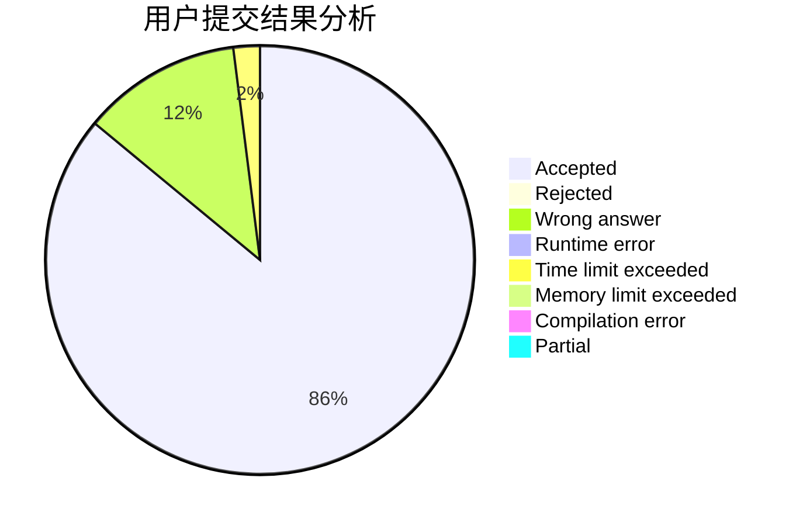
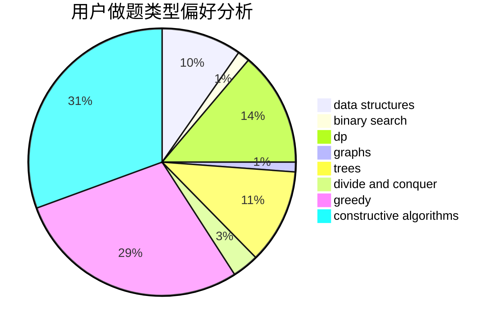
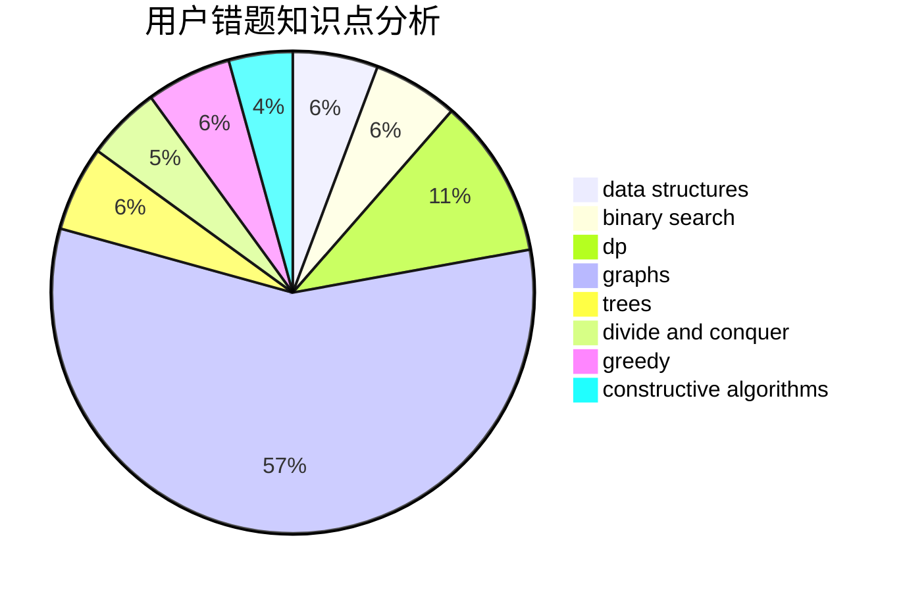

# Vector__

<!-- tabs:start -->

#### **用户提交结果分析**

#### **用户做题类型偏好分析**

#### **用户错题知识点分析**

<!-- tabs:end -->
# 推荐题目
[952E](https://codeforces.com/contest/952/problem/E)		nan		  
[11882](https://codeforces.com/contest/1188/problem/2)		dsu,graphs,sortings,trees		  
[429D](https://codeforces.com/contest/429/problem/D)		data structures,
                        divide and conquer,
                        geometry		  
[98D](https://codeforces.com/contest/98/problem/D)		constructive algorithms		  
[1121B](https://codeforces.com/contest/1121/problem/B)		brute force,
                        implementation		  
[1037G](https://codeforces.com/contest/1037/problem/G)		games		  
[235A](https://codeforces.com/contest/235/problem/A)		number theory		  
[937A](https://codeforces.com/contest/937/problem/A)		implementation,
                        sortings		  
[205C](https://codeforces.com/contest/205/problem/C)		dsu,graphs,sortings,trees		  
[1251D](https://codeforces.com/contest/1251/problem/D)		binary search,
                        greedy,
                        sortings		  
