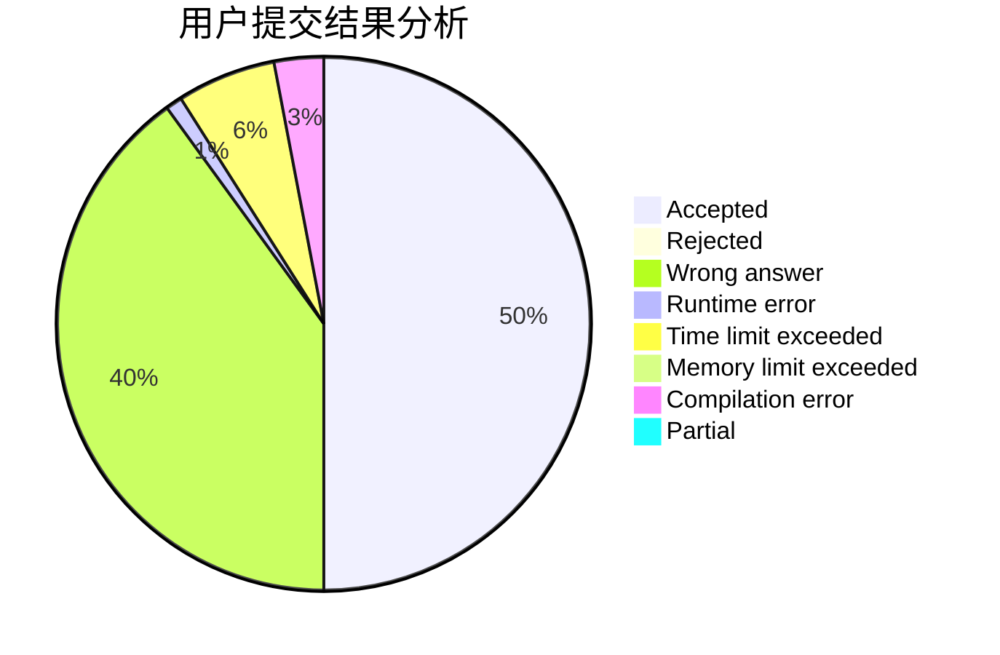
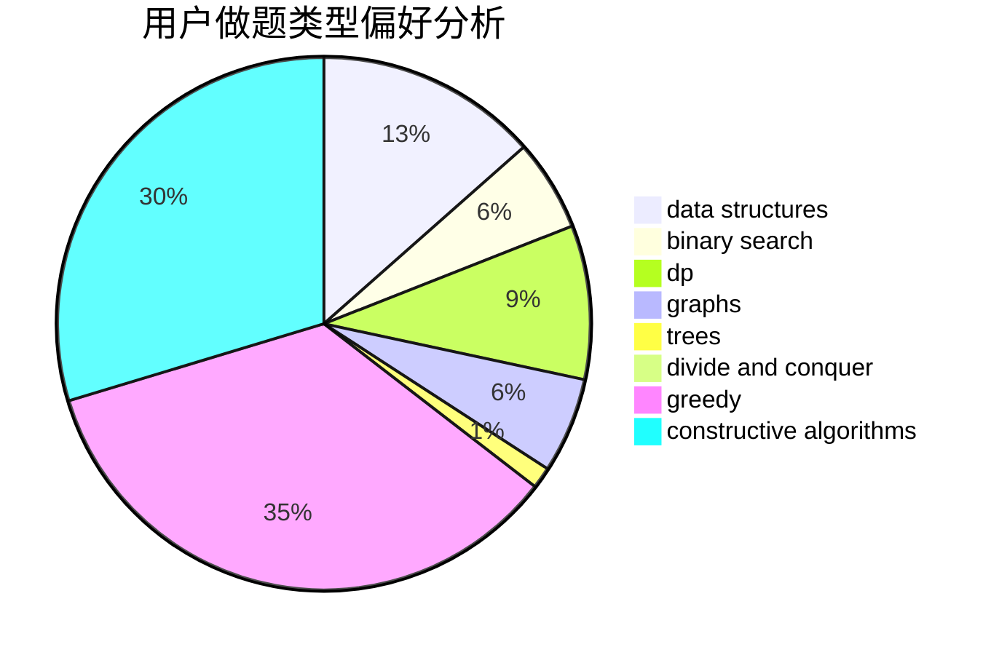

# Vector_zhou

<!-- tabs:start -->

#### **用户提交结果分析**

#### **用户做题类型偏好分析**

#### **用户错题知识点分析**

<!-- tabs:end -->
# 推荐题目
[1422F](https://codeforces.com/contest/1422/problem/F)		data structures,
                        math,
                        number theory		  
[757F](https://codeforces.com/contest/757/problem/F)		data structures,
                        graphs,
                        shortest paths		  
[225E](https://codeforces.com/contest/225/problem/E)		math,
                        number theory		  
[1424M](https://codeforces.com/contest/1424/problem/M)		graphs,
                        sortings		  
[672A](https://codeforces.com/contest/672/problem/A)		implementation		  
[700D](https://codeforces.com/contest/700/problem/D)		data structures,
                        greedy		  
[1088D](https://codeforces.com/contest/1088/problem/D)		bitmasks,
                        constructive algorithms,
                        implementation,
                        interactive		  
[723B](https://codeforces.com/contest/723/problem/B)		expression parsing,
                        implementation,
                        strings		  
[47B](https://codeforces.com/contest/47/problem/B)		implementation		  
[793G](https://codeforces.com/contest/793/problem/G)		data structures,
                        divide and conquer,
                        flows,
                        graph matchings		  
