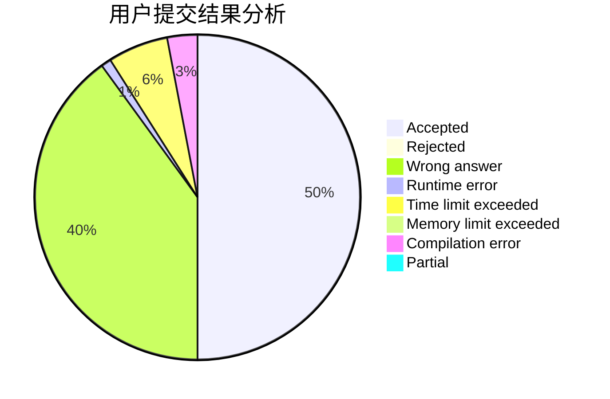
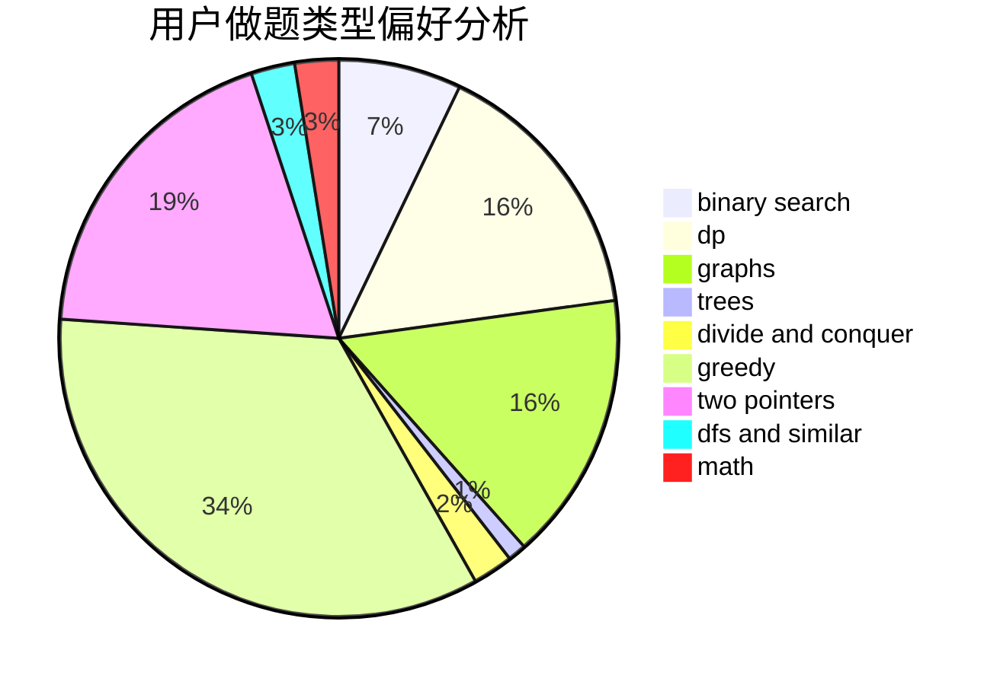

# Vector_zhou

<!-- tabs:start -->

#### **用户提交结果分析**

#### **用户做题类型偏好分析**

<!-- tabs:end -->
# 推荐题目
[1422F](https://codeforces.com/contest/1422/problem/F)
[757F](https://codeforces.com/contest/757/problem/F)
[225E](https://codeforces.com/contest/225/problem/E)
[1424M](https://codeforces.com/contest/1424/problem/M)
[672A](https://codeforces.com/contest/672/problem/A)
[700D](https://codeforces.com/contest/700/problem/D)
[1088D](https://codeforces.com/contest/1088/problem/D)
[723B](https://codeforces.com/contest/723/problem/B)
[47B](https://codeforces.com/contest/47/problem/B)
[793G](https://codeforces.com/contest/793/problem/G)
