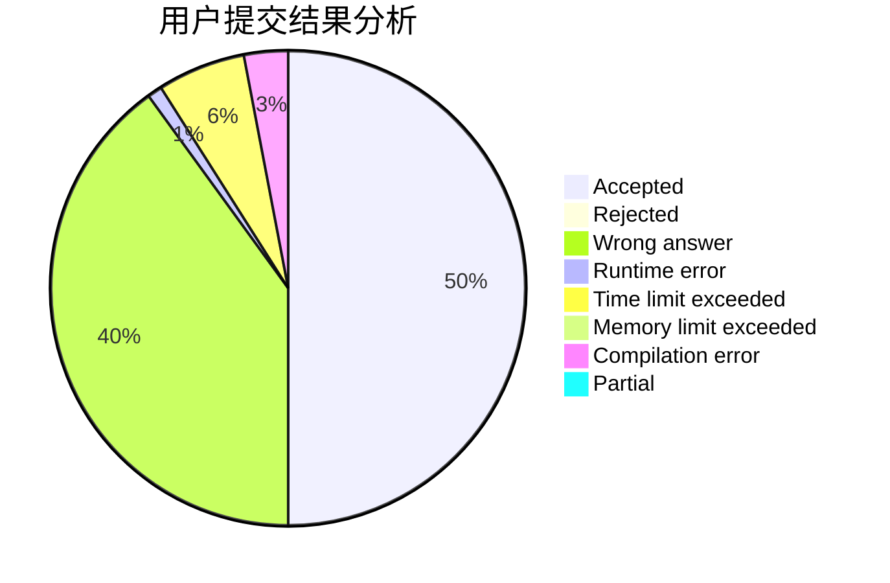
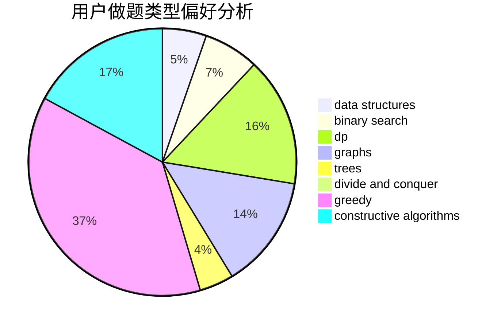
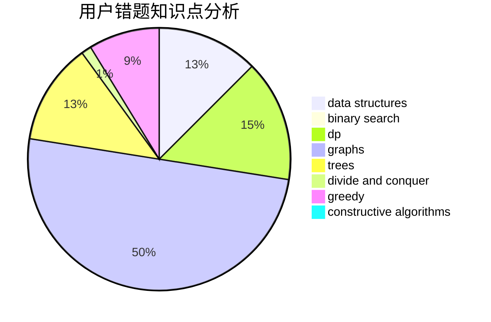

# Vector_zhou

<!-- tabs:start -->

#### **用户提交结果分析**

#### **用户做题类型偏好分析**

#### **用户错题知识点分析**

<!-- tabs:end -->
# 推荐题目
[1413D](https://codeforces.com/contest/1413/problem/D)		data structures,
                        greedy,
                        implementation		  
[736A](https://codeforces.com/contest/736/problem/A)		dsu,graphs,sortings,trees		  
[200C](https://codeforces.com/contest/200/problem/C)		brute force,
                        implementation		  
[1417C](https://codeforces.com/contest/1417/problem/C)		dsu,graphs,sortings,trees		  
[645E](https://codeforces.com/contest/645/problem/E)		dp,
                        greedy,
                        strings		  
[676D](https://codeforces.com/contest/676/problem/D)		graphs,
                        implementation,
                        shortest paths		  
[1088A](https://codeforces.com/contest/1088/problem/A)		brute force,
                        constructive algorithms		  
[704B](https://codeforces.com/contest/704/problem/B)		dp,
                        graphs,
                        greedy		  
[460D](https://codeforces.com/contest/460/problem/D)		brute force,
                        constructive algorithms,
                        math		  
[776A](https://codeforces.com/contest/776/problem/A)		brute force,
                        implementation,
                        strings		  
