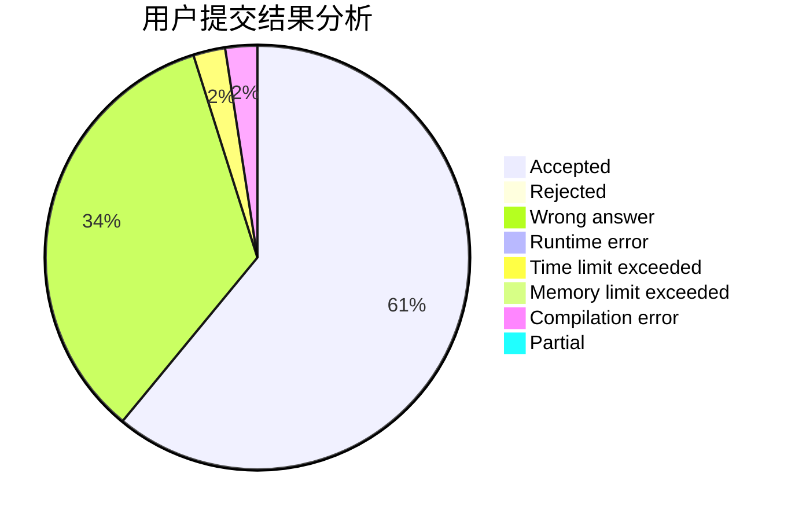
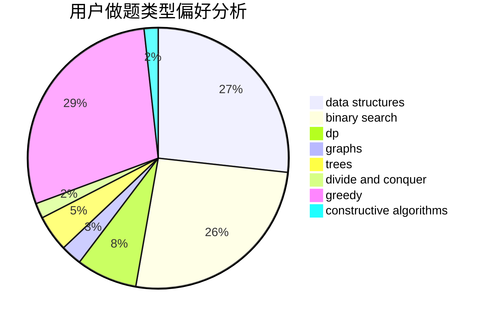
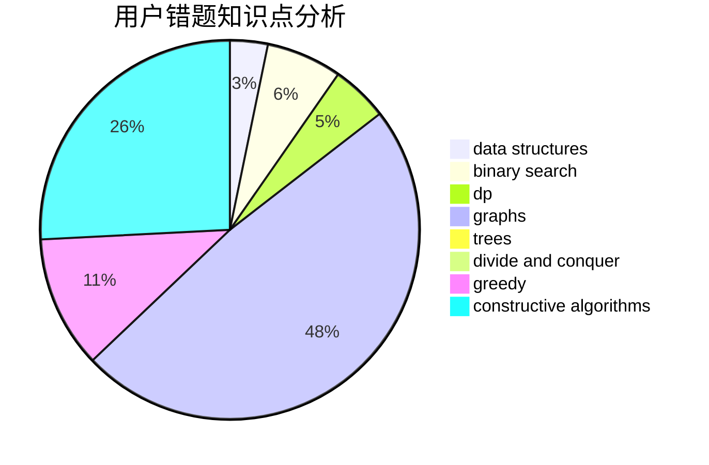

# VerakinT

<!-- tabs:start -->

#### **用户提交结果分析**

#### **用户做题类型偏好分析**

#### **用户错题知识点分析**

<!-- tabs:end -->
# 推荐题目
[51F](https://codeforces.com/contest/51/problem/F)		dfs and similar,
                        dp,
                        graphs,
                        trees		  
[901A](https://codeforces.com/contest/901/problem/A)		constructive algorithms,
                        trees		  
[59A](https://codeforces.com/contest/59/problem/A)		implementation,
                        strings		  
[1143E](https://codeforces.com/contest/1143/problem/E)		dsu,graphs,sortings,trees		  
[439D](https://codeforces.com/contest/439/problem/D)		binary search,
                        sortings,
                        ternary search,
                        two pointers		  
[1023E](https://codeforces.com/contest/1023/problem/E)		constructive algorithms,
                        interactive,
                        matrices		  
[997C](https://codeforces.com/contest/997/problem/C)		combinatorics,
                        math		  
[574C](https://codeforces.com/contest/574/problem/C)		dsu,graphs,sortings,trees		  
[918E](https://codeforces.com/contest/918/problem/E)		dsu,graphs,sortings,trees		  
[660B](https://codeforces.com/contest/660/problem/B)		implementation		  
