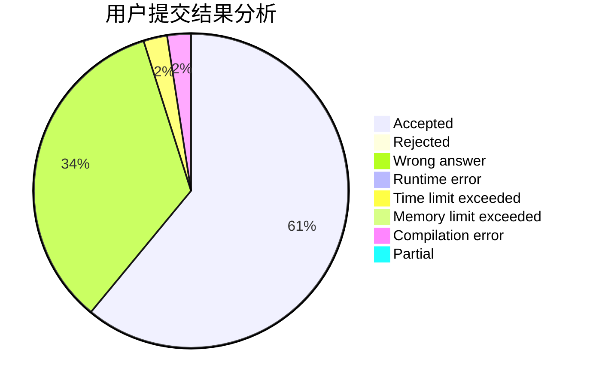
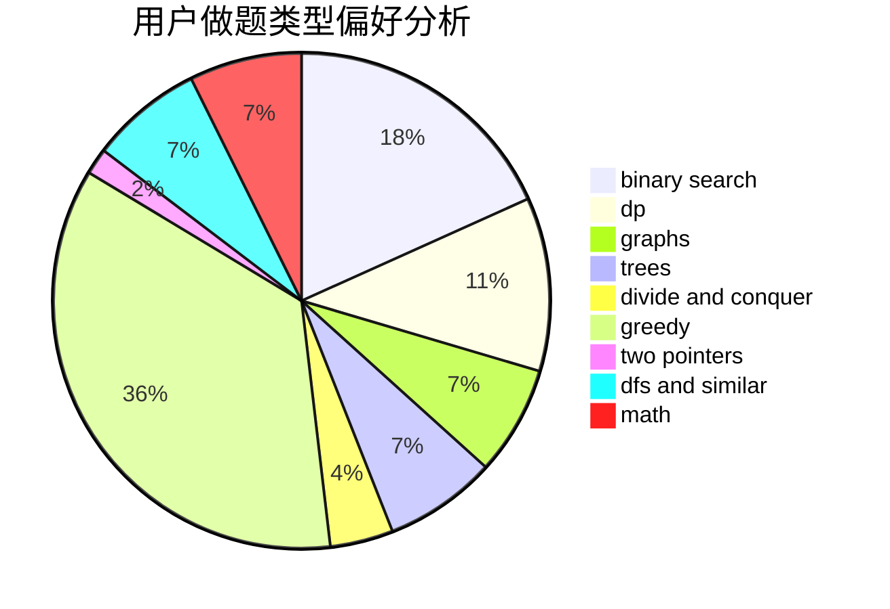

# VerakinT

<!-- tabs:start -->

#### **用户提交结果分析**

#### **用户做题类型偏好分析**

<!-- tabs:end -->
# 推荐题目
[51F](https://codeforces.com/contest/51/problem/F)
[901A](https://codeforces.com/contest/901/problem/A)
[59A](https://codeforces.com/contest/59/problem/A)
[1143E](https://codeforces.com/contest/1143/problem/E)
[439D](https://codeforces.com/contest/439/problem/D)
[1023E](https://codeforces.com/contest/1023/problem/E)
[997C](https://codeforces.com/contest/997/problem/C)
[574C](https://codeforces.com/contest/574/problem/C)
[918E](https://codeforces.com/contest/918/problem/E)
[660B](https://codeforces.com/contest/660/problem/B)
