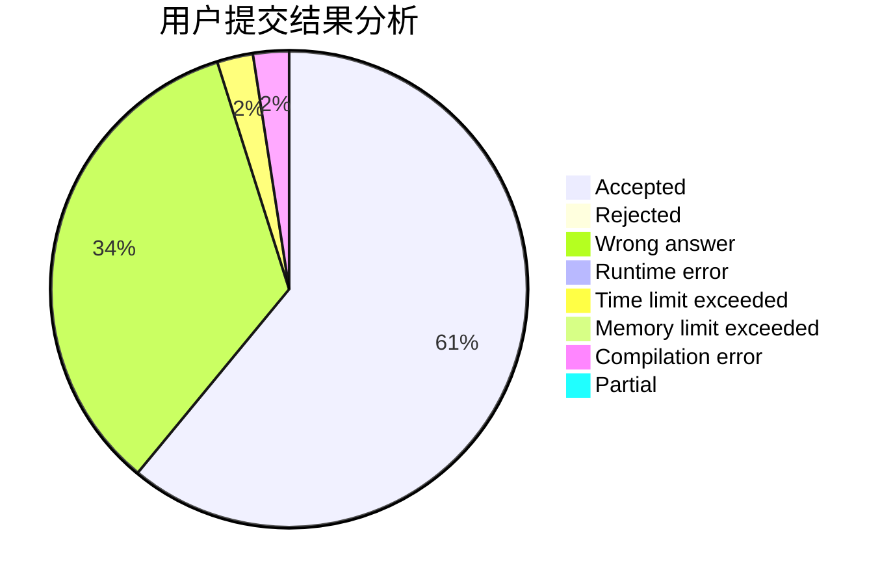
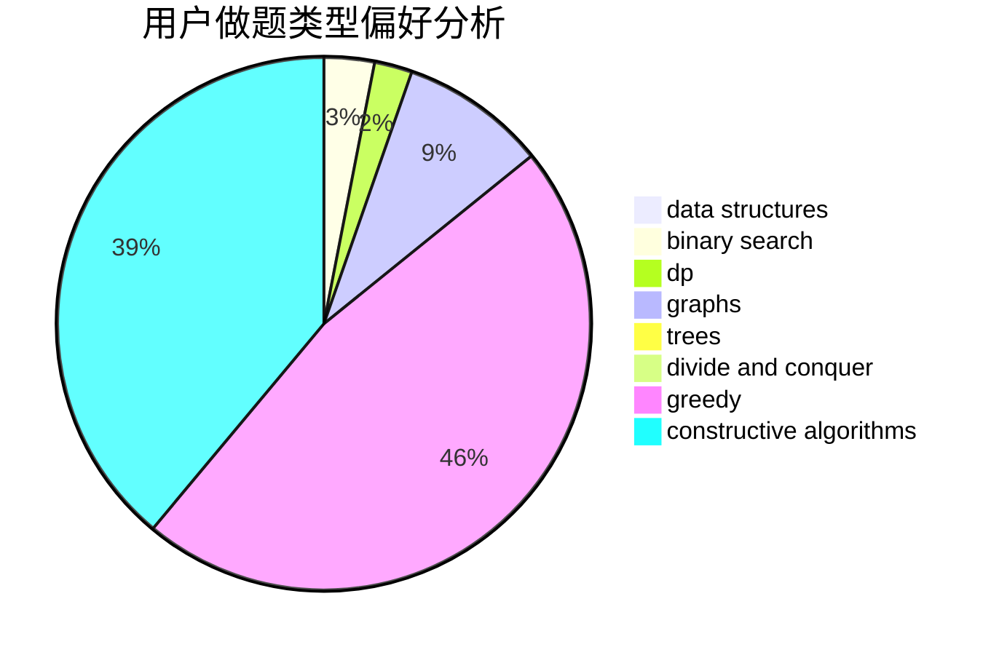
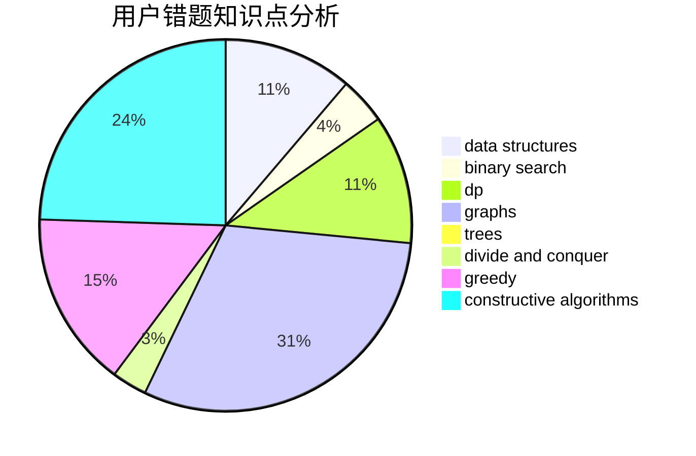

# VerakinT

<!-- tabs:start -->

#### **用户提交结果分析**

#### **用户做题类型偏好分析**

#### **用户错题知识点分析**

<!-- tabs:end -->
# 推荐题目
[49E](https://codeforces.com/contest/49/problem/E)		dp		  
[883G](https://codeforces.com/contest/883/problem/G)		dfs and similar,
                        graphs		  
[578D](https://codeforces.com/contest/578/problem/D)		dp,
                        greedy		  
[1141E](https://codeforces.com/contest/1141/problem/E)		math		  
[414B](https://codeforces.com/contest/414/problem/B)		combinatorics,
                        dp,
                        number theory		  
[1023B](https://codeforces.com/contest/1023/problem/B)		math		  
[981H](https://codeforces.com/contest/981/problem/H)		combinatorics,
                        data structures,
                        dp,
                        fft,
                        math		  
[549E](https://codeforces.com/contest/549/problem/E)		geometry,
                        math		  
[902C](https://codeforces.com/contest/902/problem/C)		dsu,graphs,sortings,trees		  
[630F](https://codeforces.com/contest/630/problem/F)		combinatorics,
                        math		  
