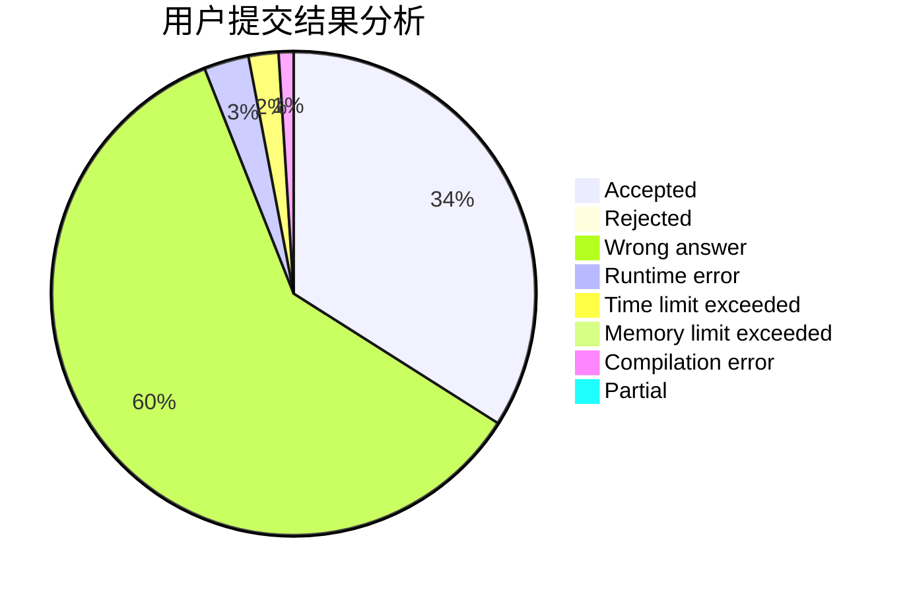
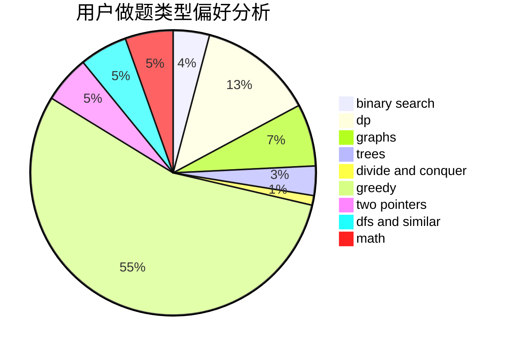

# AhoCorasick

<!-- tabs:start -->

#### **用户提交结果分析**

#### **用户做题类型偏好分析**

<!-- tabs:end -->
# 推荐题目
[225E](https://codeforces.com/contest/225/problem/E)
[1292E](https://codeforces.com/contest/1292/problem/E)
[1383A](https://codeforces.com/contest/1383/problem/A)
[1073C](https://codeforces.com/contest/1073/problem/C)
[228B](https://codeforces.com/contest/228/problem/B)
[1169B](https://codeforces.com/contest/1169/problem/B)
[22E](https://codeforces.com/contest/22/problem/E)
[229D](https://codeforces.com/contest/229/problem/D)
[22B](https://codeforces.com/contest/22/problem/B)
[230B](https://codeforces.com/contest/230/problem/B)
