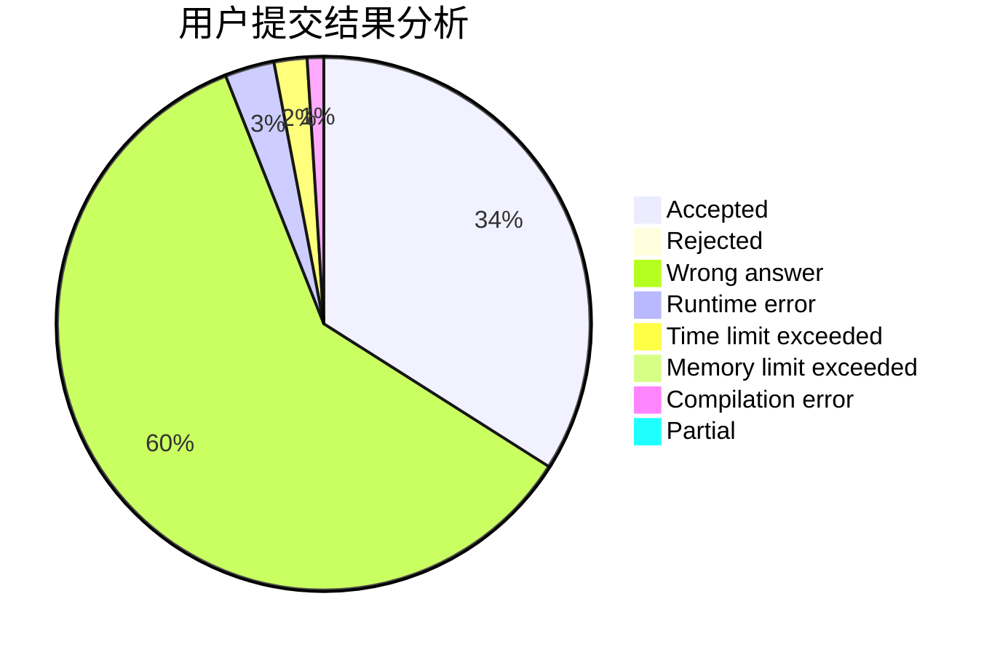
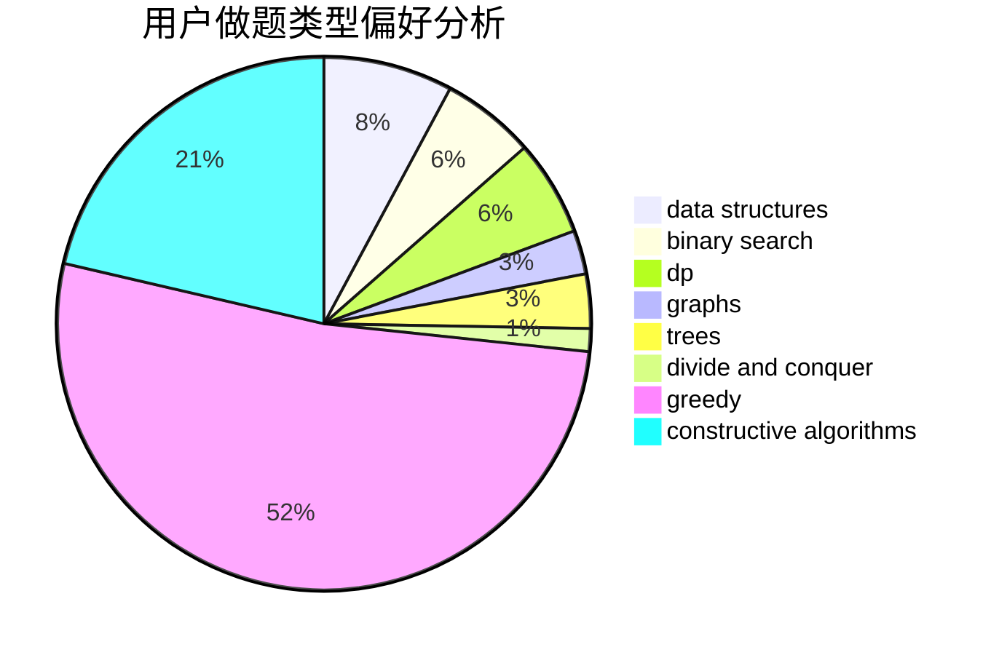
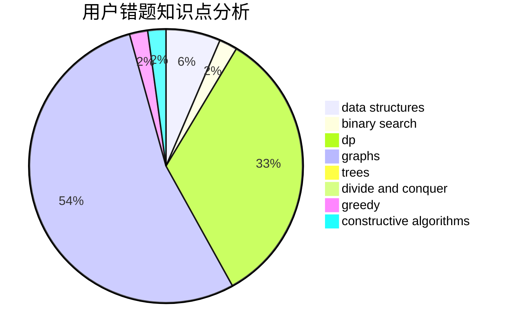

# AhoCorasick
<!-- tabs:start -->
#### **用户提交结果分析**

#### **用户做题类型偏好分析**

#### **用户错题知识点分析**

<!-- tabs:end -->
# 推荐题目
[Meximization](http://codeforces.com/problemset/problem/1497/A)		brute force,
                        data structures,
                        greedy,
                        sortings		  
[Multiply by 2, divide by 6](http://codeforces.com/problemset/problem/1374/B)		math		  
[Dubstep](http://codeforces.com/problemset/problem/208/A)		strings		  
[Football Championship](http://codeforces.com/problemset/problem/200/C)		brute force,
                        implementation		  
[Coloring Edges](http://codeforces.com/problemset/problem/1217/D)		constructive algorithms,
                        dfs and similar,
                        graphs		  
[Dr. Evil Underscores](http://codeforces.com/problemset/problem/1285/D)		bitmasks,
                        brute force,
                        dfs and similar,
                        divide and conquer,
                        dp,
                        greedy,
                        strings,
                        trees		  
[Prizes, Prizes, more Prizes](http://codeforces.com/problemset/problem/208/D)		implementation		  
[Police Station](http://codeforces.com/problemset/problem/208/C)		dp,
                        graphs,
                        shortest paths		  
[A Tale of Two Lands](http://codeforces.com/problemset/problem/1166/C)		binary search,
                        sortings,
                        two pointers		  
[Little Elephant and Sorting](http://codeforces.com/problemset/problem/205/B)		brute force,
                        greedy		  
<!-- tabs:start -->
#### **data structures**
[Meximization](http://codeforces.com/problemset/problem/1497/A)		brute force,
                        data structures,
                        greedy,
                        sortings		  
[Multiply by 2, divide by 6](https://codeforces.com/contest/205/problem/D)		binary search,
                        data structures		  
[Dubstep](http://codeforces.com/problemset/problem/1380/E)		data structures,
                        dsu,
                        implementation,
                        trees		  
[Football Championship](http://codeforces.com/problemset/problem/204/E)		data structures,
                        implementation,
                        string suffix structures,
                        two pointers		  
[Coloring Edges](http://codeforces.com/problemset/problem/200/A)		brute force,
                        data structures		  
[Dr. Evil Underscores](http://codeforces.com/problemset/problem/1491/C)		brute force,
                        data structures,
                        dp,
                        greedy,
                        implementation		  
[Prizes, Prizes, more Prizes](http://codeforces.com/problemset/problem/19/D)		data structures		  
[Police Station](http://codeforces.com/problemset/problem/1287/B)		brute force,
                        data structures,
                        implementation		  
[A Tale of Two Lands](http://codeforces.com/problemset/problem/1492/C)		binary search,
                        data structures,
                        dp,
                        greedy,
                        two pointers		  
[Little Elephant and Sorting](http://codeforces.com/problemset/problem/1490/G)		binary search,
                        data structures,
                        math		  
#### **binary search**
[Meximization](http://codeforces.com/problemset/problem/1166/C)		binary search,
                        sortings,
                        two pointers		  
[Multiply by 2, divide by 6](https://codeforces.com/contest/205/problem/C)		binary search,
                        combinatorics,
                        dp		  
[Dubstep](https://codeforces.com/contest/205/problem/D)		binary search,
                        data structures		  
[Football Championship](http://codeforces.com/problemset/problem/1238/D)		binary search,
                        combinatorics,
                        dp,
                        strings		  
[Coloring Edges](http://codeforces.com/problemset/problem/201/E)		binary search,
                        combinatorics		  
[Dr. Evil Underscores](https://codeforces.com/contest/1345/problem/F)		binary search,
                        greedy,
                        math		  
[Prizes, Prizes, more Prizes](http://codeforces.com/problemset/problem/1129/E)		binary search,
                        interactive,
                        trees		  
[Police Station](http://codeforces.com/problemset/problem/1436/C)		binary search,
                        combinatorics		  
[A Tale of Two Lands](http://codeforces.com/problemset/problem/1492/C)		binary search,
                        data structures,
                        dp,
                        greedy,
                        two pointers		  
[Little Elephant and Sorting](http://codeforces.com/problemset/problem/1463/D)		binary search,
                        constructive algorithms,
                        greedy,
                        two pointers		  
#### **dp**
[Meximization](http://codeforces.com/problemset/problem/1285/D)		bitmasks,
                        brute force,
                        dfs and similar,
                        divide and conquer,
                        dp,
                        greedy,
                        strings,
                        trees		  
[Multiply by 2, divide by 6](http://codeforces.com/problemset/problem/208/C)		dp,
                        graphs,
                        shortest paths		  
[Dubstep](https://codeforces.com/contest/205/problem/C)		binary search,
                        combinatorics,
                        dp		  
[Football Championship](http://codeforces.com/problemset/problem/1279/E)		combinatorics,
                        dp		  
[Coloring Edges](http://codeforces.com/problemset/problem/201/D)		bitmasks,
                        brute force,
                        dp		  
[Dr. Evil Underscores](http://codeforces.com/problemset/problem/201/C)		dp		  
[Prizes, Prizes, more Prizes](http://codeforces.com/problemset/problem/1238/D)		binary search,
                        combinatorics,
                        dp,
                        strings		  
[Police Station](http://codeforces.com/problemset/problem/1032/F)		dp,
                        trees		  
[A Tale of Two Lands](http://codeforces.com/problemset/problem/208/B)		dfs and similar,
                        dp		  
[Little Elephant and Sorting](http://codeforces.com/problemset/problem/1250/D)		dp		  
#### **graph**
[Meximization](http://codeforces.com/problemset/problem/1217/D)		constructive algorithms,
                        dfs and similar,
                        graphs		  
[Multiply by 2, divide by 6](http://codeforces.com/problemset/problem/208/C)		dp,
                        graphs,
                        shortest paths		  
[Dubstep](http://codeforces.com/problemset/problem/1487/C)		brute force,
                        constructive algorithms,
                        dfs and similar,
                        graphs,
                        greedy,
                        implementation,
                        math		  
[Football Championship](http://codeforces.com/problemset/problem/1437/C)		dp,
                        flows,
                        graph matchings,
                        greedy,
                        math,
                        sortings		  
[Coloring Edges](http://codeforces.com/problemset/problem/1470/D)		constructive algorithms,
                        dfs and similar,
                        graph matchings,
                        graphs,
                        greedy		  
[Dr. Evil Underscores](http://codeforces.com/problemset/problem/1476/C)		dp,
                        graphs,
                        greedy		  
[Prizes, Prizes, more Prizes](http://codeforces.com/problemset/problem/1304/D)		constructive algorithms,
                        graphs,
                        greedy,
                        two pointers		  
[Police Station](http://codeforces.com/problemset/problem/1475/C)		combinatorics,
                        graphs,
                        math		  
[A Tale of Two Lands](http://codeforces.com/problemset/problem/553/E)		dp,
                        fft,
                        graphs,
                        math,
                        probabilities		  
[Little Elephant and Sorting](http://codeforces.com/problemset/problem/1495/C)		constructive algorithms,
                        graphs		  
#### **trees**
[Meximization](http://codeforces.com/problemset/problem/1285/D)		bitmasks,
                        brute force,
                        dfs and similar,
                        divide and conquer,
                        dp,
                        greedy,
                        strings,
                        trees		  
[Multiply by 2, divide by 6](http://codeforces.com/problemset/problem/1143/C)		dfs and similar,
                        trees		  
[Dubstep](http://codeforces.com/problemset/problem/1380/E)		data structures,
                        dsu,
                        implementation,
                        trees		  
[Football Championship](http://codeforces.com/problemset/problem/1032/F)		dp,
                        trees		  
[Coloring Edges](http://codeforces.com/problemset/problem/1129/E)		binary search,
                        interactive,
                        trees		  
[Dr. Evil Underscores](http://codeforces.com/problemset/problem/1479/D)		binary search,
                        bitmasks,
                        brute force,
                        data structures,
                        probabilities,
                        trees		  
[Prizes, Prizes, more Prizes](http://codeforces.com/problemset/problem/1511/C)		brute force,
                        data structures,
                        implementation,
                        trees		  
[Police Station](http://codeforces.com/problemset/problem/1499/F)		combinatorics,
                        dfs and similar,
                        dp,
                        trees		  
[A Tale of Two Lands](http://codeforces.com/problemset/problem/1491/E)		brute force,
                        dfs and similar,
                        divide and conquer,
                        number theory,
                        trees		  
[Little Elephant and Sorting](http://codeforces.com/problemset/problem/1466/D)		data structures,
                        greedy,
                        sortings,
                        trees		  
#### **divide and conquer**
[Meximization](http://codeforces.com/problemset/problem/1285/D)		bitmasks,
                        brute force,
                        dfs and similar,
                        divide and conquer,
                        dp,
                        greedy,
                        strings,
                        trees		  
[Multiply by 2, divide by 6](http://codeforces.com/problemset/problem/19/E)		dfs and similar,
                        divide and conquer,
                        dsu		  
[Dubstep](http://codeforces.com/problemset/problem/1461/D)		binary search,
                        brute force,
                        data structures,
                        divide and conquer,
                        implementation,
                        sortings		  
[Football Championship](http://codeforces.com/problemset/problem/1466/G)		combinatorics,
                        divide and conquer,
                        hashing,
                        math,
                        string suffix structures,
                        strings		  
[Coloring Edges](http://codeforces.com/problemset/problem/1490/D)		dfs and similar,
                        divide and conquer,
                        implementation		  
[Dr. Evil Underscores](https://codeforces.com/contest/1483/problem/C)		data structures,
                        divide and conquer,
                        dp		  
[Prizes, Prizes, more Prizes](http://codeforces.com/problemset/problem/1491/E)		brute force,
                        dfs and similar,
                        divide and conquer,
                        number theory,
                        trees		  
[Police Station](http://codeforces.com/problemset/problem/1303/G)		data structures,
                        divide and conquer,
                        geometry,
                        trees		  
[A Tale of Two Lands](http://codeforces.com/problemset/problem/1494/D)		constructive algorithms,
                        data structures,
                        dfs and similar,
                        divide and conquer,
                        dsu,
                        greedy,
                        sortings,
                        trees		  
[Little Elephant and Sorting](http://codeforces.com/problemset/problem/1482/E)		data structures,
                        divide and conquer,
                        dp		  
#### **greedy**
[Meximization](http://codeforces.com/problemset/problem/1497/A)		brute force,
                        data structures,
                        greedy,
                        sortings		  
[Multiply by 2, divide by 6](http://codeforces.com/problemset/problem/1285/D)		bitmasks,
                        brute force,
                        dfs and similar,
                        divide and conquer,
                        dp,
                        greedy,
                        strings,
                        trees		  
[Dubstep](http://codeforces.com/problemset/problem/205/B)		brute force,
                        greedy		  
[Football Championship](https://codeforces.com/contest/1072/problem/D)		greedy		  
[Coloring Edges](https://codeforces.com/contest/1086/problem/C)		greedy,
                        implementation,
                        strings		  
[Dr. Evil Underscores](https://codeforces.com/contest/1345/problem/F)		binary search,
                        greedy,
                        math		  
[Prizes, Prizes, more Prizes](http://codeforces.com/problemset/problem/19/C)		greedy,
                        hashing,
                        string suffix structures		  
[Police Station](http://codeforces.com/problemset/problem/1491/C)		brute force,
                        data structures,
                        dp,
                        greedy,
                        implementation		  
[A Tale of Two Lands](http://codeforces.com/problemset/problem/1349/B)		constructive algorithms,
                        greedy,
                        math		  
[Little Elephant and Sorting](http://codeforces.com/problemset/problem/1144/B)		greedy,
                        implementation,
                        sortings		  
#### **constructive algorithms**
[Meximization](http://codeforces.com/problemset/problem/1217/D)		constructive algorithms,
                        dfs and similar,
                        graphs		  
[Multiply by 2, divide by 6](http://codeforces.com/problemset/problem/1349/B)		constructive algorithms,
                        greedy,
                        math		  
[Dubstep](http://codeforces.com/problemset/problem/1493/A)		constructive algorithms,
                        greedy		  
[Football Championship](http://codeforces.com/problemset/problem/1463/D)		binary search,
                        constructive algorithms,
                        greedy,
                        two pointers		  
[Coloring Edges](https://codeforces.com/contest/1456/problem/B)		bitmasks,
                        brute force,
                        constructive algorithms		  
[Dr. Evil Underscores](http://codeforces.com/problemset/problem/1492/D)		bitmasks,
                        constructive algorithms,
                        greedy,
                        math		  
[Prizes, Prizes, more Prizes](https://codeforces.com/contest/1504/problem/D)		constructive algorithms,
                        games,
                        interactive		  
[Police Station](https://codeforces.com/contest/1483/problem/A)		brute force,
                        constructive algorithms,
                        greedy,
                        implementation		  
[A Tale of Two Lands](https://codeforces.com/contest/1457/problem/D)		bitmasks,
                        brute force,
                        constructive algorithms		  
[Little Elephant and Sorting](http://codeforces.com/problemset/problem/1513/A)		constructive algorithms,
                        implementation		  
#### **sortings**
[Meximization](http://codeforces.com/problemset/problem/1497/A)		brute force,
                        data structures,
                        greedy,
                        sortings		  
[Multiply by 2, divide by 6](http://codeforces.com/problemset/problem/1166/C)		binary search,
                        sortings,
                        two pointers		  
[Dubstep](http://codeforces.com/problemset/problem/15/A)		implementation,
                        sortings		  
[Football Championship](http://codeforces.com/problemset/problem/1144/B)		greedy,
                        implementation,
                        sortings		  
[Coloring Edges](https://codeforces.com/contest/1496/problem/C)		geometry,
                        greedy,
                        math,
                        sortings		  
[Dr. Evil Underscores](http://codeforces.com/problemset/problem/1495/A)		geometry,
                        greedy,
                        math,
                        sortings		  
[Prizes, Prizes, more Prizes](http://codeforces.com/problemset/problem/1497/A)		brute force,
                        data structures,
                        greedy,
                        sortings		  
[Police Station](http://codeforces.com/problemset/problem/1427/A)		math,
                        sortings		  
[A Tale of Two Lands](http://codeforces.com/problemset/problem/1461/D)		binary search,
                        brute force,
                        data structures,
                        divide and conquer,
                        implementation,
                        sortings		  
[Little Elephant and Sorting](http://codeforces.com/problemset/problem/1437/C)		dp,
                        flows,
                        graph matchings,
                        greedy,
                        math,
                        sortings		  
<!-- tabs:end -->
