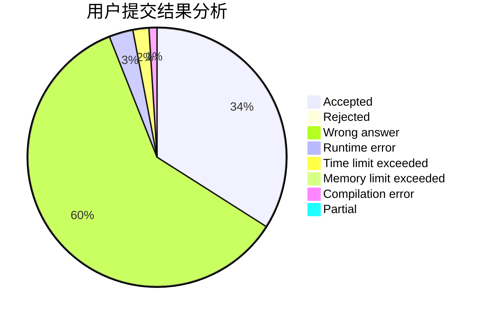
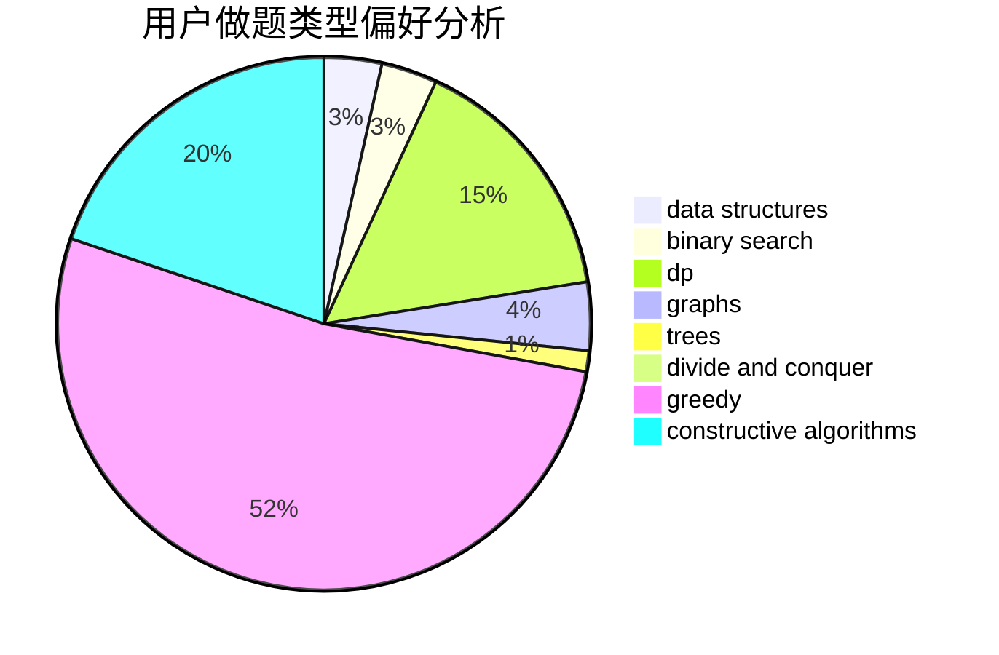
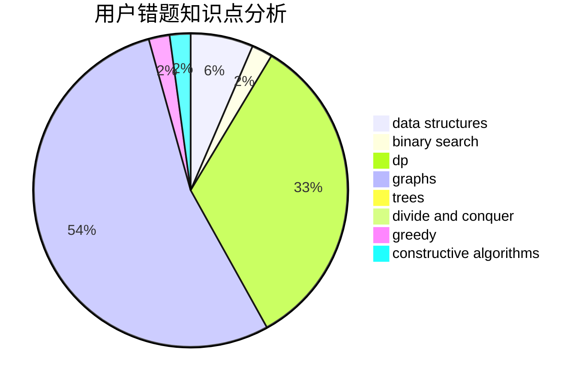

# AhoCorasick

<!-- tabs:start -->

#### **用户提交结果分析**

#### **用户做题类型偏好分析**

#### **用户错题知识点分析**

<!-- tabs:end -->
# 推荐题目
[225E](https://codeforces.com/contest/225/problem/E)		math,
                        number theory		  
[1292E](https://codeforces.com/contest/1292/problem/E)		constructive algorithms,
                        greedy,
                        interactive,
                        math		  
[1383A](https://codeforces.com/contest/1383/problem/A)		dsu,
                        graphs,
                        greedy,
                        sortings,
                        strings,
                        trees,
                        two pointers		  
[1073C](https://codeforces.com/contest/1073/problem/C)		binary search,
                        two pointers		  
[228B](https://codeforces.com/contest/228/problem/B)		brute force,
                        implementation		  
[1169B](https://codeforces.com/contest/1169/problem/B)		graphs,
                        implementation		  
[22E](https://codeforces.com/contest/22/problem/E)		dfs and similar,
                        graphs,
                        trees		  
[229D](https://codeforces.com/contest/229/problem/D)		dp,
                        greedy,
                        two pointers		  
[22B](https://codeforces.com/contest/22/problem/B)		brute force,
                        dp		  
[230B](https://codeforces.com/contest/230/problem/B)		binary search,
                        implementation,
                        math,
                        number theory		  
