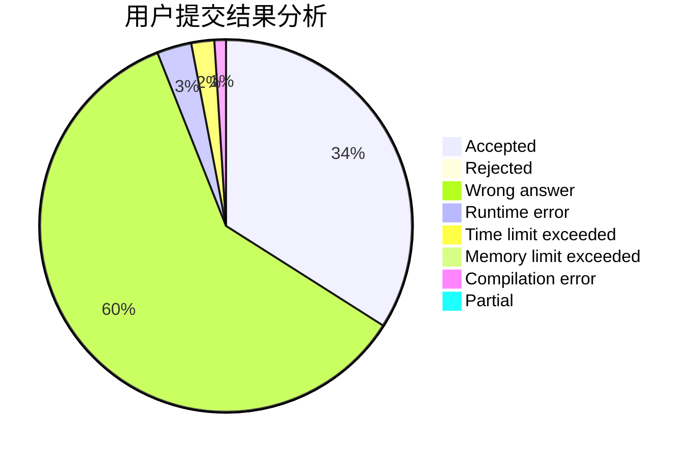
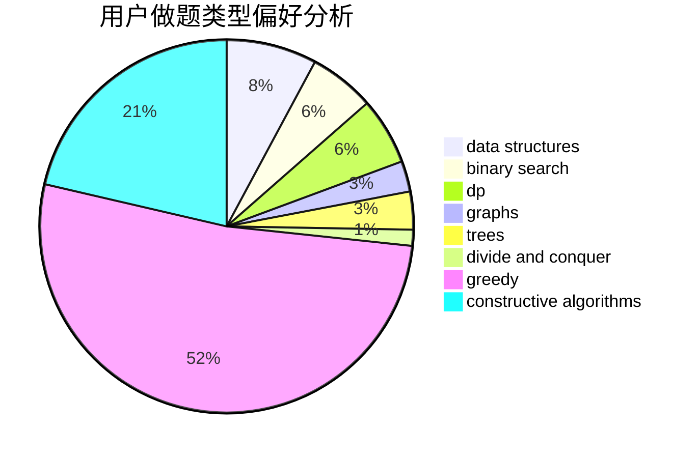
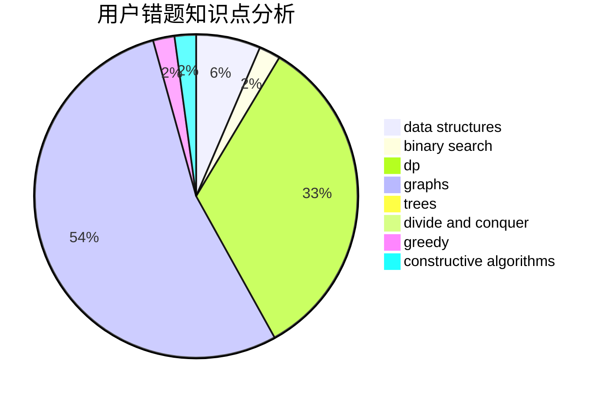

# AhoCorasick

<!-- tabs:start -->

#### **用户提交结果分析**

#### **用户做题类型偏好分析**

#### **用户错题知识点分析**

<!-- tabs:end -->
# 推荐题目
[200C](https://codeforces.com/contest/200/problem/C)		brute force,
                        implementation		  
[1285D](https://codeforces.com/contest/1285/problem/D)		bitmasks,
                        brute force,
                        dfs and similar,
                        divide and conquer,
                        dp,
                        greedy,
                        strings,
                        trees		  
[1374B](https://codeforces.com/contest/1374/problem/B)		math		  
[1072D](https://codeforces.com/contest/1072/problem/D)		dsu,graphs,sortings,trees		  
[204C](https://codeforces.com/contest/204/problem/C)		math,
                        probabilities		  
[1166C](https://codeforces.com/contest/1166/problem/C)		binary search,
                        sortings,
                        two pointers		  
[208C](https://codeforces.com/contest/208/problem/C)		dp,
                        graphs,
                        shortest paths		  
[205B](https://codeforces.com/contest/205/problem/B)		brute force,
                        greedy		  
[208A](https://codeforces.com/contest/208/problem/A)		strings		  
[208D](https://codeforces.com/contest/208/problem/D)		implementation		  
